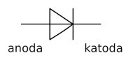

# Principy činnost polovodičových prvků
- Otázky: polovodiče, PN přechod, dioda a její Volt-Ampérova charakteristika, tranzistor, bipolární tranzistor, unipolární tranzistor ve spínacím režimu, realizace logických členů NAND a NOR v technologii CMOS
- Předmět: IEL
- Zdroj: http://szz.g6.cz/doku.php?id=temata:01-polovodice:main

## Polovodiče
Polovodiče jsou látky, které se vyznačují negativní tepelnou závislostí odporu. Se zvyšující se teplotou odpor látky klesá a tudíž jí lépe prochází elektrický proud. Chování odporu lze ovlivnit příměsi. Polovodiče mají často také optické vlastnosti.

Polovodičové součástky jsou nejčastěji postaveny na křemíku (Si). Křemík má 4 valenční elektrony, což mu umožňuje vytvářet až 4 vazby s vedlejšími atomy. Krystalová mřížka z čistého křemíku nemá příliš zajímavé elektrické vlastnosti. Ty jsou zajímavější, když se do mřížky zanese příměs. Tomu se říká _doping_ a využívají se k tomu prvky jako fosfor (\(P_5\), donor), nebo bor (\(B_3\), akceptor). Vznikají tak polovodiče typy N nebo typu P.

V polovodičích typu P chybí elektrony a tudíž převládá děrová vodivost - jako nositelé elektrického proudu převažují díry. Naproti tomu v polovodičích tupu N přebývají elektrony, které jsou tak majoritní nositelé elektrického proudu - elektronová vodivost.

### PN přechod
PN přechod je rozmezí polovodičů typu P a N. Při jejich spojení nastává _difuze_, část elektronů se přesune z N do P a část děr se přesune z P do N. Procesem _rekombinace_ vznikne pásmo, ve kterém nejsou žádné volné nosiče náboje - __potenciálová beriéra__.

## Dioda
Dioda je polovodičová součástka tvořena jedním PN přechodem. Dioda umožňuje pouštět proud pouze jedním směrem. Podle způsobu připojení ke zdroji elektrického pole můžeme teda řídit proud:
- __Propustný směr__ - dioda je ke zdroji připojena shodnými póly, potenciálová bariéra je překonána, proud protéká.
- __Závěrný směr__ - dioda je ke zdroji připojena opačnými póly, potenciálová bariéra se zvětší, proud neprotéká.

Schématický symbol:
- _Anoda_ - typ P - kladný náboj - šipka
- _Katoda_ - typ N - záporný náboj - čára
- Šipka znázorňuje směr proudu v propustném směru

Diody mohou mít různé funkce: usměrňovací, detekční a spínací, stabilizační, kapacitní, luminiscenční (LED) a fotodiody.

Pro překonání potenciálové bariéry je potřeba alespoň minimální napětí 0,6 - 0,7 V. Při napojení diody v závěrném směru na zdroj příliš velkého napětí může nastat průraz a diodou začne procházet elektrický proud.

## Tranzistor
Tranzistor je polovodičová součáska tvořena dvěma PN přechody. Je to základním stavebním prvkem všech dnešních integrovaných obvodů. Tranzistor má dvě hlavní funkce: _spínač_ a _zesilovač_. Tranzistory se dělí na _bipolární_ a _unipolární_.

### Bipolární tranzistor
Bipolární tranzistor využívá obou nosičů náboje přítomných v polovodičích. Ovládá se otevřením PN přechodu báze-emitor, kdy bází musí protékat proud. Existují dva druhy bipolárních tranzistorů: __NPN__ a __PNP__.

Tranzistor má 3 vodiče - _báze_ B, _emitor_ E (šipka) a _kolektor_ C. Podle toho, zda je na bázi přiveden proud je možné ovládat, zda prochází proud mezi kolektorem a emitorem. NPN tranzistor je aktivní, když je do báze přiveden proud (log. 1); PNP tranzistor je aktivní, když je z báze vyveden proud (log. 0).

### Unipolární tranzistory
Unipolární tranzistory využívají pouze jeden typ nosičů náboje přítomných na polovodičích. Nepotřebují vstupní proud, jsou ovládané na základě elektrického pole, což je činí ekonomičtější. Budeme se bavit o tranzistorech vyrobených technologií __CMOS__. Tranzistory CMOS mohou být dvojího typu: typu P (aktivní v log. 0) a typu N (aktivní v log. 1).

#### CMOS typu N
Tranzistor CMOS typu N má 3 vodiče - _gate_ G, _source_ S, _drain_ D. Pokud je na G přiveden __kladný náboj__, tak se v tranzistoru vytvoří vodivý kanál a proud prochází mezi S a D. CMOS typu N používá pouze polovodiče typu N.

#### CMOS typu P
Tranzistor CMOS typu P funguje obdobně jako CMOS typu N. Využívá pouze polovodiče typu P.

### NAND v technologii CMOS

### NOR v technologii CMOS

