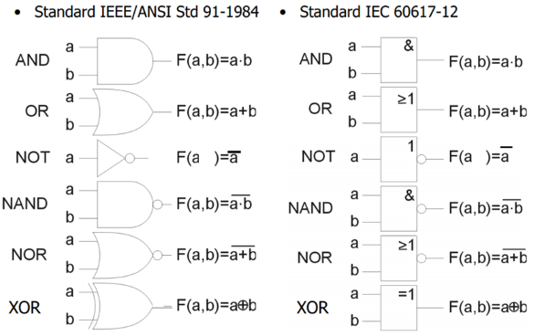

# Kombinační logické obvody
- Otázky: kombinační logické obvody, multiplexor, demultiplexor, kodér, dekodér, binární sčítačka
- Předmět: INC, INP
- Zdroj: http://szz.g6.cz/doku.php?id=temata:02-kombinacni_obvody:main

## Logické obvody
Logický obvod je hierarchicky uspořádaný obvod, ve kterém jednotlivé komponenty zpracovávají a mezi sebou komunikují informaci reprezentovanou v binární podobě. Logické obvody se dělí na dva základní typy: __kombinační__ a sekvenční. Kombinační logické obvody mají vstup a výstup, který je závislý pouze na aktuálním vstupu (žádný vnitřní stav). Tyto obvody se skládají ze stavebních bloků zvané logické členy.

## Multiplexor
Multiplexor je kombinační obvod, který přepíná signál z více vstupů na jeden výstup. Podle signálu na vodiči __S__ (Select) se vybere jeden ze vstupů, který se přenese na výstup. Multiplexor se označuje podle poměru přepínání, např.: 2-1, 4-1.

Multiplexory vyššího poměru lze skládat z multiplexorů nižšího poměru. Nižší multiplexor tak označuje pouze menší počet bitů z celkové adresy. Multiplexor se využívá pro převod paralelního vstupu na sériový (data selector) nebo pro tvorbu vlastních logických funkcí.

## Demultiplexor
Demultiplexor je kombinační obvod, který jeden vstup mapuje na více výstupů. Podle signálu na vodiči __S__ (Select) se vybere na který výstup se signál namapuje. Demultiplexor se označuje podle poměru, např.: 1-2, 1-4.

## Dekodér
Dekodér je kombinační obvod, který funguje velmi podobně jako multiplexor, který má na vstupu vždy log. 1. Signál na vodiči __S__ (Select) tudíž určuje, na kterém výstupním vodiči se objeví log. 1, a na ostatních výstupech je log. 0.

Dekodér se využívá například pro dekódování adres, jako dekodéry pro sedmisegmentové displeje a taky pro převod BCD na číslo 1-10. BCD dekodér je speciální dekodér, který dekóduje 4-bitový kód BCD na dekadické číslo.

## Kodér
Kodér je kombinační obvod, který na výstup mapuje adresu vstupu v log. 1. Pouze jeden vstup může být v log. 1, jinak nebude kodér správně fungovat. Kodér se využívá například pro prioritní kodér (přidělování sběrnice, řadič přerušení).

## Binární sčítačka
Nejjednodušší sčítačka se nazývá _Half-adder_ (HA). Tato sčítačka má pouze dva vstupy, nebere v potaz předchozí přenos (_carry_). Má dva výstupy: výsledek S a příznak přenosu C.

Při rozšíření o přenos vzniká _Full-adder_ (FA). Tato sčítačka bere v potaz předchozí přenos.

Plná sčítačka se v praci pro vícebitové sčítání nepoužívá, poněvadž je příliš pomalá a složitá. Pro zjednodušení lze využít sériovovou sčítačku, která má vstupy a výstupy v posuvných registrech a carry v jednoduchém registru. Nicméně tato sčítačka je stále velmi pomalá.

V praxi se využívá CLA sčítačka (Carry-Look-Ahead). Tato sčítačka má navíc výstupy G (_Generate carry_) a P (_Propagate carry_), které umožňují paralelně generovat přenos:
- G (generate) - značí případ, kdy __určitě__ nastane přesun do vyššího řádu
- P (propagate) - značí případ, kdy __může__ nastat přesun do vyššího řádu

Jednotlivé výstupy CLA sčítačky se vypočítají následovně:
- \(C_{i+1} = G_i\,and\,(P_i\,or\,C_i)\)
- \(S = A\,xor\,B\,xor\,C\)
- \(G = A\,and\,B\)
- \(P = A\,xor\,B\)

