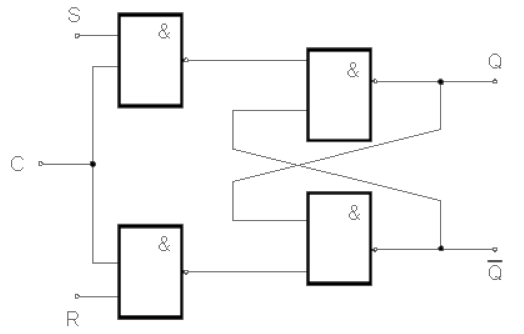

# Sekvenční logické obvody
- Otázky: sekvenční logické obvody, klopné obvody (RS, JK, T, D), čítače, registry, stavové automaty (reprezentace a implementace)
- Předmět: INC
- Zdroj: http://szz.g6.cz/doku.php?id=temata:03-sekvencni_obvody:main

## Sekvenční logické obvody
Sekvenční logické obvody mají na rozdíl od kombinačních logických obvodů vnitřní stav, který si pamatují. Výstup sekvenčních obvodů je tedy závislý na vstupu a vnitřním stavu. Tyto logické obvody se skládají ze dvou částí - kombinační a paměťové.

## Klopný obvod
Klopný obvod je sekvenční obvod s několika diskrétními stavy. Mezi stavy klopný obvod přechází skokově. Klopné obvody jsou schopny, pomocí zpětné vazby, uchovávat svůj stav a tak se často využívají jako paměťové prvky.

Klopné obvody mohou být asynchronní a synchronní:
- __Asynchronní (Latch)__ - Vstupní signály přímo ovlivňují stav KO.
- __Synchronní (Flip-Flop)__ - Vstupní signály ovlivňují stav KO pouze při aktivním stavu hodinového signálu. Hodinový signál může být aktivní jako puls (_dvoufázový klopný obvod_) nebo jako hrana (_derivační klopný obvod_).

### RS Klopný obvod
RS klopný obvod má dva vstupy: R (_Reset_), který změní stav obvodu na log. 0, a S (_Set_), který změní stav obvodu na log. 1. Obvod si svůj stav pamatuje a opakovaná aktivace stejného vstupu nemá žádný vliv. Vstupy RS klopného obvodu jsou invertované, tudíž jsou aktivní v log. 0. Aktivace obou vstupů R a S je zakázaná (neznámý stav).

RS klopný obvod lze rozšířit o _povolovací vstup_ C. Tento vstup povolí funkci klopného obvodu pouze pokud je aktivní.

### JK Klopný obvod
JK klopný obvod je rozšíření RS klopného obvodu, které podporuje původně zakázaný stav, kdy jsou R a S vstupy aktivovány zároveň. Vstupy nazýváme J (místo S) a K (místo R). Aktivace J a K zároveň překlápí vnitřní stav obvodu. JK klopný obvod jinka funguje stejně jako RS.

### T klopný obvod
T (toggle) klopný obvod je rozšíření JK klopného obvodu. T klopný obvod má jeden vstup T, který při aktivaci (log. 1) překlápí aktuální stav klopného obvodu

### D klopný obvod
D (hold) klopný obvod je další rozšíření RS klopného obvod. Vstup D je připojen na vstup S a invertovaně připojen na vstup R. Na nástupné hraně hodinového signálu ukládá aktuální stav na vstupu D.

D klopný obvod lze použít jako jednobitový registr.

## Posuvný registr
Posuvný registr je sekvenční logický obvod, který ukládá a posouvá vstupní hodnotu. Posuvný registr je možné sestavit z několika sériově napojených D klopných obvodů. Posuvný registr mění stav při nástupné hraně hodinového signálu.

Posuvný registr je možné implementovat i pomocí multiplexorů - _barrel shifter_. 

## Čítač
Čítač je sekvenční logický obvod, který čítá vstupní impulsy. Čítač je možné sestavit z několika sériově napojených T klopných obvodů. Čítač mění stav při sestupné hraně hodinového signálu.

## Stavové automaty
Stavový automat (FSM) je sekvenční obvod, který se skládá z tří částí:
- __Next-state logic__ - definuje do jakého stavu máme přejít
- __Paměť__ - ukládá aktuální stav
- Výstupy
    - __Moore výstup__ - výstup závysí pouze na vnitřním stavu.
    - __Mealy výstup__ - výstup závisý na vnitřním stavu a vstupu.

Je to šestice \(A=(X,Y,Q,q_0,P,V)\), kde:
- \(X\) ... vstupní abeceda
- \(Y\) ... výstupní abeceda
- \(Q\) ... vnitřní abeceda
- \(q_0\) ... počáteční stav
- \(P\) ... přechodová funkce \(X \times Q \rightarrow Q\)
- \(V\) ... výstupní funkce \(X \times Q \rightarrow Y\)

Stavobé automaty se mohou dělet na synchronní a asynchronní a dále na úrovňové a hranové:
- __Asynchronní__ - změna vstupní proměnné se promítne ihned do stavu sekvenčního obvodu.
- __Synchronní__ - používá se synchronizační signál (hodinový signál), změna vstupní proměnné se promítne do stavu sekvenčního obvodu až při příchodu hodinového signálu.
- __Úrovňové__ - sekvenční obvod sleduje hodnoty vstupních proměnných a tím i jejich změny po celou dobu trvání hodinového signálu a průběžně na ně reaguje.
- __Hranové__ - sekvenční obvod reaguje na hodnoty vstupních proměnných jen při příchodu hrany hodinového signálu.

Chování stavového automatu je možné zapsat pomocí grafu přechodů nebo tabulky přechodů.

