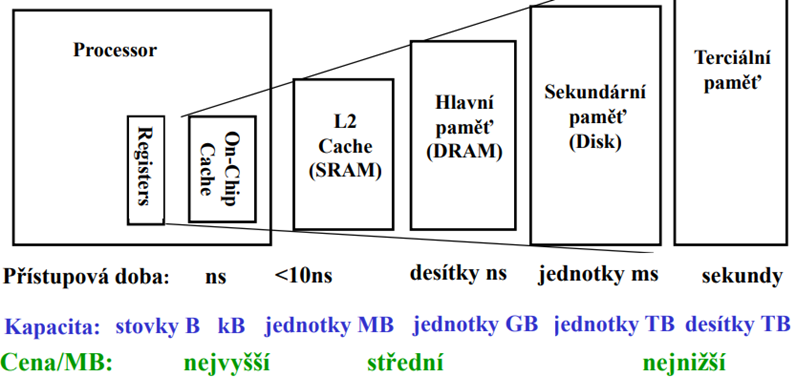
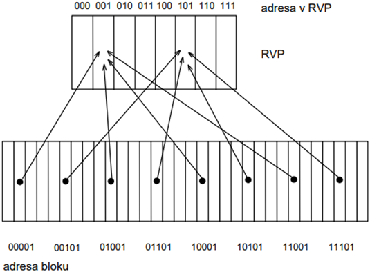
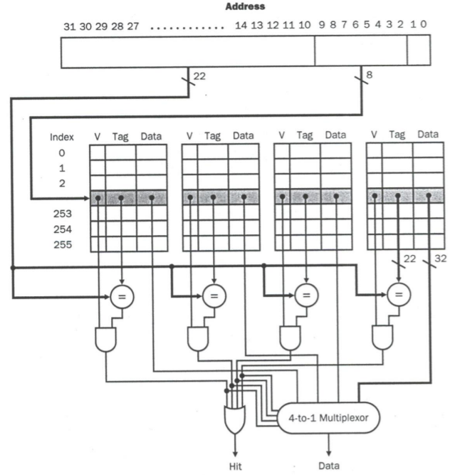

# Hierarchie paměti v počítači
- Otázky: vlastnosti paměti, typy a principy pamětí, principy lokality, organizace rychlé vyrovnávací paměti
- Předmět: INP
- Zdroje:
    - https://wis.fit.vutbr.cz/FIT/st/cfs.php.cs?file=%2Fcourse%2FINP-IT%2Flectures%2Finp2021_11pameti.pdf (paměti)
    - https://wis.fit.vutbr.cz/FIT/st/cfs.php.cs?file=%2Fcourse%2FINP-IT%2Flectures%2Finp2021_12pam_hier.pdf (paměťový hierarchie)

## Paměti
Paměť je elektronická součástka, zařízení nebo materiál, který umožňuje _uložit_ obsah informace, _uchovat_ ji po požadovanou dobu a znovu ji _získat_ pro další použití. Existují různé druhy pamětí s různými vlastnostmi jako:
- __Kapacita__
- __Rychlost__
    - _Přístupová doba_ - doba od zahájení čtení po získání obsahu paměťového místa
    - _Doba cyklu_ - doba od zahájení čtení/zápisu do skončení operace, kdy je možno spustit další operaci
    - _Přenosová rychlost_ - data/čas
- __Stálost obsahu__
    - _Volatilní_ - potřebuje k uchování informace napájecí napětí
    - _Nevolatilní_ - nepotřebuje k uchování informací napájecí napětí
    - _Destruktivní_ - čtením se data vymažou a je potřeba je znovu zapsat
- __Doba uchování informace__
    - _Statická_ (SRAM) - uchovaná informace se udržuje dlouhodobě (rychlá, malá a drahá)
    - _Dynamická_ (DRAM) - uchovanou informaci je potřeba neustále obnovovat (pomalejší ale levnější)
- __Přístup k datům__
    - S libovolným přístupem (RAM - Random Access Memory)
    - Se sériovým přístupem (SAM - Serial Access Memory)
    - Se smíšeným přístupem
- __Výběr z paměti__
    - Adresový
    - Asociativní - pro mapování používá klíče
- __Fyzikální princip pamětí__ - polovodičové / magnetické / optické / molekulární
- __Přístupnost obsahu__
    - _RWM_ (Read/Write Memory)
    - _ROM_ (Read Only Memory) - pouze pro čtení
    - _PROM_ (Programable ROM) - umožňuje jedno naprogramování
    - _EPROM_ (Erasable Programable ROM) - mazatelná a programovatelná ROM, maže se UV zářením
    - _EEPROM_ (Electricaly Erasable Programable ROM) - elektronicky mazatelná programovatelná ROM (flash paměti)
- Poměr cena/bit
- Chybovost a poruchovost

## Hierarchie paměti
Obecně platí, že čím větší kapacita, tím menší je cena/bit a přenosová rychlost. A protože větší paměti jsou obvykle mnohem pomalejší než procesor je nutné využívat __paměťovou hierarchii__. Čím blíže je paměť k procesoru, tím menší ale rychlejší je. Obecně můžeme paměť rozdělit na následující úrovně:
- Registry a cache v procesoru
- Cache (SRAM)
- Hlavní pamět (DRAM)
- Sekundární pamět (disk)
- Terciální paměť (magnetické pásky)

### Principy lokality
Principy lokality jsou základní předpoklady, díky nimž může fungovat paměťová hierarchie. Jsou dva principy lokality: __časová lokalita__ a __prostorová lokalita__.

> __Časová lokalita__ nám říká, že při využití paměťového bloku je velká šance, že ho budeme brzo používat znovu.

> __Prostorová lokalita__ nám říká, že při využití paměťového bloku je velká šance, že brzo budeme potřebovat i jeho sousedy v paměťovém prostoru.

## Rychlá vyrovnávací paměť
Rychlá vyrovnávací paměť (RVP) je paměť typu __SRAM__. SRAM je rychlá, ale drahá paměť, která navíc na čipu zabýrá docela dost místa a tudíž může mít pouze omezenou kapacitu. RVP je rozdělena do bloků o konstatní velikosti, v hlavní paměti jsou bloky stejné velikosti, ale je jich mnohem více. Proto v RVP mohou být uloženy jen některé bloky. Při nalezení požadovaného bloku nastavá _cache hit_, pokud není nalezen nastává _cache miss_. Poměr _cache hit_ a _cache miss_ se nazývá __hit rate__. V praci se snažíme \(\text{hit rate} > 95%\).

Princip RVP je následující: Programy obvykle pracují s malými úseky paměti (prostorová lokalita). Tento úsek se přenese do RVP a je tak rychleji přístupný. Procesor při přístupu k datům hladá paralelně v RVP a hlavní paměti. Protože je RVP rychlejší, tak dříve oznámý procesoru, zda se požadovaná data v paměti nacházejí nebo nenacházejí. Pokud jsou data v RVP požadavek přístupu k hlavní paměti se zruší, pokud nejsou tak se čeká na data z hlavní paměti.

V moderních procesorech se obvykle používá více vrstev RVP, značných L1, L2, L3 cache. Existuje několik způsobů organizace RVP podle typu mapování dat z vyšších vrstev paměti.

### RVP s přímým mapováním
RVP má rámce popsané adresami, které jsou menší než adresy v hlavní paměti. Adresy polohy bloku se určí podle nejnižších _x_ bitů. Protože, ale v hlavní paměti je více bloků se stejnou RVP adresou je nutné uchovávat informaci, jaký blok je v RVP přítomen - __adresový příznak__ (tag), což jsou zbývající horní bity adresy. Navíc se používá i __příznak platnosti__ dat (valid bit).

### RVP s plně asociativním mapováním
RVP umožňuje jakýkoliv blok z hlavní paměti uložit na jakoukoliv adresu v RVP. Adresový příznak bloku obsahuje celou adresu paměťového bloku. Při vyhledávání paměťového bloku je ale nutné zkontrolovat všechny bloky v RVP.

### RVP s skupinovým asociativním mapováním
Představuje kompromis mezi přímým mapováním a plně asociativním mapováním. RVP se rozdělí do _skupin_, které mají stejný počet bloků. Takto je možné současně uložit více položek se stejnou RVP adresou. Podle počtu skupin má RVP určitý __stupeň asociativity__. Stejně jako RVP s přímým mapováním se ukládá adresový příznak a příznak platnosti.

Při skupinovám asociativním mapováním se vyskytuje problém výběru oběti. Používají se různé algoritmy:
- LRU - Least Recently Used
- MFU - Most Frequently Used
- FIFO - First-In, First-Out
- RAND - Random

### Koherence dat
Pokud se změní data v RVP, tak bloky na vyšších úrovní ztratí platnost a nesmí se použít. Vzníká datová nekoherence. Pro udržování koherence dat ve všech kopií bloků se používají různé strategie:
- Přímý zápis (write-through) - Okamžitě se zapisuje i do bloku v hlavní paměti. Snadná realizace, ale pomalé.
- Zápis s mezipamětí (write buffer) - Opravné zápisy se odloží, dokud nedostaneme přístup k hlavní paměti, nedokončí se aktuální disková operace
- Zpětný zápis (write back) - Opravný zápis se provede až když je blok vyjmut z RVP. Je možné navíc využít příznak změny (dirty bit), který označuje zda byly data změněny.

## Virtuální paměť
Diskové jednotky mají podobné problémy jako hlavní paměť. Jsou příliš pomalé na to, aby s nimi pracoval přímo procesor. Proto se jako jejich vyrovnávací paměť využívá __virtuální paměť__. Virtuální paměť používáme protože:
- Chceme udělat efektivní sdílení paměti M pro mnoho programů.
- Chceme odstranit omezení fyzikální velikosti paměti M

Virtuální paměť vychází z poznatku, že pouze malá část program je současně aktivních. Využívá dva adresové prostory: fyzický adresový prostor (HW) a logický adresový prostor (OS).
