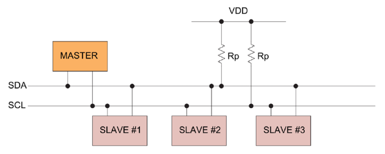

# Vestavěné systémy
- Otázky: mikrokontrolér, periferie, rozhraní, převodníky
- Předmět: IMP
- Zdroj: http://szz.g6.cz/doku.php?id=temata:05-vestavene_systemy:main

## Vestavěný systémy
Vestavěný systém je kombinace HW a SW, jejímž smyslem je řídit nějaký externí proces nebo systém. Vestavěný systém má po celou dobu své existence jeden program, který má aplikačně specifickou funkci. Uživatel obvykle ani neví, že je v něm počítač. Většinou není žádná interakce s člověkem, pouze s prostředím. Je dán důraz na reaktivnost (odezva v reálném čase), autonomii (funguje bez zásahu člověka) a kritičnost (bezpečně vykonává svoji funkci).

Vestavěné systémy se skládají z mikrokontroléru (počítač, MCU) a periferií. MCU obsahuje procesor, paměť, řadič a různé sběrnice. Periferie zajišťují různé specifické funkce, jako: časovač, čítač, watchdog, FPGA, GPIO (vstupy/výstupy), převodníky, ...

### Mikrokontroléry
Mikrokontroléry se dělí podle architektury:
- RISC / CISC
    - CISC (Complex Instruction Set Computer) - specializované instrukce pro různé operace s pamětí.
    - RISC (Reduced Instruction Set Computer) - menší množství instrukcí, pro práci s pamětí pouze LOAD a STORE.
- von Neumanovská architektury / Hardvardská architektura
    - Von Neumanovská architektura má společnou paměť pro program i data.
    - Hardvardská architektura má oddělené paměti pro program a data

Mikrokontrolér může běžet v různých režimech činnosti, které mají různou spotřebu:
- __Run__ - plný běh procesoru
- __Active background__ - ladění aplikace, bootloader
- __Wait__ - CPU přepnutý do nízkopříkonového režimu, ukončuje se při přerušení
- __Stop__ - Zastavení CPU
- __Stop 3__ - Omezení spotřeby vnitřních obvodů a rychlé probuzení, hlavní paměť a registry jsou napájené
- __Stop 2__ - Odpojení napájení vnitřních obvodů, registry nejsou napájené

Standardní programová smyčka je následující:
- Pokud je volán podprogram, je předáno řízení hlavnímu programu až po provedení celého podprogramu.
- Při přerušení je podprogram volán instrukcí a program obsluhy přerušení je zase vyvolán hardwarove. Přerušení probíhá nesynchronizovaně, nelze určit, kfy se předá řízení.
- Průběh obsluhy přerušení:
    1. Detekce přerušení - po detekci požadavku na přerušení CPU dokončí vykonávanou instrukci.
    2. Uložení kontextu CPU na zásobník.
    3. Zakázání přerušení, což zabraňuje opakovanému obsluhování přerušení.
    4. Výběr vektoru přerušení, který obsahuje adresu programu obsluhy tohoto přerušení. Vybírá se přerušení s nejvyšší prioritou.
    5. Uložení hodnoty vektoru do PC a zahájení obsluhy.

## Komunikační rozhraní
Komunikační rozhraní umožňují MCU komunikovat s jinými zařízeními nebo rozhraními. Jsou dva typy komunikačních rozhraní: __sériové__ a __paralelní__. Sériové komunikační rozhraní se dělí na: __asynchroní__ (UART) a __synchroní__ (SPI, I2C).

### UART
Asynchronní komunikační rozhraní (nepřenáší se hodinoví signál). Umožňuje _simplex_ komunikaci (jednosměrná komunikace). Komunikace probíhá následovně: Vysílač vysílá klidovou hodnotu (log. 1). Pro začátek komunikace slouží přechod do log. 0 - __start bit__. Dále se posílají datové bity. Za poslední datovým bitem (případně _paritním bitem_) se vyšle alespoň jeden (nebo dva) __stop bit__, který má hodnotu klidového stavu.

### SPI
Synchronní komunikační rozhraní (přenáší se hodinoví signál). Umožňuje _full-duplex_ komunikace (obousměrná komunikace zároveň). Rozlišují se zařízení _Master_, který generuje hodinový signál, a _Slave_. Mezi zařízení jsou vodiče MOSI (Master Out Slave In), MISO (Master In Slave Out), SPSCK (hodiny) a SS_x (Slave Select, povolovací vstup).

### IIC
Synchronní komunikační rozhraní, které umožňuje _half-duplex_ komunikaci (obousměrná komunikace). Rozlišují se zařízení _Master_, který generuje hodinový signál, a _Slave_. Mezi zařízeními jsou vodiče SDA (datový signál) a SCL (hodinový signál). V zapojení se využívá pull-up rezistory. V klidovém stavu je SDA v log. 1. Pro začátek komunikace se SDA uvede do log. 0, když je SCL v log. 1. Následně se mohou posílat data, když SCL v log. 0. Pro ukončení komunikace se SDA uvede do log. 1, když je SCL v log. 1.

Na SDA je možné provádět i adresaci připojených zařízení. Výběr _slave_ probíhá v odeslání 8 bitů v první (adresovém) rámci, které jsou interpretovány jako adresa.

### GPIO
GPIO jsou piny mikrokontroléru. Mikrokontroléry mají velké množství pinů, které se agregují do portu (PORTA, PORTB, ...). Pin může být buď vstupní nebo výstupní, což lze ovládat pomocí registru (PORTx_PDDR).

## Převodníky
Analogově-digitální převodní (ADC) umožňuje převádět analogový signál na digitální hodnotu. ADC konvertuje vstupní napětí na nějaké určité číslo. ADC má několik vstupů: V_refh (referenční vysoké napětí), V_refl (referenční nízké napětí), a V (vstupní napětí). ADC vrací x-bitovou hodnotu (podle typu převodníku), která vyjadřuje relativní hodnotu vstupního napětí mezi referenčními napětími (neboli V_refh = max, V_refl = min). ADC obvykle využívá napěťový dělič, pro postupnou aproximaci výsledné hodnoty.

AD převodník využívá aproximační model. V něm se začíná od MSB a postupně se generují nižší bity. Převod AD převodníku tak trvá určitou dobu:
- Zahájení - nastavení konfigurace převodníku.
- Vykonávání - aproximace.
- Ukončení - Uložení výsledku do registru nebo násilné přerušení.

## Časovače a čítače
Čítač je speciální registr, který kromě funkcí čtení a zápis umožňuje také zvýšit nebo snížit svoji hodnotu o jedna. Používá se pro čítání událostí. Časovač je speciální druh čítače, který je inkrementován hodinovým signálem mikropočítače. Jeho učel je měřit čas.
