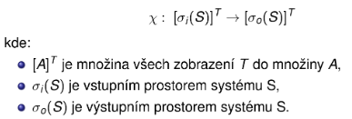

# Principy modelování a simulace systémů
- Otázky: systémy, modely, simulace, algoritmy řízení simulace
- Předmět: IMS

## Systém 
- Soubor elementárních částí (prvků systémů), které mají mezi sebou určité vazby.
- **Reálné systémy**
- **Nereálné systémy** - Fiktivní, ještě neexistující.

Formálně je to dvojice 

\(\Large S = (U, R)\)

kde:
- \(U = \{u1, u2, …, un\}\) - Univerzum je konečná množina prvků systému.
    - \(u = (X, Y)\)
        - kde:
            - \(X\) je množina všech vstupních proměnných.
            - \(Y\) je množina všech výstupních proměnných.
- \(R\) - Množina všech propojení (relací)
    - \(\large R = \bigcup\limits_{i,j = 1}^N R_{ij}\)
      - kde:
        - \(\large R_{ij} \subseteq Y_i \times X_j\) (Propojení prvku ui s uj)

Vazba mezi prvky může být sériová, paralelní a nebo zpětná.

## Model 
- Napodobenina systému jiným systémem. 
- Reprezentace znalostí. 
- Existují fyzikální modely, matematické modely… 
- Přírodní zákony jsou matematické modely (U = R*I).
## Modelování 
- Vytváření modelů systému. 
- Modelovat lze jen to co známe a umíme popsat.

## Simulace 
- Získávání nových znalostí o systému experimentováním s jeho modelem. 
- Výhody simulačních metod jsou například cena, rychlost, bezpečnost, někdy jediný způsob (srážky galaxií). 
- Problémy jsou ale kontrola validity (nemusí být validní a nepoznáme to), náročnost na vytváření a výkon, nepřesnost numerického měření, problémy stability numerických metod…
- Postup 
    - Opakované řešení modelu. 
    - Opakuje se dokud nezískáme dostatek informací o chování nebo dokud nenajdeme parametry pro které má systém žádané chování.
    1. Nastavení hodnot parametrů a počátečního stavu modelu.
    2. Zadání vstupních podnětů z okolí při simulaci.
    3. Vyhodnocení výstupních dat (informace o chování systému). 

## Základní etapy modelování a simulace
1. Vytvoření **abstraktního modelu** - Zjednodušený popis zkoumaného systému.
2. Vytvoření **simulačního modelu** - Zápis abstraktního modelu formou programu.
3. **Verifikace a validace** - Ověřování správnosti modelu.
4. **Simulace** - Experimentování se simulačním modelem.
5. Analýza a interpretace výsledků - Získání nových znalostí o zkoumaném systému.

## Analytické řešení modelů 
- Popis chování modelu matematickými vztahy a jeho matematické řešení. 
- Vhodné pro jednoduché systémy nebo zjednodušený popis složitých. 
- Dosazením korektních hodnot získáme řešení (např. model volného pádu ve vakuu).

## Čas
- Reálný - Ve kterém probíhá skutečný děj.
- Modelový - Časová osa modelu (nemusí být synchronní s reálným).
- Strojový - Čas CPU spotřebovaný na výpočtu programu.

### Časová množina 
- Množina všech časových okamžiků, ve kterých jsou definovány hodnoty vstupních, stavových a výstupních proměnných prvků systému
- **Diskrétní** - {1,2,3,4,5}.
- **Spojitá** - <1.0, 5.0>. Tato se na počítači diskretizuje.

## Chování systémů 
- Každému časovému průběhu vstupních proměnných přiřazuje časový průběh výstupních proměnných. 
- Je dáno vzájemnými interakcemi mezi prvky. 
- Jedná se o zobrazení:

## Ekvivalence chování systémů 
- Pokud stejné podněty u obou vyvolají stejné reakce, tak mají ekvivalentní chování.

## Izomorfní systémy 
- Systémy \(S1 = (U1, R1)\) a \(S2 = (U2, R2)\) jsou izomorfní pokud:
1. Prvky \(U1\) lze vzájemně jednoznačně přiřadit \(U2\) (bijektivní zobrazení 1:1).
2. Prvky \(R1\) lze bijektivně zobrazit na \(R2\) se stejně orientovanými vztahy na prvky univerz.

## Homomorfní systémy
- Je základním principem modelování.
- Platí:
1. Prvkům \(U1\) je možno přiřadit jednoznačně prvky \(U2\) (N:1).
2. Prvkům \(R1\) je možno jednoznačně přiřadit prvky \(R2\) se stejně orientovanými vztahy s univerzy.

## Klasifikace systémů
- **Spojité** - Všechny prvky mají spojité chování.
- **Diskrétní** - Všechny prvky mají diskrétní chování.
- **Kombinované** - Obsahuje spojité i diskrétní prvky.
- **Deterministické** - Všechny prvky jsou deterministické.
- **Nedeterministické** - Alespoň jeden prvek s nedeterministickým chováním.

## Typy simulace
- Podle popisu modelu:
    - Spojitá / diskrétní / kombinovaná
    - Kvalitativní / kvantitativní 
- Podle simulátoru:
    - Na analogovém / číslicovém počítači, fyzikální
    - Real-Time simulace
    - Paralelní a distribuovaná simulace

## Verifikace modelu 
- Ověřujeme korespondenci abstraktního a simulačního modelu, tj. izomorfní vztah mezi AM a SM. 
- Předchází vlastní etapě simulace. 

## Validace modelu 
- Snažíme se dokázat, že skutečně pracujeme s modelem adekvátním modelovanému systému. 
- Velmi obtížné a nelze absolutně dokázat.

# Klasifikace modelů

## Konceptuální 
- Jejich komponenty nebyly (zatím) přesně popsány ve smyslu teorie systémů. 
- Obvykle se používají v počáteční fázi modelování pro ujasnění souvislostí a komunikaci v týmu. 
- Mají formu textu nebo obrázku.

## Deklarativní 
- Popis přechodů mezi stavy systému. 
- Model je definován stavy a událostmi, které způsobí přechod z jednoho do druhého za jistých podmínek. 
- Vhodné především pro diskrétní modely. 
- Obvykle zapouzdřeny do objektů (konečné automaty, petriho sítě…).

## Funkcionální 
- Grafy zobrazující funkce a proměnné. 
- Buď je uzel grafu proměnná nebo funkce (Queuing systems, bloková schémata, systémová dynamika).

## Popsané rovnicemi (constraint) 
- Rovnice (algebraické, diferenciální…), neorientované grafy.

## Prostorové (spatial) 
- Rozdělují systém na prostorově menší ohraničené podsystémy (celulární automaty, L-systémy, N-body problém).
- př.: game of life

## Multimodely 
- Je složen z modelů různého typu, které jsou obvykle heterogenní (spojité + diskrétní, spojité + fuzzy, HLA).

---------------------------

## Náhodné proměnné 
- Veličina, která jako výsledek pokusů může nabýt nějakou proměnnou, přičemž předem nevíme jakou. 
- Lze je zadat distribuční funkcí nebo rozdělením pravděpodobností.
- **Diskrétní** - Konečně nebo spočetně mnoho různých hodnot.
- **Spojité** - Hodnoty spojitě vyplňují určitý interval.

## Metoda Monte Carlo 
- Experimentální numerická (simulační) metoda. 
- Řeší úlohu experimentování se stochastickým modelem. 
- Využívá vzájemného vztahu mezi hledanými veličinami a pravděpodobností, se kterými nastanou jevy. 
- Vyžaduje generování náhodných čísel. 
- Není příliš přesná. 
- Vhodné, když jsou běžné numerické metody nepraktické. 
- Jednoduchá implementace (existuje více variant).
1. Vytvoříme stochastický model.
2. Provádíme náhodné experimenty.
3. Získanou pravděpodobnost nebo průměr použijeme pro výpočet výsledku.

- Přesnost (N je počet provedených experimentů):

    \(\LARGE err = \frac{1}{\sqrt{N}}\) 

## Proces 
- V diskrétním modelu je proces posloupnost událostí.
- **Paralelní procesy** - Současně prováděné procesy.
- **Kvaziparalelismus** - Provádění paralelních procesů na jednoprocesorovém počítači.

# Petriho sítě 
- Mohou modelovat paralelismus procesů, komunikaci a synchronizaci procesů, nedeterminismum
- Definice P/T Petriho sítě:

\(\Sigma = (P, T, F, W, C, M_0)\)
  - kde:
    - \(P\) je množina míst (stavy).
    - \(T\) je množina přechodů, \(P \cap T = \empty\)
    - Incidenční relace \(F \subseteq (P \times T) \cup (T \times P)\)
    - Váhová funkce \(W: F \rightarrow \{1, 2, \ldots\}\)
    - Kapacity míst \(C: P \rightarrow N\)
    - Počáteční značení \(M_0: P \rightarrow N\)

## Proveditelnost přechodu v petriho síti 
- Je proveditelný pokud ve vstupních místech čeká dostatek procesů a současně výstupní místa mají dostatečnou kapacitu.

## Systémy hromadné obsluhy (SHO) - (Queueing systems) 
- Systémy obsahující zařízení (s frontami), která poskytují obsluhu transakcím. 
- Typicky obsahují transakce (procesy) a popis jejich přechodů, obslužné linky a opis obsluhy a fronty různých typů, ve kterých transakce čekají. 
- Při simulaci sledujeme informace o čase stráveném transakcí v systému, doby čekání ve frontách, vytížení obslužných linek. 
- Cílem je odhalit různá zdržení, optimalizovat výkon…

### Modelování SHO 
- Popisujem procesy (příchod, činnost, odchod), stav obslužných linek a frontu u zařízení a průběh obsluhy transakcí v zařízení.
- Nejčastěji se popisuje Petriho sítěmi
 

### Fronty čekajících požadavků 
- Vytvoří se, když požadavek chce být obsloužen již obsazeným zařízením. 
- Fronty charakterizuje řazení požadavků ve frontě (FIFO, LIFO…), způsob výběru požadavků z fronty a největší možná jejich délka. 
- **Frontové řady** - FIFO, LIFO, SIRO (Service in random order).
- **Nulová fronta** - Požadavek nemůže vstoupit do fronty.
- **Fronta konečná** - Omezení kapacity fronty.
- **Fronta s netrpělivými požadavky** - Netrpělivý požadavek opouští systém, překročí-li doba čekání určitou mez (time-out).
- Fronty mohou být také prioritní.

### Prioritní obsluha
- Započatá obsluha se normálně ukončí (slabá priorita).
- Obsluha se přeruší, začne obsluha prioritního požadavku a přerušený požadavek buď odchází ze systému neobsloužen nebo se vrací do fronty a je poté obsluhován buď od místa přerušení nebo od začátku.
- Jsou-li všechny linky obsazené a u každé je fronta, požadavek se sám rozhodne, do které se zařadí.
- Vytvářejí-li požadavky jednu společnou frontu, požadavek vstupuje do té linky, která se uvolní nejdříve.

### Kendallova klasifikace SHO 
- Má tvar:
    - \(X/Y/c\), kde:
        - \(X\) - typ stochastického procesu popisující příchod požadavků k obsluze.
        - \(Y\) - zákon rozložení délky obsluhy.
        - \(c\) - počet dostupných obslužných linek. -přirozené číslo včetně nekonečna.
- Například M/M/1.
- \(X, Y\) = velká písmena dle následující tabulky.

# Celulární automaty 
- Diskrétní systém. 
- Je možné implementovat jako pole, vyhledávací tabulku (nenulové buňky), pomocí SIMD… 
- Existují také reverzibilní automaty, u kterých je možné se vracet nazpět v simulaci.
## Buňka (cell)
- základní element
- má svůj vnitřní stav
  - např.: může být v jednom z konečného počtu stavů ({0,1}).
## Pole buněk (lattice)
- N-rozměrné (obvykle 1D nebo 2D). 
- Rovnoměrné rozdělení prostoru, může být konečné nebo nekonečné.
## Okolí (neighbourhood)
- Typy se liší počtem a pozicí okolních buněk.

  

# Metoda snižování řádu derivace
1. Osamostatnit nejvyšší řád derivace.
2. Zapojit všechny integrátory za sebe a na vstupu prvního zapojit (modifikovaný - násobení, přičítání) výsledek
- Tato metoda funguje, pokud nejsou derivované vstupy derivace vstupů (x’, x’’, …).

# Metoda postupné integrace
1. Osamostatnit nejvyšší řád derivace.
2. Postupná integrace rovnice a zavádění nových stavových podmínek.
3. Výpočet nových počátečních podmínek.
- Podmínka: konstantní koeficienty.

## Pravidla (Rules)
- Funkce stavu buňky a jejího okolí definující nový stav buňky v čase: 
  \(s(t + 1) = f(s(t), N_s(t))\).
- Lze je rozdělit do 4 tříd:
  - Třída 1 - Po konečném počtu kroků dosáhnou jednoho ustáleného konkrétního stavu.
  - Třída 2 - Dosáhnou periodického opakování nebo zůstanou stabilní.
  - Třída 3 - Chaotické chování (fraktální útvary).
  - Třída 4 - Kombinace běžného a chaotického chování (např. life) - nejsou reverzibilní.

# Algoritmy řízení simulace

## Next event (řízení diskrétní simulace)
1. Inicializace času, kalendáře, modelu.
2. Dokud není kalendář prázdný, vyjmi první záznam z kalendáře (záznamy jsou seřazeny)
3. Pokud aktivační čas události přesáhl čas konce simulace, ukonči simulaci. 
4. Nastav čas na aktivační čas události.
5. Proveď chování, které popisuje událost a vrať se na bod 2.

## Kalendář událostí 
- Uspořádaná datová struktura uchovávající aktivační záznamy budoucích událostí. 
- Každá naplánovaná událost má v kalendáři záznam, minimálně tvořený:
  - aktivační čas
  - priorita
  - vykonávaná událost
- Kalendář umožňuje výběr prvního záznamu s nejmenším aktivačním časem a vkládání/rušení záznamu.

## Řízení spojité simulace
### Spojitá simulace je složena ze tří částí:
- metoda/funkce **Dynamic**, ve které dochází k **aktualizaci vstupů integrátorů**
- **numerická metoda** (Euler, RK) ve které se **pro každý integrátor počítají nové stavy**
- **hlavní cyklus**, který řídí simulaci (volá předchozí metody), **inkrementuje** čas dle **kroku** a sleduje, jestli nebylo dosaženo konce simulace a případně provádí **dokročení**.

### Dokročení 
- může být řešeno dvěma způsoby:
    - pokud do konce simulace zbývá **menší časový okamžik**, než je nastavený krok, lze poslední **krok snížit** tak, aby čas po jeho provedení přesně odpovídal konci simulace. (příliš malý krok může způsobit nepřesnost)
    - pokud do konce simulace **zbývá krok a kousek**, můžeme poslední **krok prodloužit** tak, aby čas po jeho provedení přesně odpovídal konci simulace. 

**Příklad řízení spojité simulace bez dokročení:**

## Řízení kombinované simulace
- U kombinované simulace je nutné řešit kombinaci **stavových událostí a numerické integrace**. 
- Je nutné detekovat **změnu stavových podmínek** a **přesně dokročit** na čas, kdy ke změně dochází (problém příliš malého kroku). 
- Ke **stavovým událostem** dochází při **změnách stavových podmínek**, nelze je naplánovat. 
- Změnu stavové podmínky může být **obtížné detekovat** z důvodu **nepřesnosti numerického výpočtu** nebo příliš **dlouhého kroku**.

### Algoritmus řízení kombinované simulace pracuje následovně:
1. **Inicializace** stavu, času, modelu atd.
2. **Kontrola**, že není dosažen **čas konce simulace** a její případné ukončení.
3. **Uložení** aktuálního stavu a času.
4. **Provedení jednoho kroku** numerické integrace.
5. **Kontrola**, jestli nedošlo ke **změně stavových podmínek**. Pokud ne, pokračuje se bodem 2, jinak bod 6.
6. Hledání okamžiku **změny stavové podmínky** (využití uložených hodnot v kroce 3) 
   - např. metodou půlení intervalů. 
     - Okamžik se hledá s přesností minimálního kroku (menší krok by vedl na nepřesnost, stejně jako na nepřesnost vede nepřesné určení času změny stavové podmínky)

**Pseudokod kombinovane simulace**

## Řízení simulace číslicových obvodů
- Tato simulace je řízená událostmi a ukládání velkého množství událostí do kalendáře je nepraktické/problematické. P
- oužívá se proto princip selektivního sledování, kdy dochází k vyhodnocování pouze těch prvků, na které má vliv změna na vstupu. 
- Používá se např. pevný krok pro změnu času. Problematické mohou být zpětné vazby v obvodech a nastavení počátečních hodnot signálů.
### Princip algoritmu:
1. **Inicializace** modelu, plánování, …
2. Dokud je naplánovaná událost, tak pokračuj s dalším bodem, jinak konec simulace.
3. **Nastav hodnotu modelového času** na \(T\) (pevným krokem, na základě právní naplánované události, …)
4. **Pro všechny události**, které jsou naplánované na tento čas \(T\) **proveď**:
   1. odeber událost z plánovaných události (kalendáře),
   2. aktualizuj hodnoty signálů,
   3. všechny připojené prvky na tyto signály zařaď do množiny \(M\).
5. **Projdi všechny prvky** v množině \(M\) a jestli změna na jeho vstupu způsobí **změnu jeho výstupu, naplánuj** jeho obsluhu jako novou událost.
6. Pokračuj bodem 2.

**Pseudokód:**

