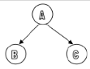

# Datové a řídicí struktury imperativních programovacích jazyků
- Otázky:
- Předmět: IAL
- prezentace:
  - [Lineární abstraktní datové typy, seznamy](https://wis.fit.vutbr.cz/FIT/st/cfs.php.cs?file=%2Fcourse%2FIAL-IT%2Flectures%2FPred-02_2021_final.pdf&cid=13948)
  - [Zásobník, fronta, vyhledávací tabulka, vícerozměrná pole](https://wis.fit.vutbr.cz/FIT/st/cfs.php.cs?file=%2Fcourse%2FIAL-IT%2Flectures%2FPred-03_2021_final.pdf&cid=13948)
  - [Stromové datové struktury, vyhledávací tabulky I](https://wis.fit.vutbr.cz/FIT/st/cfs.php.cs?file=%2Fcourse%2FIAL-IT%2Flectures%2FPred-04_2021_final.pdf&cid=13948)
  
## Datový typ 
- Určuje množinu hodnot a množinu operací nad těmito hodnotami. 
- Typ proměnné se zavádí v její deklaraci. 
- Je určen:
    - Názvem
    - Množinou hodnot, kterých může nabývat
    - Množinou operací nad hodnotami

## Operace
- Ekvivalence
- Přiřazení
- Transformační operátory - Přetypování.
- Konstruktory - Vytváření strukturovaných datových typů z komponent.
- Selektory - Získání hodnoty komponenty struktury.

## Typ výrazu - Určen použitými operátory a operandy.
## Ordinální datový typ 
- Prvky daného typu mají jasně stanovené pořadí.
- Každý prvek má předchůdce a následovníka (např. integer).
- Jejich hodnoty je možné uspořádat (mají dané pořadí)

## Strukturovaný datový typ 
- Sestává z komponent jiného (dřív definovaného) typu = kompoziční typ. 
- Má strukturovanou hodnotu a musí mít definované hodnoty všech komponent.
- **Homogenní** - Všechny komponenty (položky) jsou stejného typu (pole).
- **Heterogenní** - Komponenty (složky) jsou rozdílného typu (struct).
- **Statický** - Nemůže měnit v průběhu výpočtu počet komponent ani způsob uspořádání.
- **Dynamický** - Může měnit počet i uspořádání.

## Pole 
- Homogenní ortogonální (pravoúhlý) datový typ. 
- Typ je specifikovaný velikostí svých dimenzí a komponentním typem. 
- K prvkům se přistupuje pomocí identifikátoru pole a indexu prvku.
    - Vektor - Jednorozměrné pole.
    - Matice - Dvourozměrné pole.
## Řetězec 
- Strukturovaný homogenní datový typ. 
- Položky mají typ znak (char). 
- Má vlastnosti (a často je tak i implementován) jako jednorozměrné pole znaků.

## Záznam (record/struct) 
- Strukturovaný statický heterogenní datový typ. 
- Komponenty mohou být libovolného datového typu. 
- Jména a počet komponent je dán při definici typu a nemohou se měnit za běhu programu. 

# Abstraktní datové typy
Abstraktní datové typy jsou uživatelsky definované datové typy, které využívají vestavěných datových typů daného jazyka. Většinou se používají pro implementaci nějakého složitějšího objektu/struktury. Uživateli zpřístupňují pouze funkce implementující práci s tímto datovým typem, vnitřní struktura abstraktního datového typu je skryta a uživatel by s ní neměl pracovat.

- Datový typ je __lineární__, když každý prvek až na první a poslední má právě jednoho předchůdce a právě jednoho následovníka.

## Seznam 
- Homogenní lineární dynamická struktura. 
- Prvkem seznamu může být jakýkoliv typ (také strukturovaný). 
- Seznam může být prázdný.

### Ekvivalence 
- Když jsou oba seznamy prázdné a nebo když se rovnají jejích první prvky a také jejich zbytky (rekurzivní definice)

### Druhy
- Jednosměrný - Prvek ukazuje na svého následovníka.
    
    

- Dvousměrný - Prvek ukazuje na svého následovníka a předchůdce.
 
    

- Kruhový jednosměrný - Jednosměrný, kde poslední prvek má za následovníka první prvek

    

- Kruhový dvousměrný - Dvousměrný, kde poslední prvek má za následovníka první prvek a první prvek má za předchůdce poslední prvek.

### Operace nad seznamem

Pozn.: tohle je z dokumentu, vím, že tohle je z přednášek, ale bral bych to jako příklady - základní operace bych bral - inicializace, vložení, nalezení, smazání prvku a zrušení seznamu, zbytek podle implementace

- Init - Inicializace - Vytvoření prázdného seznamu prvků daného typu.
- InsertFirst - Vlož prvek na začátek seznamu. Může vložit prvek do prázdného seznamu.
- CopyFirst - Vrátí hodnotu prvního prvku.
- DeleteFirst - Odstraní první prvek.
- First - Aktivuje první prvek.
- Succ - Aktivuje následníka aktivního prvku.
- Copy - Vrátí hodnotu aktivního prvku.
- Actualize - Změní hodnotu aktivního prvku.
- PostInsert - Vloží nový prvek za aktivní.
- PostDelete - Zruší prvek za aktivním.
- Active - True pokud je nějaký prvek aktivní.
- Empty - True pokud je prázdný - Toto se však dá poznat tím, že hlavička neukazuje na prvek.

## Zásobník 
- Homogenní lineární dynamická struktura typu LIFO (Last in - First out). 
- Využívá se pro reverzaci pořadí (LR gramatiky), konstrukci rekurzivních programů (bez rekurze).

### Operace nad zásobníkem
- Init - Vytvoří prázdný zásobník.
- Push - Vloží prvek na vrchol zásobníku.
- Pop - Výjme prvek z vrcholu zásobníku.
- Top - Přečte hodnotu z vrcholu zásobníku.
- Empty - True pokud je prázdný.

## Binární strom 
- Homogenní dynamická struktura. 
- Binární strom je buď prázdný nebo se sestává z jednoho uzlu zvaného kořen a dvou podstromů (levého a pravého) a oba podstromy mají vlastnost binárního stromu (rekurzivní definice).

### Váhově vyvážený 
- Pokud pro všechny jeho uzly platí, že počty uzlů jejich levého podstromu a pravého podstromu se rovnají nebo se liší právě o jedna

### Absolutně váhově vyvážený strom 
- Strom jehož počet uzlů je \(2^n - 1\), pro n > 0 a jehož výška je právě n.

### Výškově vyvážený 
- Když pro všechny jeho uzly platí, že výška levého podstromu se rovná výšce pravého podstromu nebo se liší právě o 1.

### Průchody stromem
Průchody podle tohoto schématu:

- **Preorder** - Výsledek: A, B, C. 

    

- **Inorder** - Výsledek: B, A, C

    

- **Postorder** - Výsledek: B, C, A.

    

- **InvPreOrder** - Výsledek: A, C, B. Inverzní PreOrder.
- **InvInOrder** - Výsledek: C, A, B. Inverzní InOrder.
- **InvPostOrder** - Výsledek: C, B, A. Inverzní PostOrder.

# Řídící struktury
- Sekvence - Příkazy, výrazy…
- Selekce - Větvení (if, switch)...
- Iterace - Cyklus (for, while, repeat, do while, goto)...
 

## Funkce 
- Umožňují rozložení složitého problému na jednodušší podproblémy. 
- Deklarace funkce se skládá z návratového typu, názvu funkce a seznamu parametrů. 
- Deklaraci je často možné vynechat a funkci přímo definovat. 

## Složený příkaz (blok) 
- Posloupnost libovolných příkazů (včetně dalších bloků). 
- Často se syntakticky odlišuje ({} v C, begin end. v Pascalu, odsazení v Python). 
- Proměnné zde definované mají často platnost pouze v tomto bloku.

## Výraz/příkaz 
- Například aritmetický výraz, prostý výskyt konstanty či proměnné, funkční volání, přiřazení… 
- Výrazový příkaz se získá ukončením výrazu patřičným symbolem (; např.). 
- Zvláštním případem je prázdný příkaz.

## Podmíněný příkaz if 
- Podmínka ma pravdivostní hodnotu (true/false), v případě nepravdy je vykonávána else větev (existuje-li).

## Podmíněný příkaz switch 
- Slouží k větvení podle hodnoty celočíselného výrazu.
## Cykly 
- Několikanásobné opakování kódu.
- Nekonečné cykly je možné ukončit příkazem break. 
- Přeskočení nynější iterace je možné příkazem continue.
- **While** - Vhodné například pro předem neznámý počet provádění. Vyhodnocuje se poprvé podmínka, tedy tělo nemusí být vykonáno.
- **Do while** (repeat until) - Tělo je provedeno alespoň jednou.
- **For** - Tělo se provede přesně stanovený počet krát.
- **Goto** - Větvení. Skočí v kódu na návěstí. Skákat lze pouze lokálně (tedy nelze skočit pryč z funkce - na to je např. longjump v C - to je nebezpečné narozdíl od goto).
