# Vyhledávání a řazení
- Otázky:
- Předmět: IAL
- preyentace:
  - [Řazení I](https://wis.fit.vutbr.cz/FIT/st/cfs.php.cs?file%3D%2Fcourse%2FIAL-IT%2Flectures%2FPred-07_2021_final.pdf%26cid%3D13948)
  - [Řazení II](https://wis.fit.vutbr.cz/FIT/st/cfs.php.cs?file%3D%2Fcourse%2FIAL-IT%2Flectures%2FPred-08_2021_final.pdf%26cid%3D13948)

# Vyhledávání

## Pojmy
### Přístupová doba 
- Doba potřebná k vyhledání položky s hledaným klíčem. 
- Označují se doby minimálního úspěšného a neúspěšného vyhledání, maximální doba úspěšného a neúspěšného vyhledání, průměrná doba úspěšného a neúspěšného vyhledání.

### Klíč 
- Může být jednoduchý nebo strukturovaný. 
- Priority složek strukturovaného klíče určují váhu jednotlivých položek. 
- Pro ekvivalenci 2 strukturovaných klíčů musí být ekvivalentní všechny složky klíče. 
- Pro relaci uspořádání se postupně porovnávají odpovídající si složky klíče se snižující se prioritou.

### Zaslepení 
- Zrušení hodnoty tak, že se klíč přepíše takovou hodnotou co nebude nikdy hledána.
## Sekvenční Vyhledávání
- Nejrychleji jsou nalezeny položky na počátku. 
- Jednoduchá implementace

### Vlastnosti
- Minimální čas úspěšného vyhledání = 1
- Maximální čas úspěšného vyhledání = N
- Průměrný čas úspěšného vyhledání = N/2
- Čas neúspěšného vyhledání = N

### Vyrianty

**Se zarážkou** 
- Na konci struktury je “zarážka”, což je hledaný klíč, tedy hodnota je vždy nalezena. 
- Toto přidává urychlení v tom, že není potřeba po každém porovnání klíčů testovat konec struktury, pouze se otestuje na konci vyhledávání jestli se nalezla zarážka nebo hledaná položka.

**V seřazeném poli** 
- Jakmile se narazí na hodnotu klíče, která je větší než hledaný klíč, vyhledávání se ukončuje jako neúspěšné. 
- Tato metoda se urychlí pouze pro neúspěšné hledání.

**S adaptivní rekonfigurací prvků pole podle četnosti přístupu** 
- Nejčastěji hledané položky jsou na začátku struktury (používá se k tomu počítadlo vyhledávání). 
- Druhou variantou je, že nalezená položka se prohodí se svým levým sousedem (není potřeba počítadlo).

## Nesekvenční Vyhledávání v poli
### Binární vyhledávání 
- Provádí se nad seřazenou množinou klíčů s náhodným přístupem (pole). 
- Metoda připomíná metodu půlení intervalů. 
- Složitost je při nejhorším logaritmická. 
- Pole půlíme a podle prostřední hodnoty prohledáváme levou nebo pravou část
### Dijkstrova varianta binárního vyhledávání 
- Vychází z předpokladu, že v poli může být více položek se shodným klíčem. 
- Hledá se tedy nejpravější nebo nejlevější klíč.

V poli [1, 1, 1, 1, 1, 1, 1, 1, 1, 1, 2] najde Dijkstrova varianta klíč K = 1 na 10. pozici

## Vyhledávání v binárním vyhledávacím stromu - BVS
- Podobné binárnímu vyhledávání v seřazeném poli. 
- Je-li vyhledaný klíč roven kořeni, vyhledávání končí úspěšně. 
- Je-li klíč menší než klíč kořene, pokračuje vyhledávání v levém podstromu, je-li větší, pokračuje v pravém. 
- Vyhledávání končí neúspěšně, je-li prohledávaný (pod)strom prázdný.

### BVS se zarážkou 
- Funguje podobně jako u pole.

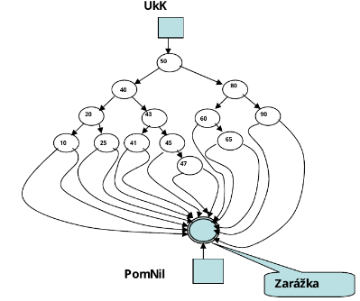

## Vyhledávání v tabulkách s rozptýlenými položkami (hash table) 
- Základem je princip tabulky s přímým přístupem. 
- Využívá se zde mapovací funkce, která jednoznačně mapuje klíče na sousední místa v paměti (políčka tabulky) a naopak - takováto tabulka je tabulka s přímým přístupem. 
- Časová složitost je tady pak v přímé tabulce 1. 
- Problém je, že je velmi obtížné najít vhodnou mapovací funkci, která by nevyžadovala velké množství místa (taková funkce, kde 2 klíče nevytvoří stejnou hodnotu - kolizi).

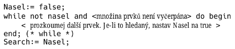

### Mapovací funkce 
- Transformuje klíč na index do primárního pole/tabulky. 
- Hodnota indexu musí být v rozsahu pole (toho je možné docílit pomocí mod). 
- Dobrá mapovací funkce by měla splňovat 2 požadavky:
    - Rychlé mapování
    - Vytváření co nejméně kolizí
- Jelikož se hashovací funkce mapuje více klíčů na jednu hodnotu je potřeba používat rozptylovací funkci, která když toto nastane, tak nalezne místo, kam hodnotu uložit. 
- Nebo je možné na jednom klíči mít více hodnot a poté je procházet lineárně.

# pozn. Datové sktuktury

## BVS - binární vyhledávací strom
- Uspořádaný binární strom pro jehož každý uzel platí, že klíče všech uzlů levého podstromu jsou menší než klíč v uzlu a klíče uzlů pravého podstromu jsou větší než v uzlu.
- Rekurzivní definice: 
  - BVS je buď prázdný nebo se sestává z kořene, hodnota jehož klíče je větší než hodnota všech klíčů levého binárního vyhledávacího podstromu a je menší než hodnota všech klíčů pravého binárního podstromu.
- **InOrder** průchod dává posloupnost prvků seřazenou podle velikosti klíče.
- 
### Uspořádaný strom 
- kořenový strom, pro jehož každý uzel platí, že n-tice kořenů podstomů uzlu je uspořádaná.

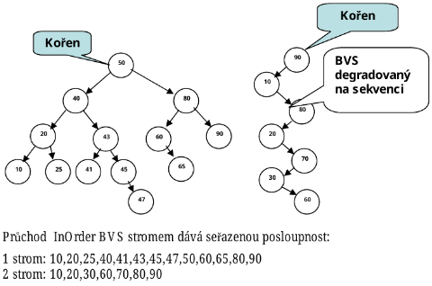

### BVS se zpětnými ukazateli 
- Má význam pouze tehdy, chceme-li se u InOrder průchodu vyhnout rekurzi nebo použití zásobníku.

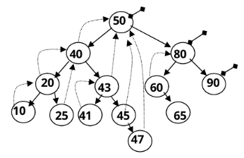

### AVL strom 
- Samovyvažující se BVS.

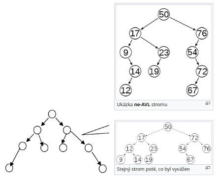

# Řazení

## Pojmy

### Třídění (sorting)
 - Rozdělování položek homogenní datové struktury do skupin se shodnými vlastnostmi.
### Řazení (ordering)
 - Uspořádání položek lineární homogenní datové struktury do sekvence podle relace uspořádání nad zadanou vlastností (klíčem) položek.
### Setřídění (merging)
 - Sloučení 2 nebo více seřazených lineárních homogenních datových struktur do jedné seřazené lineární homogenní datové struktury.
### Sekvenční řadící algoritmus 
- Přistupuje k řazeným položkám sekvenčně.
### Nesekvenční řadící algoritmus 
- Umožňuje náhodný přístup k položkám struktury.
### Stabilní řazení 
- Zachovává pořadí položek stejné hodnoty.
### Řazení bez přesunu položek 
- Využije se pomocné pole (pořadník) a inicializuje se hodnotami shodnými s indexem. 
- Výsledkem je pak pole se seřazenými indexy prvků řazeného pole.

    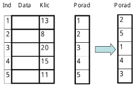

### Klasifikace metod řazení
- Podle přístupu k paměti 
    - Vnitřní řazení (řazení polí)
    - Vnější řazení (soubory a seznamy)
- Podle procesoru
    - Seriové
    - Paralelní

### Přirozenost 
-  Přirozený algoritmus rychleji zpracuje již částečně seřazenou posloupnost, zatímco u algoritmu, který přirozený není, tento fakt nehraje žádnou roli.

## Select Sort 
- **Nestabilní**
- **Kvadratická složitost**
- (řazení na principu výběru) Nejjednodušší a nejpřirozenější způsob. 
- Hledá se nejmenší prvek z neseřazené části a připojí se na konec seřazené části.

[Video](https://www.youtube.com/watch?v%3Dg-PGLbMth_g)

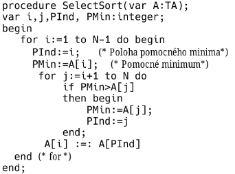

## Bubble sort 
- **Stabilní a přirozený**
- **Má kvadratickou složitost**
- Porovnávají se dvojice sousedních prvků a v případě obráceného uspořádání se prohodí.
- Nejméně efektivní metoda, nejvíce používaná, ale je nejrychlejší pokud je pole již seřazené.

[Video](https://www.youtube.com/watch?v%3Dxli_FI7CuzA%26t%3D64s)

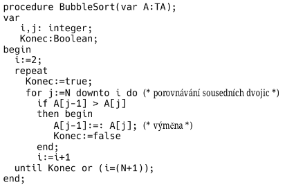

## Bubble-insert sort
- **Stabilní – vhodná pro vícenásobné řazení podle více klíčů.**
- **Přirozená, in situ(vše provádí v poli).**
- **Má kvadratickou časovou složitost.**
- Metoda bublinového vkládání  Kombinuje vyhledání místa pro vkládání i posun segmentu pole do jednoho cyklu: 
    - Postupným porovnáváním a výměnou dvojic prvků.

## Binary-insert sort
- **Stabilní**
- **Přirozená, in situ.**
- **Má kvadratickou časovou složitost.**
- Vkládání s binárním vyhledáváním.  
- Pro vložení prvku vyhledáváme místo v seřazení posloupnosti – lze využít binární vyhledávání.  
- V případě shodných klíčů musí metoda nalézt místo za nejpravějším ze shodných klíčů – varianta Dijkstrovy metody binárního vyhledávání

[Video](https://www.youtube.com/watch?v%3D-OVB5pOZJug)

## Heap sort - (Řazení hromadou) 
- **Linearitmická složitost.**
- **Nestabilní a nepřirozený.**
- Hromada (heap) je struktura stromového typu, pro niž platí, že mezi otcovským uzlem a všemi jeho synovskými uzly platí stejná relace uspořádání (např. otec je větší než všichni synové). 
- Nejčastější případ hromady je binární hromada, která je založená na binárním stromu, pro který navíc platí: 
    - Všechny hladiny kromě poslední jsou plně obsazené.
    - Poslední hladina je zaplněna zleva.

[Video](https://www.youtube.com/watch?v%3D2DmK_H7IdTo)

## Insert sort - (Řazení na principu vkládání) 
- **Stabilní**
- **kvadratická složitost**
- Postupně se berou prvky a ty se vkládají do seřazené části na vhodné místo.

[Video](https://www.youtube.com/watch?v%3DJU767SDMDvA)

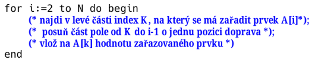

## Quick sort - (Řazení rozdělováním) 
- **Nestabilní a nepracuje přirozeně.**
- **Asymptotická složitost je linearitmická.**
- Patří mezi nejrychlejší metody řazení polí. 
- pricip "Rozděl a panuj"
- Funguje tak, že pole rozdělí na 2 části, kde levá část je menší než určitý prvek a pravá zase větší. 
- Toto se postupně aplikuje na všechny části, které jsou větší než 2 prvky.

[Video](https://www.youtube.com/watch?v%3DHoixgm4-P4M)

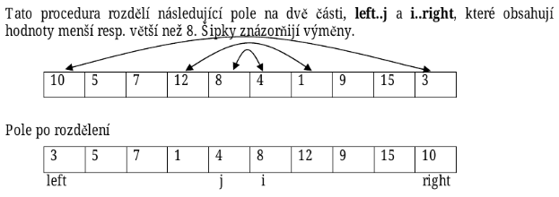

## Shell sort - (Řazení se snižujícím se přírůstkem) 
- **Nestabilní**
- **Časová složitost -- závisí na volbě kroků**
  - \(n^{\frac{3}{2}} \quad až\quad n*\log^2n\)
- **pracuje in situ**
- Pracuje na principu bubble sortu.
- třídí prvky se zmenšujícím se krokem

[Video](https://www.youtube.com/watch?v%3DddeLSDsYVp8)

.png)

## Merge sort - Řazení setřiďováním
- Asymptotická časová složitost je \(TM(n) \simeq (28*n + 22)log_2(n)\)
- princip "rozděl a panuj"
- rozdělíme pole na 2 části, každou setřídíme (rekurzvně stejně)
- spojíme setřízené části do 1 setřízené

[Video](https://www.youtube.com/watch?v%3D4VqmGXwpLqc)
## Radix sort - (Řazení tříděním podle základu) 
- Principiálně pracuje bez přesunu položek. 
- Hodnoty se třídí podle radixů (kořenů)

[Video](https://www.youtube.com/watch?v%3DUey0-GOMtT8)

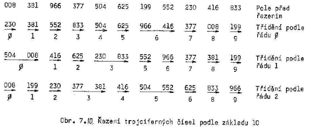
## Přehled algoritmů
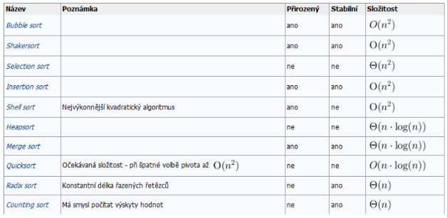