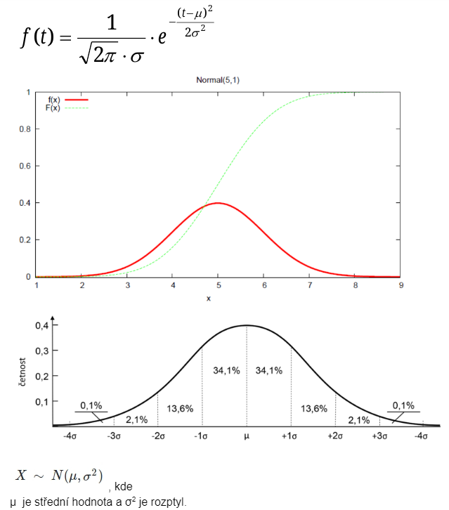

# Pravděpodobnost a statistika
- Otázky: náhodná veličina a vektor, rozdělení pravděpodobnosti, generování pseudonáhodných čísel, bodové a intervalové odhady parametrů, testování hypotéz, regresní a korelační analýza
- Předmět: IPT, IMS

\(\Large F(x)\) - Distribuční funkce.

\(\Large f(x)\) - Hustota rozdělení pravděpodobnosti.

## Pravděpodobnost - 
- \(\Omega\) - Množina všech hodnot kterých může náhodná veličina \(X\) nabývat.
- Náhodný jev - Podmnožina \(\Omega\) (značené velkými písmeny).
- \(P(A)\) - Pravděpodobnost, že nastane jev \(A\). \(0 <= P(A) <= 1\).

## Klasická pravděpodobnost 
- Jenom pokud je \(\Omega\) konečná množina a všechny pokusy nastávají se stejnou pravděpodobností.

\(\LARGE P(A)=\frac{|A|}{|\Omega|}\)

## Geometrická pravděpodobnost 
- Podíl míry množin příznivých výsledků a míry množiny všech možných výsledků. 
- Používá se pokud je množina \(\Omega\) nespočetná a všechny výsledky pokusů nastávají se stejnou pravděpodobností.

\(\LARGE P(A)=\frac{m(A)}{m(\Omega)}\)

## Diskrétní pravděpodobnost 
- Pokud je \(\Omega\) konečná množina a nebo spočetná. 
- Všechny jevy nemusí nastat se stejnou pravděpodobností (ale musí platit že součet \(P\) je 1 ). 
- \(P\) je součet všech elementárních jevů

\(\LARGE P(A)=\sum\limits_{\omega_i \in \Omega}P(\omega_i)\)

musí platit

\(\LARGE \sum\limits_{k=1}^{\infty}P(X = k) = 1\)

\(X\) je diskrétní náhodná veličina (diskrétní hodnoty).
- Distribuční funkce - Pro popis rozdělení náhodných veličin. 
- Je neklesající a zprava spojitá. 
- V každém bodě vyjadřuje její funkční hodnota \(P\) že náhodná veličina \(X\) nabude hodnoty menší nebo rovné hodnotě v tomto bodu. 
- \(\LARGE F(x) = P(X \lt x)\)
- U diskrétní veličiny má distribuční funkce schodovitý tvar.

    

## Spojitá pravděpodobnost 
- Pokud \(X\) nabývá hodnot z \(\Omega\), která je nespočetně nekonečná (např. \(\Omega = R\)) a přitom jednotlivé hodnoty nemusí nabývat stejné pravděpodobnosti.

### Hustota rozdělení pravděpodobnosti - \(f(x)\). 
- Určuje s jakou pravděpodobností nabývá veličina \(X\) určitou hodnot (obsah \(f(x)\) na intervalu určuje s jakou pravděpodobností nabývá \(X\) hodnotu na tomto intervalu).
### Spojitá pravděpodobnost jevu 
- Na intervalu \(\langle a, b \rangle\) 
- Získáme ji jako integrál z hustoty rozdělení pravděpodobnosti
- \(\LARGE P(X \in \langle a, b \rangle) = \int\limits_a^b f(x)dx\) 
- \(\LARGE F(x) = P(X \lt x) = P(X \in (-\infty, x)) = \int\limits_{-\infty}^X f(t)dt\)

**Hustota je derivací distribuční funkce.**

\(\LARGE F'(x) = f(x)\) 

# Rozdělení

## Rovnoměrné rozdělení pravděpodobnosti (Uniform) 
- Pokud je každá hodnota z intervalu \(\langle a, b\rangle\) má stejnou pravděpodobnost.

## Normální rozdělení pravděpodobnosti (Gaussovo) 
- Pro veličiny spojitého typu. 
- Odpovídá jevům s vlivem většího počtu nezávislých faktorů

## Poissonovo rozdělení pravděpodobnosti 
- Počet výskytů jevů v určitém intervalu. 
- Pokud diskrétní veličina \(Y ({0, 1, 2, …})\) udává počet výskytů události za časovou jednotku \(t = 1\). 

\(\LARGE p_k = P(Y = k) = \frac{\lambda^k}{k!}*e^{-\lambda} \quad pro \quad k = 1, 2, 3, \ldots \)

kde 
- \(\Large\lambda\) - Označuje průměrný počet výskytů události za časovou jednotku \(t=1\).
- \(\Large k\) - Počet výskytů pro které hledáme pravděpodobnost. 

## Exponenciální rozdělení pravděpodobnosti 
- Rozdělení délky intervalu mezi náhodnými událostmi. 
- Závisí pouze na \(h\) nikoliv na počtu událostí, které nastaly před okamžikem \(t\) - Vyjádření doby čekání na událost. 
- \(X\) udává dobu mezi 2 výskyty - Dochází k němu průměrně jednou za \(1/\lambda\) časových jednotek. 

## Binomické rozdělení pravděpodobnosti 
- Experiment, kde mohou nastat jen 2 možné výsledky, které se navzájem vylučují (úspěch neúspěch). 
- Úspěch = \(p\), pak neúspěch = \(1-p\). 
- \(X\) udává počet úspěchů při \(N\) nezávislých pokusech.

# Statictické veličiny

## Střední hodnota 
- Pravděpodobnostně vyvážený průměr všech jejích možných hodnot.

\(E(X) = \int\limits_R P(x) dx\)

## Rozptyl 
- Charakteristika variability rozdělení pravděpodobnosti náhodné veličiny, které vyjadřuje variabilitu rozdělení souboru náhodných hodnot kolem její střední hodnoty.

# Generování pseudonáhodných čísel 
- Provádí se proto, že generování skutečně náhodných čísel je problematické (nedeterminismus se těžko realizuje na PC) a také časově náročné a je na to potřeba speciální HW. 
- Základem je generování rovnoměrného rozložení na intervalu \(\langle0, 1)\), které je možné poté transformovat. 
- Generátory mají často nějakou periodu po které se hodnoty opakují… snažíme se aby byla co největší.

## Požadavky na generátory
- Rovnoměrnost rozložení
- Statistická nezávislost generované posloupnosti
- Co nejdelší perioda
- Rychlost

## Kongruentní generátor 
- Generuje rovnoměrné rozložení. 
- Generuje čísla v rozsahu \(0\leq x_i \lt m\). 
- Pro převod na požadovaný rozsah \(\langle0, 1)\) musíme výsledek \(x_i+1\) dělit modulem \(m\)

\(\LARGE x_{i+1} = (a*x_i = b)\mod m\)

## Transformace na jiné rozložení

### Inverzní transformace 
- Najdu inverzní funkci distribuční funkce - Pro výsledek dostanu vstup. 
- Je však definovaná na intervalu \(\langle0, 1)\) a proto se vždy trefíme. 
- Ne vždy ale lze distribuční funkci lehce vyjádřit funkcemi a invertovat.

### Vylučovací metoda 
- Sérií pokusů hledáme hodnotu, která vyhovuje funkci hustoty cílového rozložení. 
- Nehodí se pro neomezené rozložení nebo pokud má funkce malý poměr plochy pod funkcí oproti nad (mnoho opakování). 
- Vygeneruje se bod v prostoru ohraničujícím funkci a pokud se v ní nachází je hodnota platná, pokud ne opakujeme generování.

### Kompoziční 
- Funkci hustoty rozložíme na několik jednodušších (dostaneme intervaly, kde se dá metoda použít).

## Testování generátorů 
- Chceme potvrdit že vygenerované veličiny zapadají do daného rozložení.  
### Test dobré shody \(x^2\)

1. Vygenerujeme soubor \(n\) vzorků.
2. Vypočteme histogram souboru \(H\) (pro \(k\) kategorií).
3. Vypočteme teoretický histogram rozložení \(h\)
   - \(\Large x^{2}_{k-1} = \sum\limits_{j=1}^k \frac{(H_j - h_j)^2}{h_j}\)
4. Výsledek testu zhodnotíme na základě tabulky x2. Je-li \(x^{2}_{k-1} \gt x_p\) pak generátor nevyhovuje.

- Další testy - Testy náhodnosti, poker test, Hammingův test…
