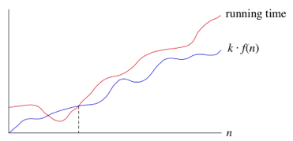
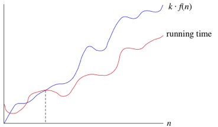
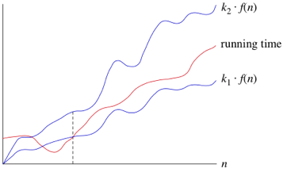
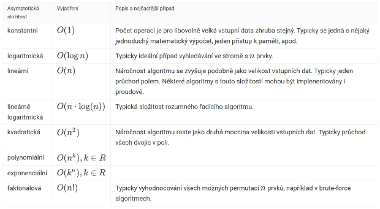

# Hodnocení složitosti algoritmů
- Otázky: paměťová a časová složitost, asymptomatická časová složitost, určování časové složitosti
- Předmět: 

## Složitost algoritmu 
- Slouží pro hodnocení kvality algoritmu a porovnání s jinými algoritmy. 
- Tato složitost je závislá na počtu zpracovávaných dat (n).
    - **Paměťová/Prostorová složitost** - Jaký prostor zaujímá program a data. Množství paměti potřebné pro zpracování úlohy o rozměru n.
    - **Časová složitost** - Čas potřebný pro provedení algoritmu.
- Na základě jedné složitosti nelze určit druhou, ale občas je možné jednu zlepšit na úkor druhé.

## Analýza složitosti algoritmu 
- Algoritmus se analyzuje za účelem získání funkce jeho časové a prostorové složitosti. 
- Nejprve získáme tyto funkce a pak je kategorizujeme pomocí théta.

## Jakým způsobem lze zjistit časovou složitost algoritmu?
- Logickou úvahou analyzujeme cykly. 
- Analyticky zistíme jaká je časová složitosť.
- Experimentálně spoštět algoritmus nad různě velkými daty a zkoumat časovou závislost na velikosti dat
- Experimentálním testovaním a extrapolací funkce

## Asymptotická složitost 
- Zanedbávají se nepodstatné členy (aditivní a multiplikativní konstanty), jelikož implementace se mohou lišit. 
- Asymptotická složitost určuje řád růstu algoritmu (lineární, exponenciální, logaritmická...). 
- Přesné určování se provádí za pomocí například turingova stroje, matematicky (neformální analýza), profilováním či testováním.

## Notace

### Omega
- Vyjadřuje dolní hranici chování. 
- Množina všech funkcí, které mají stejný nebo vyšší řád růstu. 
- Tedy vyjádření nejlepšího případu.

### Omikron
- Vyjadřuje horní hranici. 
- Množina funkcí, které mají stejný nebo nižší řád růstu. 
- Tedy vyjádření nejhoršího případu.

### Théta
- Množina funkcí, které mají stejný řád. 
- Nelze však určit u všech algoritmů.

### Tabulka častých složitostí

## Třídy složitosti
- **P** 
  - Pokud existuje Turingův stroj, který úlohu vyřeší v polynomiálním čase.
- **NP** 
  - Problémy, jejichž řešení lze ověřit v polynomiálním čase nedeterministickým Turingovým strojem, ovšem nevíme, zda je lze také v polynomiálním čase nalézt.
