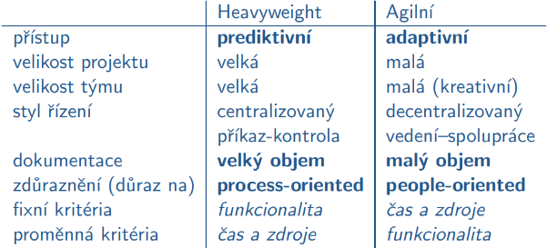
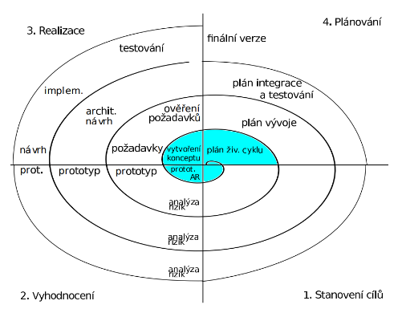
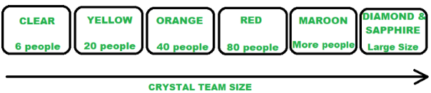

# Životní cyklus softwaru
- Otázky: charakteristika etap a základních modelů
- Předmět: IUS
- zdroje:
  - [Softwarové inženýrství, základní problémy při vývoji softwaru, vodopádový model životního cyklu softwaru](https://wis.fit.vutbr.cz/FIT/st/cfs.php.cs?file%3D%2Fcourse%2FIUS-IT%2Flectures%2FIUS01.pdf%26cid%3D13367)
  - [Lineární a iterativní modely životního cyklu softwaru, agilní metodiky vývoje softwaru](https://wis.fit.vutbr.cz/FIT/st/cfs.php.cs?file%3D%2Fcourse%2FIUS-IT%2Flectures%2FIUS08.pdf%26cid%3D13367)
  - [Agilní metodiky vývoje softwaru, management SW projektů, řízení kvality softwaru, SW metriky](https://wis.fit.vutbr.cz/FIT/st/cfs.php.cs?file%3D%2Fcourse%2FIUS-IT%2Flectures%2FIUS09.pdf%26cid%3D13367)

## Životní cyklus softwaru 
- Mechanismus uplatňovaný při návrhu softwaru. 
- Využívá se při vývoji velkých a složitých projektů.

## Softwarové inženýrství 
- Systematický přístup k vývoji, nasazení a údržbě softwaru.

## Důležité vlastnosti u vývoje SW
- Splnění požadavků
- Cena
- Čas

## Typy SW produktu
- Generický software 
    - SW pro širokou veřejnost, tzv. krabicový SW. 
    - Musí být velice dobře otestovaný (Ubuntu, Photoshop…).
- Zákaznický software 
    - Vyvíjen pro určitého zákazníka.
    - Většinou pro danou specializovanou oblast neexistuje generický SW. 
    - Cena je mnohem větší (menší poptávka). 
    - Firma si ho přímo objedná a specifikuje požadavky (IS VUT, FIT KIT).

## Vlastnosti software
- Použití 
  - Správnost, spolehlivost, efektivnost, použitelnost, bezpečnost.
- Přenos 
  - Přenositelnost, znovupoužitelnost, interoperabilita (spolupráce s jinými systémy).
- Změny 
  - Udržovatelnost, modifikovatelnost, testovatelnost, dokumentovanost.

## Problémy při vývoji software
- Nevyhnutelné 
  - Složitost
  - Přizpůsobivost (na změny zadání)
  - Nestálost
  - Neviditelnost (nevíme přesně jak jsme blízko konci).
- Ostatní 
  - Specifikace požadavků (nejasnosti v zadání)
  - Náchylnost k chybám (chyby se těžko odhalují)
  - Práce v týmu
  - Nízká znovupoužitelnost
  - Dokumentování
  - Stárnutí softwaru (opravou chyb se zanesou nove chyby).

# Proces vývoje softwaru 
- Základem je transformace požadavků uživatele na požadavky na software -> návrh softwaru, podle kterého je software implementován. 
- Proces závisí na dobré dekompozici.

## Tři strany vývoje SW
- Zákazník - Objednal SW
- Dodavatel - Vytváří SW
- Uživatel - Bude SW používat

## Etapy životního cyklu SW

###  Analýza a specifikace požadavků 
- Zabýváme se požadavky zákazníka (pochopení požadavků). 
- Řeší se požadavky a ne až tolik realizace. 
- Součástí je studie vhodnosti, která říká jestli má smysl projekt dělat. 
- Identifikují se možná rizika a analyzují se. 
- Provádí se plán akceptačního testování, což jsou testy na jejichž základě zákazník SW převezme (záruka pro zákazníka).
 
**Výstup** - Prohlášení o cílech, studie vhodnosti a plán akceptačního testování.

**Kategorie požadavků:**
- Funkcionální - co má projekt dělat.
- Požadavky na provoz systému - za jakých podmínek bude systém pracovat.
- Požadavky na výsledný systém - podmínky pro vývoj a nasazení.
- Požadavky na vývojový proces - požadavky zákazníka na dodržování norem.
- Požadavky na rozhraní - komunikace se systémem.
- Externí požadavky - požadavky dle charakteru aplikace (např. legislativní požadavky).
 
**Specifikace požadavků:**
- Metody získání požadavku - Interview, dotazník, studium dokumentů, pozorování při práci, analýza existujícího SW…
- Problémy při získání informací - Plynou z použití přirozeného jazyka (zkreslení zobecnění). Nepřesná představa, zákazník se neorientuje v SW...
- Kroky při specifikaci požadavků - Studie vhodnosti (zda to zvládnem), analýza/definování/specifikace požadavků a SW.
- Prostředky v RUP - Use case diagramy, specifikace (strukturovaný text), slovník pojmů.

### Architektonický návrh 
- Slouží k ujasnění koncepce systémů a k jeho dekompozici - vymezování funkcionality jednotlivých podsystémů a definování vztahů mezi podsystémy. 
- Provádí se naplánování nasazení do provozu.

**Výstup** - Specifikační dokument a plán testování celého systému.

### Podrobný návrh 
- Podrobná specifikace SW součástí. 
- Stanovení fyzické struktury dat a způsoby ošetřování neočekávaných a chybových stavů. 
- Návrh testů jednotlivých součástí včetně testovacích dat.

**Výstup** - Návrhový dokument.

### Implementace a testování částí 
- Implementace jednotlivých částí. 
- Vypracování dokumentace. 
- Testování jednotlivých částí.

**Výstup** - Naimplementované jednotlivé části.

###  Integrace a testování 
- Spojení do celku. 
- Probíhá testování celku.

**Výstup** - Celkový systém.

### Akceptační testování a instalace 
- Otestování systému uživatelem - po přijetí si zákazník SW převezme, v případě chyb musí být opraveny. 
- Rozhoduje o úspěchu nebo neúspěchu. 

### Provoz a údržba 
- Vyžaduje průběžné řešení problémů a chyb, které se objevují až za běhu. 
- Tato etapa zabírá nejvíc času a úsilí.

# Modely životního cyklu SW
- U každého projektu se etapy mohou lišit, společné rysy je však možné popsat modely životního cyklu SW. 
- Definují etapy a jak po sobě jdou (ale ne však délku ani rozsah).
- Modely životního cyklu dělíme na **Heavyweight** a **Agilní**.

## Vodopádový model 
- Etapy jsou řazeny za sebou, po skončení jedné začíná další. 
- V případě nalezení chyb je potřeba se vrátit a projít znova. 
- Neodpovídá reálnému vývoji.

## Iterativní model 
- Snaží se odstranit hlavní problém vodopádového. 
- Proces je rozdělen do iterací, kde každá je instance vodopádového modelu. 
- Vede k horšímu návrhu struktury SW.

## Inkrementální model 
- Podobný iterativnímu, projekt je odevzdáván uživateli po částech, pozdější upřesnění požadavků může mít negativní vliv jako u vodopádového modelu.

## Spirálový model 
- Zavádí do vývoje prototypování a klade důraz na **analýzu rizik**. 
- Jednotlivé etapy se opakují vždy na **vyšším stupni zvládnuté problematiky**, výsledkem je **prototyp**. 
- Spustitelné verze existují od začátku. 
- Náročný na řízení. 
- Spirála je rozdělena do 4 kvadrantů:
  1. **Stanovení cílů**: určení funkcionálních a výkonnostních požadavků, určení omezujících podmínek (čas a cena), návrh možných alternativ.
  2. **Vyhodnocení** stanovených cílů: ověření jejich splnitelnosti, analýza rizik, prototypování a simulace,
  3. **Realizace** stanovených cílů a jejich **testování**,
  4. **Plánování** následujícího cyklu.
  - po každém cyklu je dokončený **Milestone**

## VModel
- vychází z vodopádového modelu 
- Fáze začínají až po dokončení předchozí a na každou fázi navazuje její testování.
- zachovává jednoduchost a srozumitelnost vodopádového modelu

## WModel
- vychází z V-modelu
- aktivity spojené s ověřováním a testováním jsou na stejné úrovni jako
návrhové aktivity ⇒ druhé souběžné V

## Rational Unified Process (RUP) 
- Není pouze koncept, ale je použitelný na řízení reálných projektů. 
- Výsledek výzkumu koordinovaným firmou Rational. 
- Vývoj probíhá iteračně (se spustitelným kódem po každé iteraci). 
- Klade důraz na:
    - Vizualizaci SW (pomocí UML)
    - Průběžnou kontrolu kvality produktu
    - Řízení změn
    - Využívání existujících komponent

## Agilní metodologie 
- Využívají se většinou u **malých projektů s malým počtem programátorů**, s **decentralizovaným řízením** (vedení založené na spolupráci) a **adaptivním přístupem** (menší množství plánování, úpravy dle reakcí zákazníka) - velká flexibilita. 
- Čas a peníze jsou obvykle dané a funkcionalita se implementuje na základě toho (co se stihne, co bude zaplaceno; na co budou peníze, to bude naprogramováno). 
- Vyžadují **intenzivní zapojení zákazníka** do procesu vývoje. 
- Agilní metodiky **kladou důraz na lidi a jejich individualitu** (people-oriented), člověk je v dané oblasti profesionál (analytik, programátor, tester) a je schopen rozhodovat technické otázky práce, velmi důležitá je **komunikace v rámci týmu**. 
- Omezuje se byrokracie a formální požadavky. 
- Ověření správnosti je prováděno **zpětnou vazbou od zákazníka**. 
- Odchod schopných zaměstnanců může být kritický. 
- Agilní metodiky **dobře reagují na změny v průběhu vývoje**, což je běžné.

### Rapid Application Development
- Metodika založená na rychlém iterativním vývoji prototypů. 
- Brzká dispozice funkčních verzí
- Vyžaduje intenzivní zapojení zákazníka do vývojového procesu - zpětná vazba na poskytnuté verze. 
- Zaměřuje se zejména na splnění potřeb a požadavků zákazníka (business potřeb SW). 
- Metodika je určena pro menší a středně velké týmy. 
- Zhodnocení:
  - Výhody: 
    - flexibilita a schopnost rychlé reakce na změny požadavků od zákazníka. 
    - Vyšší kvalita zpracování business potřeb (zákazník dostává doopravdy to, co chce). 
    - Více projektů splňuje termíny a ceny. 
  - Nevýhody: 
    - nižší kvalita návrhu a výsledného kódu způsobená změnami, což vede na problémy s udržovatelností.

### Extrémní programování (XP)
- Populární agilní metoda, která je založena na komunikaci (v týmu a se zákazníkem, zákazník se prakticky stává členem týmu) a iterativním vývoji. 
- SW není dodán zákazníkovi celý v určitý termín v budoucnosti, ale je dodáván způsobem, který odráží aktuální potřebu uživatelů - do systému vložíme to, co potřebujeme, když to potřebujeme. 
- Dva významní členové týmu:
  - **kouč**: zajišťuje komunikaci v týmu, pomáhá programátorům s technickými dovednostmi, komunikuje s velkým šéfem a vyšším managementem.
- **velký šéf**: provádí zásadní rozhodnutí, komunikuje s vyšším managementem.
- Extrémní programování klade velký důraz na spolupráci v týmu, manažeři, vývojáři a zákazník jsou si rovni. 
- Je založeno na 5 základních principů:
  1. **komunikace**: programátoři, zákazníci a manažeři spolu musí komunikovat - využití technik, které komunikaci vyžadují (pair programming, code review, …).
  2. **jednoduchost**: jednoduché věci se realizují a upravují s menším počtem chyb (v případě potřeby je lze rozšířit). Přírůstkové malé změny, uvolňování malých verzí systému (nejpodstatnější požadavky, které jsou postupně vylepšované a doplňované).
  3. **zpětná vazba a testování**: vše musí být otetováno, ke každé funkci píšeme testy, klidně i před tím, než začneme programovat (Test Driven Development). Jednotkové i integrační testy, zpětná vazba zákazníka.
  4. **odvaha**: nebát se zahodit naprogramovaný kód, nebát se zkusit neznámé. Pokud je potřeba, nebát se provést zásadní změny.
  5. **respekt**: Každý malý úspěch prohlubuje respekt k jedinečným příspěvkům každého člena týmu.
- Zhodnocení:
  - Výhody: 
    - iterativní inkrementální proces,
    - ladění na základě zpětné vazby - zapojení uživatelů,
    - založený na testování,
    - průběžná integrace
  - Nevýhody:
    - vyžaduje dodržování základních principů (neustálé psaní testů, párové programování, atd)
    - nedefinuje přesný postup.

### Scrum
- Agilní metoda odvozená ze hry rugby. 
- Lze kombinovat s XP. 
- Dělí se na tři základní fáze:
  1. **pre-game**: plánování a architektonický návrh, využívá se Product Backlog.
  2. **game**: vývoj, který probíhá v iteracích, iterace se nazývá Sprint a tvá okolo 30 dní, výsledkem každého sprintu je funkční inkrement. Na začátku každého sprintu je setkání mezi vývojáři, zákazníkem, uživateli atd. a definují se cíle sprintu - Sprint Backlog (seznam úloh nutných pro dosažení cíle). Každý den v průběhu sprintu se provádí Scrum Meeting - 15 min setkání členů vývojového týmu. Scrum Master je vedoucí týmu. Na konci sprintu se provádí Sprint Review - vyhodnocení proběhlého sprintu.
  3. **post-game**: integrace výsledků jednotlivých sprintů, testování (integrační, celého systému, akceptační), dokumentace, školení uživatelů.
- Zhodnocení:
  - Výhody: 
    - iterativní inkrementální proces,
    - časté uvolňování verzí,
    - architektura je navržena před procesem vývoje,
    - jednoduchý proces,
    - zapojení uživatelů.
  - Nevýhody:
    - nedefinuje přesný postup,
    - integrace až po vytvoření všech inkrementů.

### Crystal
- Jedná se o rodinu metologií, základní přístupy a techniky sdílí s XP. 
- Více lidí je ale schopno tento proces akceptovat. 
- Rozděluje projekty do kategorií dle kritičnosti a důležitosti: 
  - Comfort C,
  - Discretionary Money (volné uvážení) D,
  - Essential Money E,
  - Life L.
- Kategorie metodik, které se používají, se označují barvou, liší se dle velikosti týmu a délce projektu:

  

- Zhodnocení:
  - Výhody: 
    - iterativní inkrementální proces - časté uvolňování verzí,
    - průběžná integrace,
    - zapojení uživatelů - požadavky se ladí během celého vývoje na základě zpětné vazby
  - Nevýhody:
    - nedefinuje jasný společný proces,
    - není vhodný pro vysoce kritické projekty,
    - velká závislost na přímé komunikaci.

# Analýza
## Strukturovaná analýza 
- Chápe systém jako kolekci procesů operujících nad daty - navrhujeme strukturu dat a funkce nad nimi pracující.
## Objektová analýza 
- Chápe systém jako kolekci vzájemně komunikujících objektů.

## Základní modely analýzy
- Funkční modelování 
  - Ukazuje funkce systému, toky a data. Data Flow Diagram.
- Datové modelování 
  - Ukazuje entity aplikační domény zpracované systémem a statické vztahy mezi nimi. 
  - Entity Relationship Diagram (ER Diagram).
- Datový slovník 
  - Obsahuje specifikace prvků modelů. DFD, ERD.
- Modelování dynamického chování    
  - Stavový diagram.

## Návrh 
- Vstupem jsou většinou tyto diagramy:
    - Doplněné analytické diagramy - Diagramy interakce.
    - Diagramy upřesňující vybrané analytické diagramy
        - Návrhové třídy 
        - Návrhové podsystémy
        - Stavové diagramy
        - Rozhraní

## Implementace 
- Transformace návrhu jednotlivých částí modulů a jejich vzájemných vazeb do programové realizace.

### Úkony před implementací
- Výběr jazyka
- Strategie implementace
  - Zdola nahoru - Od nejnižší úrovně po největší celky.
  - Shora dolu

## Ověřování
- provádí se před spuštěním programu

> **Validace** - Ověření, že SW splňuje potřeby uživatele.
>
> **Verifikace** - Ověření, že SW vyhovuje specifikaci.

**Statické ověřování** - Nevyžaduje běh programu.

**Dynamické ověřování** - Testování. Výsledky se odvozují na základě výstupů.

## Testovnání
- Odhalování chyb během vývoje. 
- Důležité zvolit správné vstupy.
### Testovací kritérium
- Spolehlivé - Na jakoukoliv množinu vstupů získáme stejný výsledek.
- Platné - Když pro každou chybu existuje množina vstupů, která ji odhalí.
### Typy testování
- Náhodné
- Funkcionální - Pouze dle specifikace (neřeší se implementace).
- Strukturální - Vychází ze vnitřní struktury (řesí se implementace).

