# Jazyk UML
- Otázky:
- Předmět: IUS
- zdroje:
  - [UML, digramy tříd a objektů](https://wis.fit.vutbr.cz/FIT/st/cfs.php.cs?file%3D%2Fcourse%2FIUS-IT%2Flectures%2FZS-2019-20%2FIUS4.pdf%26cid%3D13367)
  - [UML, sekvenční diagram, d komunikace, návrhové vzory](https://wis.fit.vutbr.cz/FIT/st/cfs.php.cs?file%3D%2Fcourse%2FIUS-IT%2Flectures%2FZS-2019-20%2FIUS5.pdf%26cid%3D13367)

HLavně chtěli:
- Obecně UML
- Prakticky ukázat jeden z typů diagramu
- znát syntaxi
- Behaviorální UML - popis chování = systém, který se v čase mění
## Jazyk UML (Unified Modeling Language) 
- Grafický jazyk pro vizualizaci, specifikaci, navrhování a dokumentaci programových systémů. 
- Použitelný i pro modelování organizace (business modelling). 
- Základním cílem je vizualizace, specifikace struktury a chování navrhovaného systému. Napomáhá dekompozici systému. 
- Nepatří sem ER diagram!

## Základní pohledy 
- Projekce systému na jeden z jeho klíčových aspektů.
- **Strukturální** - Popisuje vrstvu mezi objekty a třídami, jejich asociace a možné komunikační kanály.
- **Datový** - Popisuje stavy systémových komponent a jejich vazby.
- **Pohled na chování** - Popisuje jak systémové komponenty interagují a charakterizuje reakce na vnější systémové operace.
- **Pohled na rozhraní** - Je zaměřeno na zapouzdření systémových částí a jejich potenciální použití okolím systému.

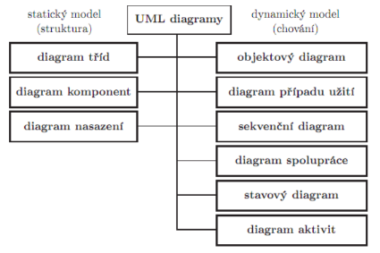

**UML diagram** 
- Struktura podobná obecnému grafu obsahující množinu grafických prvků (vrcholy) propojených vztahy (hrany).

### Modely UML 
- Pro popis používají různé diagramy.
    - Statický model - Popisuje systém z pohledu struktury (diagram tříd).
    - Dynamický model - Popisuje systém z pohledu chování (diagram případů užití, sekvenční diagram, diagram spolupráce).

## Základní stavební bloky UML
- Prvky
    - Strukturní - Třída, případ užití, komponent.
    - Chování - Interakce, stav.
    - Seskupování - Modul, balíček, podsystém.
    - Doplňkové - Komentář, poznámka.
- Vztahy - Relace především strukturálních a sestavovacích prvků.
    - Asociace - Spojení mezi prvky.
    - Závislost - Změna v jednom prvku ovlivní jiný závislý prvek.
    - Agregace, Kompozice - Vyjádření dekompozice prvku na podčásti.
    - Generalizace - Vztah mezi obecnějším a specifičtějším prvkem.
    - Realizace - Vztah mezi předpisem a jeho uskutečněním deklarace/instanciace.
- Mechanismy používané v různých typech diagramů
    - Specifikace - Textový popis jednotlivých elementů.
    - Ozdoby - Volitelné doplňky elementů.
    - Podskupiny - Různé způsoby “vidění světa” (klasifikátor, instance, rozhraní, implementace).

# Diagram tříd (class diagram) 
- Statický model. 
- Úkolem je znázornit typy objektů v systému a jejich vztahy.

## Vztahy v diagramu tříd
### Asociace 
- Slouží k zachycení vztahů a informací mezi třídami z několika různých perspektiv. 
- Vztahy vyjadřují zejména:
    - Identifikaci vztahů mezi třídami
    - Násobnost vztahů
    - Určení jakou roli hraje objekt ve vztahu
- Znázorňuje se graficky čarou mezi asociovanými třídami. 
- Násobnost a role se píše u objektu. 
- Stupeň asociace je kolik tříd se na asociaci podílí (binární, ternární). 
- Asociace může být povýšena na třídu za účelem přiřazení parametrů nebo pro eliminaci vícenásobné asociace.

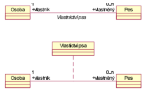
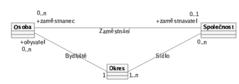

### Kompozice a agregace
- Speciální typy asociace, říkají, že jeden objekt je složený z jiných objektů. 
- Rozdíl mezi těmito 2 je v síle vztahu.
  - Agregace - Vztah celek-část
  - Kompozice - Silnější forma agregace, zodpovědná za rušení či vytvoření částí.

**Agregace** 
- Seskupení. 
- Vztah firma-zaměstnanci. 
- Může existovat bez svých konstitučních objektů.

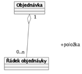

**Kompozice** 
- Člověk-orgány. 
- Nemůže existovat bez svých komponent.

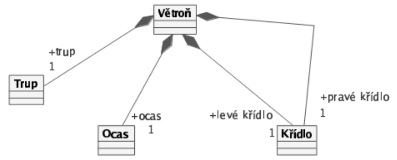

### Zobecnění/Generalizace 
- Zachycuje dědičnost. 
- Generalizace je proces extrahování sdílených charakteristik tříd (trojúhelník má vrcholy stejně jako je má mnohoúhelník...).

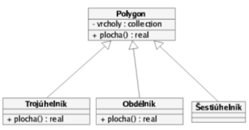

### Specializace 
- Opak generalizace. 
- Vytváření specifických podtříd.

### Závislost 
- Jiné různé vztahy mezi objekty či třídami.
    - `<<use>>` - Implicitní. Objekt neobsahuje jiný objekt, ale potřebuje ho (jeho argument, vrací ho, vytváří ho…).
    - `<<instantiate>>` - Je instancí/instanciuje.
    - `<<trace>>` - Obecná vazba, které jsou na různé úrovni abstrakce.
    - `<<refine>>` - Upřesnění (Např. optimalizovaná verze třídy).
    - `<<friend>>` - Narušení zapouzdření (jako friend v C++).
    - `<<bind>>` - Navázání na generický parametr `<T>`.

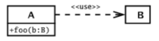

### Realizace 
- Vztah mezi třídou a rozhraním (třída implementuje rozhraní).
### Rozhraní 
- Interface. 
- Jako v interface Javě.

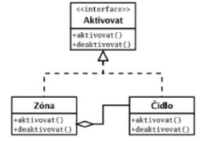

## Viditelnost v objektu 
- Určuje jestli je objekt viditelný a kým.
- **Soukromá (-)** - Private v Javě (vidí jen třída).
- **Chráněná (#)** - Protected v Javě (vidí jenom třída a potomci).
- **Veřejná (+)** - Public v Javě (vidí všichni).

# Diagram případů užití (use-case) 
- Pro zachycení požadavků. 
- Jeden případ je chápan jako funkce, kterou systém vykonává. 
- Znázorňuje:
    - Hranice systému
    - Účastníky
    - Případy užití
    - Interakce (účastníků a případů)
- Lze rozšířit o pokročilé techniky - více aktérů, zobecnění, `<<include>>`, `<<extend>>`...

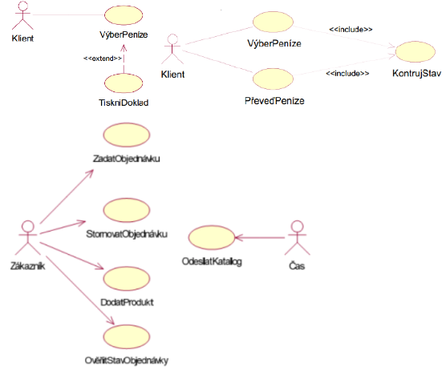

## Detaily případů užití 
- Slouží pro konkretizaci use case. 
- Často se používá tabulka - má vstupní podmínky a tok událostí.

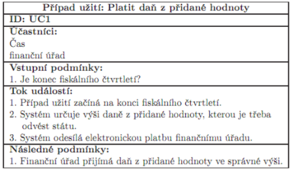

# Diagramy interakce 
- Interakce mezi třídami a jejich instancemi. 
- Liší se důrazem na strukturální vazby nebo na časovou posloupnost akcí.

## Strukturální diagram spolupráce 
- Strukturální relace mezi objekty.

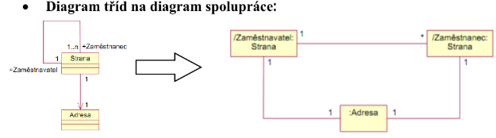

## Strukturální diagram spolupráce s označením posloupnosti zpráv 
- Může zachytit zprávy posílané mezi třídami a jejich pořadí.

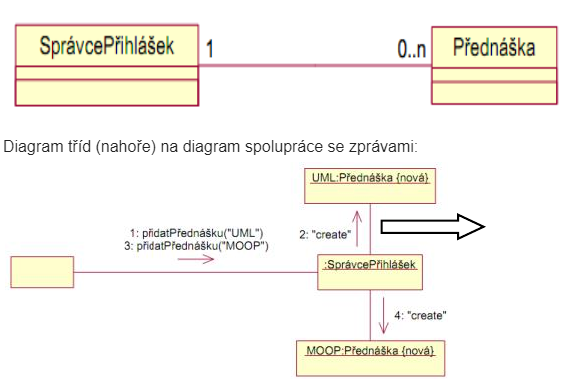

# Další diagramy
## Analytické třídy pro analýzu požadavků 
- Mapují pojmy problémové domény na abstraktní entity modelu - obsahuje jen nejpodstatnější atributy a operace.
## Objektové diagramy pro analýzu požadavků 
- Dynamický diagram. 
- Zachycuje konkrétní instance tříd a jejich vazby v určitém čase či podmínce.

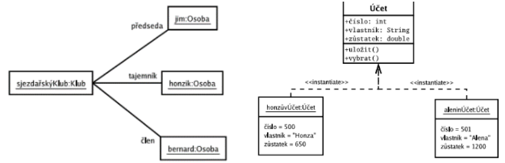

## Sekvenční diagram 
- Časově orientovaná posloupnost předávání zpráv mezi objekty.

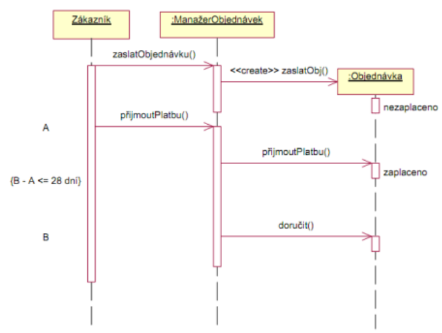

## Diagram aktivit 
- Reprezentují objektově orientované diagramy toků. 
- Je to vlastně objektově orientovaný vývojový diagram. 
- Je to zvláštní případ stavového automatu. 
- Pro modelování manažerských procesů.

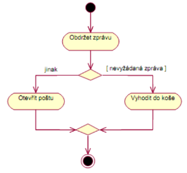

## Návrhové třídy 
- Použité při návrhu, vycházejí z analytických tříd, kterým doplňují implementačně důležité vlastnosti.

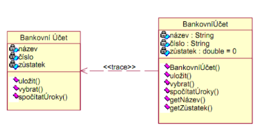

## Stavové diagramy 
- Síť stavů, událostí a přechodů mezi stavy. 
- Specifický druh stavového automatu. 
- Modeluje životní cyklus jednoho reaktivního objektu.

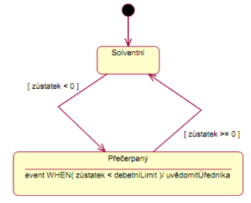

# Doplnění
## Reaktivní objekt 
- Objekt, který reaguje na vnější události.
## Návrhové vzory 
- Strukturovaně popsané.
    - Adapter - Převádí jedno rozhraní na jiné.
    
    
    - Factory - Objekt co je zodpovědný za vytváření instancí.
    
    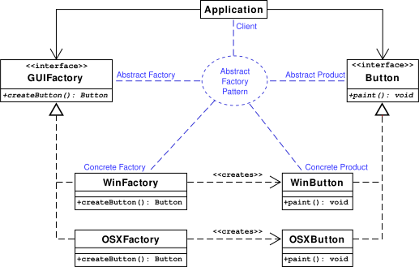
    - Singleton - Jediná instance dané třídy v systému.
  
    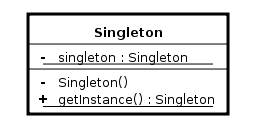
    - Observer - Pro reagování na změny a události.

    

