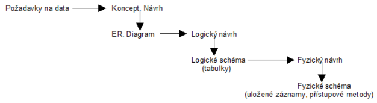

# Konceptuální modelování a návrh relační databáze
- Otázky:
- Předmět: IDS

## Konceptuální modelování 
- Jedním ze tří kroků návrhu databáze (DB).
- **Cíl** - Analyzovat požadavky na data, která budou v databázi. 
- **Výsledek** - ER diagram - základní model v požadavcích na data.

## Logický návrh
- **Cíl** - Navrhnout strukturu DB, aby obsahovala požadované věci
- **Výsledek** - Logické schéma databáze.

## Fyzický návrh 
- Fyzické uložení tabulek podle logického návrhu. 
- Složitější struktura než u logického. 
- Musí se navrhnout vzhledem k SŘBD pro efektivní přístup.

## Entity Relationship Diagram (ERD) 
- Chápe systém jako množinu entit. 
- Popisuje data tzv. v klidu a neukazuje operace nad daty.
- **Entita** - Objekt rozeznatelný od jiných.
- **Entitní množina** - Množina entit téhož typu (stejné atributy).
  - Slabá (weak) entitní množina - Je závislá na jiné entitní množině a je pomocí ní identifikovatelná.
  - Silná entitní množina - Může existovat sama o sobě.
- **Atribut** - Vlastnost entity.
    - Doména atributu - Obor hodnot.
    - Typ atributu
        - Složený - jméno (křestní + příjmení).
        - Jednoduchý - věk.
        - Jednohodnotové
        - Vícehodnotové
        - Povolující prázdnou hodnotu NULL
        - Odvozené - Věk dle datumu narození.
- **Vztah** - Asociace mezi entitami
    - Vztahová množina - Množina vztahů téhož typu.
    - Vazební entitní množina - Náhrada vztahu M:N.
    - Stupeň - Unární, binární, ternární
    - Kardinalita - Maximální počet vztahů dané vztahové množiny. Pro 1..M je M kardinalita.
    - Členství - Minimální počet vztahů - 1..M 1 je členství.
    - Generalizace/Specializace - Dědičnost atributů a účasti ve vztahových množinách
- **Kandidátní klíč** - Sloupec či sloupce tabulky jehož hodnota je v rámci tabulky unikátní (kandidát na primární klíč).
- **Primární klíč** (Identifikátor) - Atribut jehož hodnota je v dané množině jednoznačná - jednoduchý nebo složený.
- **Cizí klíč** - Odkaz na primární klíč do jiné tabulky identifikující konkrétní řádek. Slouží pro vytváření vazeb mezi tabulkami. Soulad cizího a kandidátního klíče se nazývá referenční integrita.

**Ukázka vazební entitní množiny**

**Ukázka stupňů vztahu**

**Ukázka Specifikace**

## Návrh relační databáze 
- Strukturovaný nebo objektový, strukturovaný je však vhodnější pro db. 
- Snažíme se vyvarovat problémům špatného návrhu (redundance, složitá kontrola integritních omezení…) a také se snažíme o dobrý výkon.

# Normalizace 
- Zkvalitňování návrhu tabulek - lepší schéma má lepší vlastnosti.

## Proces normalizace 
- Umožňuje se vyvarovat redundanci, nemožnosti reprezentace informace, složitých integritních omezení. 
- Opírá se o hierarchii normálních forem
## Normální formy 
- 1.NF se zajímá o atomické hodnoty jednoduchých atributů 
- 2.NF, 3.NF a BCNF definují požadované vlastnosti z hlediska funkčních závislostí atributů
- 4.NF a 5.NF definují požadované vlastnosti z hlediska vícehodnotových závislostí.

**Ukázka:** https://www.youtube.com/watch?v=J-drts33N8g

**Výchozí návrh, který se bude normalizovat:**

### 1. NF 
- Pokud každý atribut relace obsahuje jen **atomické hodnoty**.
- Odstranění neatomických hodnot - rozdělením.

Prakticky:
- Pokud se mi opakují celé položky v tabulce,
  - Přidám položku ID záznamu
    - třeba u objednávek mám jméno a položky
    - jméno se může opakovat u různých objednávek
    - udělám ID a je to rozlyšeny 
- Rozdělím složeny položky
  - např výčet výrobků u odběratele -> tabulka - OdběratelID, Vyrobek
  - Celé jméno -> položky jméno, přijmení

### 2. NF 
- Pokud je relace v **první normální formě** a každý **neklíčový atribut je plně závislý na celém primárním klíči**.
- Nezávislé atributy na PK se vloží do nové tabulky.

### 3. NF 
- Pokud je v 2. NF a všechny neklíčové atributy jsou navzájem nezávislé (neobsahuje tranzitivní závislosti).
- Odstranění atributů, které jsou závislé na něčem jíném než na PK.

**Postup pro získání 3. NF:**
1. Eliminuj duplicitní sloupce.
2. Vytvoř tabulku pro každou skupinu dat s jasně vymezeným významem a každý řádek opatři PK.
3. Obsahem jednotlivých sloupců tabulky by měla být atomická informace.
4. Podmnožinu dat se shodnou hodnotou pro určitý sloupec převeď do samostatné tabulky a spoj s původní tabulkou cizím klíčem.
5. Odstranění atributů, které jsou závislé na něčem jíném než na PK.

### BCNF 
- Pokud pro každou netriviální závislost X -> Y platí, že X je nadmnožinou nějakého klíče schématu R. 
- Pokládá se za variaci 3. NF.

### 4. NF 
- Pokud je v BCNF a popisuje pouze příčinnou souvislost.
### 5. NF 
- Pokud je ve 4. NF a není možné do ní přidat další atribut tak, aby se vlivem skrytých závislostí rozpadla na několik dílčích relací. 

## Funkční závislost 
- Pokud je Y funkčně závislé na X (X -> Y), pak se nemůže stát aby 2 řádky mající stejnou hodnotu X měly různou hodnotu Y. 
- Př.:
  - Datum narození je funkčně závislé na rodném čísle - nemůže se stát že u 2 záznamů se stejným rodným číslem bude rozdílné datum narození 