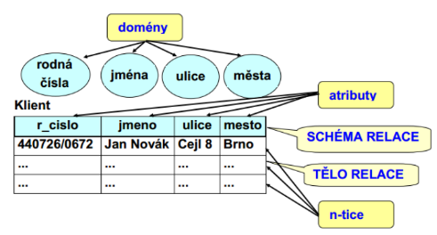
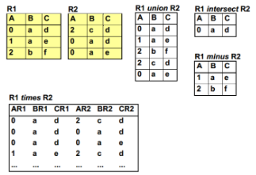
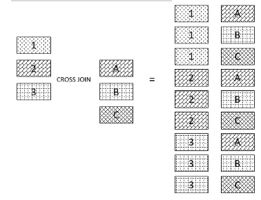
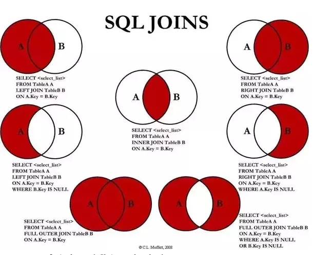
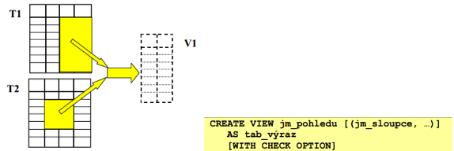

# Reprezentace a uložení strukturovaných dat
- Otázky: serializace a deserializace, relační datový model, jazyk SQL, transakce
- Předmět: IDS, IIS
- zdroje:
    - https://docs.google.com/document/d/1WR3wW3GcC
    - [	Jazyky relačních databázových systémů](https://wis.fit.vutbr.cz/FIT/st/cfs.php.cs?file%3D%2Fcourse%2FIDS-IT%2Flectures%2Fcz%2F6_jazyky.pdf%26cid%3D13974)
    - [Datové modelování](https://wis.fit.vutbr.cz/FIT/st/cfs.php.cs?file%3D%2Fcourse%2FIIS-IT%2Flectures%2Fp05_Datove_modelovani.pdf%26cid%3D14647)
    - [Vizualizace a serializace dat](https://wis.fit.vutbr.cz/FIT/st/cfs.php.cs?file%3D%2Fcourse%2FIIS-IT%2Flectures%2Fp06_Vizualizace_serializace.pdf%26cid%3D14647)

Tady znát teorii, co je to relace, ale hlavně se podle tabulky ptají na SQL dotazy - prakticky umět a znát JOINy i prakticky!!!

## Relační model 
- Nejrozšířenější způsob uložení dat v databázi (databázový model). 
- Data jsou reprezentovány jako n-tice v relacích. 
- Zahrnuje:
    - Definici logické struktury dat v relační databázi 
      - Jak jsou data v relační DB strukturovaná na logické úrovni bez ohledu na vlastní implementaci.
    - Definici obecných integritních pravidel 
      - Integritní omezení kladená na data, která musí platit v každé relační DB.
    - Manipulace s daty v relační DB 
      - Formálním dotazovacím jazykem, který umožňuje formulovat dotazy nad daty.

## Struktura relační databáze 
- Data jsou strukturovány do db relací (tabulek), která je tvořena schématem relace a tělem relace (množina n-tic).
    - Atributy - Vlastnosti reálného objektu, které chceme v DB. Může nabývat hodnot z domény. Sloupce.
    - Domény - Mohou být pouze atomické skalární hodnoty.



## Databázová relace 
DB relace na doménách {D1, D2, …, Dn} 
je dvojice \(R=(R, R*)\)
- kde:
    - \(R = R(A1:D1, A2:D2, …, An:Dn)\) je schéma relace, kde:
      - \(Ai (Ai ≠ Aj pro i ≠ j)\) značí jméno atributu definovaného v doméně \(Di.\)
    - \(R* ⊆ D1 x D2 x … x Dn\) je tělo relace.
    - Počet atributů n relace se označuje stupeň (řád) relace.
    - Kardinalita těla relace \(m = |R*|\) a označuje se kardinalita relace.

## Integritní omezení 
Omezení kladená na data v tabulkách.
- **Specifická** 
  - Daná požadavky konkrétní aplikační oblasti na ukládáná data.
- **Obecná** 
  - Musí platit v každé DB daného typu.
- **Kandidátní klíč** 
  - Každá relace (tabulka) obsahuje alespoň jeden KK. 
  - Musí splňovat 2 časově nezávislé vlastnosti:
    1. Hodnoty tohoto atributu v relaci R jsou unikátní.
    2. Atribut je vzhledem k jednoznačnosti hodnot v relaci minimální (neredukovatelný)
- **Primární klíč** 
  - Atribut jehož hodnota je v dané množině jednoznačná 
  - **jednoduchý** nebo **složený**.
- **Cizí klíč** 
  - Odkaz na primární klíč do jiné tabulky identifikující konkrétní řádek. 
  - Slouží pro vytváření vazeb mezi tabulkami. 
  - Soulad cizího a kandidátního klíče se nazývá **referenční integrita**.

## Relační databáze 
Schématem relační databáze nazýváma dvojici 

\((R, I)\)

kde:
- \(R = {R1, R2, \ldots, Rn}\) je množina schémat relací.
- \(I = {I1, I2, \ldots, Im}\) je množina integritních omezení.

## Relační algebra
- Je uzavřená - výsledky operací jsou tabulky. 
- Je referenčním prostředkem pro hodnocení vlastností a porovnání relačních dotazovacích jazyků. 
- Je vhodným základem pro optimalizaci zpracování dotazů.
 
Dvojice \(RA = (R, O)\) 

kde:
- \(R\) je množina relací.
- \(O\) je množina operací 
  - sjednocení, průnik, rozdíl, kartézský součin, projekce, selekce, přirozené spojení



### Speciální relační operace
- **Projekce**
  - Výsledkem je tabulka, která bude obsahovat jenom určité atributy původní tabulky a všechny n-tice původní tabulky, reprezentované pomocí nového schématu.
- **Selekce** 
  - Výsledkem je tabulka se stejným schématem ale obsahuje jen řádky dle dané podmínky.
- **Přirozené spojení** 
  - Spojí 2 tabulky do jedné, kde jsou atributy obou, tabulky se spojí na stejném atributu.

**Rozšířené operace** 
- Přiřazení, přejmenování, agregační funkce (sum, count…).

# SQL (Structured Query Language)
- Standardizovaný strukturovaný dotazovací jazyk pro práci s daty v relační databázi. 
- Existují 3 možné kontexty použití (binding styles):
    - Přímé SQL (direct)
    - Hostitelská verze SQL (embedded) - Snadný přístup k DB z externího programovacího jazyka (PL/SQL)
    - Jazyk modulů

## Hlavní kategorie příkazů
- Definice dat a pohledů (DDL - Data Definition Language)
    - CREATE - Tvorba objektů.
    - ALTER - Změna objektů. 
    - DROP - Odstranění objektů.
- Manipulace s daty (DML - Data Manipulation Language) - Pro přímý SQL nebo pro hostitelskou verzi
    - DELETE - Smazání řádků dle podmínky.
    - INSERT - Vloží řádek do tabulky.
    - UPDATE - Změní řádek.
    - SELECT - Vrátí tabulku záznamů z jedné nebo více tabulek.
        - WHERE - Podmínka
        - GROUP BY - Seskupení (poskládání)
        - HAVING - Podmínka
        - ORDER BY - Řazení
        - DISTINCT - Eliminace duplicity.
        - JOIN - Spojení výsledků SELECT
            - INNER JOIN - Vnitřní spojení. Průnik tabulek. Data, která nejsou v obou tabulkách nebudou ve výsledku.
            - OUTER JOIN - Vnější. Vše z obou tabulek i to co se nepřekrývá.
            - LEFT JOIN - Vnitřní + celá levá tabulka.
            - RIGHT JOIN - Vnitřní + celá pravá tabulka.
            - CROSS JOIN - Spojí řádek jedné tabulky se všemi z druhé tabulky - kartézský součin.
- Autorizace (přístupová práva)
- Integrita dat (integritní omezení)
- Řízení transakcí

Př.:
```
SELECT Orders.OrderID, Customers.CustomerName
FROM Orders
INNER JOIN  Customers ON Orders.CustomerID = Customers.CustomerID;
```

Vizualizace CROSS JOIN:



Vizualizace JOIN:



## Pohledy (VIEW)
- Virtuální DB struktura, může obsahovat data z nula a více tabulek - především pro vybírání dat. 
- Mohou z tabulek vybírat jen určité řádky, mohou obsahovat výrazy, mohou spojovat data z více tabulek, mohou odkazovat na další pohledy. 
- Používá se pro zjednodušení práce (opakované dotazování) nebo pokud potřebujeme výraz v SELECT.



## Kurzory 
- Prostředek pro zpracování víceřádkových výsledků SQL dotazů. 
- Kurzor je pojmenovaný a může jich najednou být otevřeno více.
## Dynamické SQL 
- Umožňuje vytváření SQL příkazů jako textových řetězců za běhu
- PREPARE - Vytvoření.
- EXECUTE - Vykonání.
- DEALOCATE PREPARE - Uvolnění prostoru.
- EXECUTE IMMEDIATE - Vytvoření a hned vykonání.
## Procedura 
- "Funkce" v SQL
- Sada příkazů SQL, které jsou uložené na serveru (rychlé a je provedené najednou). 
- Například pro vybírání dat, aktualizace, odstraňování, výpočty…
## Trigger 
- Uložená procedura, která se spouští v souvislosti s provedením nějakého akčního dotazu (před nebo po něm) na konkrétní tabulce. 
- Například po vložení dat nebo před odstraněním dat.

# Reprezentace strukturovaných dat
textová (serializace), 2D grafická (vizualizace)

## Serializace:
- reprezentace z datových struktur nebo stavů objektů do 1D sériové formy (řetězec). 
- Sériová forma může být uložena (textový soubor) nebo přenášena síťovým přenosem.
- JSON, XML, další specializované formáty

### XML
- původně značkovací jazyk pro tvorbu dokumentů
- lehce rozšíritelný
- možnosť formální definice vlastního schématu
- syntakticky obdobné jako HTML
- hierarchicky zanořujeme XML elementy
- rozdíl oproti HTML je, že XML nedefinuje jména, ani význam elementů a atributů, to je dané konkrétní aplikací, z toho důvodu jsou všechny značky párové

### JSON
- původně vytvořený pro přenos dat mezi serverem a klientem (prohlížečem)
- zápis JSON je literálem v jazyku JS, takže není potřeba speciálního analyzátoru
- je nezávislý na platformě

### Omezené serializační formáty
- omezují hloubku zanoření a typy položek strukturovaných hodnot
- používá se při předávání obsahu formulářů v HTML protokolem HTTP

**application/x-www-urlencoded**
- serialiyace struktury s položkami textového a booleovského typu
- mezery => +
- nealfanumerické znaky => %hh
- hodnoty položek jsou oddělené znakem '&'
- metody GET a POST

**multipart/form-data**
- serializace struktury s položkami textového a booleovského typu
- metoda POST
- neprovádí se žádné kódování hodnot 
- Je tedy možné přenášet binární data
- ve `<form>` elementu je potřeba specifikovat atribut `enctype`
 
`<form action="upload.php" method="post" enctype="multipart/form-data">`

## Vizualizace
- Pomocí HTML, CSS, JS,.. z kolekcí/struktur do formulářů, tabulek, seznamů, ...
- je definovaná zvlásť, protože generovaný HTML kód má popisovat jen štruktúru a obsah výsledného dokumentu
- tvorená pomocí CSS
- 	sada CSS pravidiel, kde každé z nich definuje vlastnosti nějaké množiny HTML elementov
- CSS pravidlo sa skladá z dvoch častí: 
    - selektor pravidlo (zvolí HTML element)
    - deklarace vlastností (popis výsledného vzhledu elementu)

## Strukturovaný datový typ
 = datová struktura
- Jedná se o množinu jednotlivých datových typů. 
- Pokud jsou stejného datového typu neomezeného počtu, jedná se o kolekci.( jako Pole v C) 
- Pokud jsou různorodého datového typu pevně určeného počtu, tvoří strukturu.( jako struktura v C, nebo Objekt )

### Operácie nad kolekcí: 
- vkládání prvku do kolekce (add)
- získání prvku z kolekce (item)
- určení počtu prvků (count)
- rušení prvku z kolekce (remove) 
- vykonávání operácí nad všemi prvkami kolekce (forall)

### Kurzor
- ukazovátko do kolekce
- stabilní a nestabilní 
- kolekce sa mění, ať už její obsah, nebo počet elementů
    - stabilní kurzor tyto změny nereflektuje
    - nestabilný změny reflektuje

### Agregáty
- Vlastnosti kolekce
- hodnoty statisticky popisující prvky kolekce nejčastěji číselných hodnot
- počet prvků, maximum, minimum, součet, průměr


