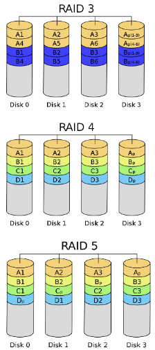
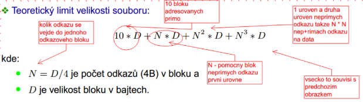

# Principy a struktury správy souborů a správy paměti
- Otázky:
- Předmět: IOS

## Adresace sektorů na disku 
- Cylindr-Hlava-Sektor (CHS) 
  - Adresace pomocí čísla válce (C), hlavy (H) a sektoru (S). 
  - Vhodné pro menší disky, jelikož větší vyžadují proměnný počet sektorů na stopě v závislosti na čísle válce.
- Logical Block Addressing (LBA) 
  - Adresace pomocí lineárního logického čísla sektoru. 
  - Používá se v dnešní době

## Diskové pole (RAID - Redundant Array of Independent Disks) 
- Metoda pro zabezpečení dat proti selhání pevného disku.

### RAID 0 
- Disk striping 
- Není to vlastně raid, protože neobsahuje žádná  redundantní data, a tedy žádnou ochranu.
- Prokládání - Data se rozdělí prokládaně na více disků.

### RAID 1 
- Data se ukládají na 2 disky, velká redundance a výkonnost stejná jako u 1 disku.

### RAID 2 
- Data jsou po bitech stripována mezi jednotlivé disky. 
- Pro zabezpečení používají Hammingův kód.

### RAID 3-5 
- Používají paritu
    - 3, 4 - Speciální disk s paritou.
    - 5 - Paritní bloky jsou rozloženy na všech discích.

### RAID 6 
- Používá 2 paritní bloky oproti RAID 5.

### Parita 
- Používá se k jednoduché detekci chyb
    - Lichá - Lichý počet jedniček.
    - Sudá - Sudý počet jedniček.

    

# DISK

## Sektor disku 
- Jeho nejmenší adresovatelná jednotka (má pevnou délku).

## Alokační blok 
- 2n sektorů 
- Nejmenší jednotka diskového prostoru, se kterou dovoluje OS pracovat.

## Fragmentace 
- Data jsou uložena nesouvisle po částech.

- Interní
    - Fragmentace uvnitř alokovaných oblastí.
    - Souborový systém vyhradí pro soubor větší prostor než je jeho velikost.
- Externí
    - Fragmentace mezi alokovanými oblastmi.
    - Volné místo paměti je obsazováno nesouvislými bloky souborů a prostor mezi nimi lze pak naplnit jenom bloky fragmentovaných souborů.

## Přístup na disk 
- Přístup se musí plánovat a tak se přicházející požadavky ukládají do cache a popřípadě se mění pořadí (jde-li to) pro optimalizace.

## Logický disk 
- Dělení fyzického disku na diskové oblasti (partition). 
- Tabulka MBR (Master Boot Record), je-li použita, obsahuje informace o diskových oblastech.

# Souborový systém
## Soubor 
- Základní organizační jednotka pro uchovávání dat na vnějších paměťových médiích.

## Souborový systém 
- Souhrn pravidel definujících chování a vlastnosti jednotlivých souborů a možnosti jejich další logické organizace.
- Také definuje způsob uložení požadovaných dat a informacím k nim.
- Druhy:
    - FAT - Univerzální mezi OS, je totiž skoro všude podporovaný.
    - EXT (2,3,4) - Pro linux.
    - NTFS - Pro Windows.

## Virtuální souborový systém (VFS) 
- Abstraktní vrstva nad více konkrétním souborovým systémem. 
- Dovoluje pracovat s jiným FS.
- Například na linuxu na EXT lze pracovat s windows NTFS.

## Žurnál 
- Speciální soubor pro záznam změn, před jejich provedením. 
- Pomáhá s integritou, tedy ochranou dat. 
- Díky němů je možné navrátit nepovedené operace. 
- Využívá metadat. 
- Operace pokryté žurnálováním jsou atomické - buď uspějí všechny části nebo nic.

## Network File System (NFS) 
- Internetový protokol pro vzdálený přístup k souborům přes internet. 
- Na linuxu se jedna o nejběžnější protokol.

## Unix File System (UFS) 
- Souborový systém používaný mnoha unixovými OS. 
- Vychází z původního unixového souborového systému (“File System (FS)”).
- Části:
    - Boot block - Informace nutné pro bootování.
    - Superblock - Metadata souborového systému.
    - Tabulka I-uzlů - I-uzly.
    - Datové bloky - Alokační jednotky - Data souborů.

### I-uzel (Inode) 
- Obsahuje metadata o souboru či adresáři.
-  (Neobsahuje jméno souboru) obsahuje:
    - Typ souboru (soubor, adresář, zařízení…).
    - Délka/velikost souboru
    - mtime - Čas poslední modifikace.
    - atime - Čas posledního přístupu.
    - ctime - Čas poslední modifikace i-uzlu.
    - UID - ID vlastníka.
    - GID - ID skupiny.
    - Přístupová práva
    - Počet pevných odkazů (jmen souboru).
    - Tabulka odkazů na datové bloky
        - 10 přímých
        - 1 nepřímý první úrovně (tabulka)
        - 1 nepřímý druhé úrovně (tabulka tabulek)
        - 1 nepřímý třetí úrovně (tabulka tabulek tabulek)

### Maximální velikost souboru v UFS

## Jiné způsoby organizace souborů
- Kontinuální uložení 
  - spojitá posloupnost na disku.
- Zřetězené seznamy bloků 
  - Blok obsahuje data a odkaz na další blok/koncovy přiznak.
- FAT
  - Pro každý blok je položka v tabulce.
- B+ stromy
  - Data jsou ve stromové struktuře. 
  - Rychlé vkládání, vyhledávání a mazání dat. 
  - Oproti B stromu obsahuje data pouze v listech. 
  - Klíče jsou v uzlech. 
  - V implementaci často je v listu ještě ukazatel na souseda (kvůli rychlosti).

## Extent 
- Vlastnost souborového systému, která umožňuje uložit větší data v souvislém bloku (po sobě jdoucí bloky).

## Typy souborů
- Obyčejný soubor
- Adresář
- Symbolický okaz (symlink) 
  - Odkaz na jiný soubor.
- Socket 
  - Lokální komunikace pomocí rozhraní pro síťové sockety.
- Pojmenovaná roura (named pipe) 
  - Perzistentní obdoba normální pipe (|)
  - umožňuje komunikaci více procesů.
- Blokový speciální soubor 
  - Zpřístupnění ovladače blokového zařízení.
- Znakový speciální soubor 
  - Zpřístupňuje ovladač znakového zařízení.

## Linux mounting 
- Používá se nejčastěji pro připojení externích zařízení (USB, SD Card, DVD…). 
- Jedná se tedy o zpřístupnění dat na daném zařízení.

## Přístupová práva 
- Uživatele - User (v /etc/passwd) - UID.
- Skupiny -  Group - GID.
- Ostatních

### Sticky bit
- příznak, který nedovoluje rušit cizí soubory v adresáři (i pokud mají všichni právo zápisu).

### Práva pro procesy
- UID - ID uživatele co ho spustil.
- EUID - Efektivní UID - pro kontrolu přístupových práv.
- GID - ID skupiny, ve které je uživatel co proces spustil.
- EGID - Efektivní GID - Podobně jako EUID.
- SUID/SGUID - Pro propůjčení práv vlastníka uživateli.

## Práce se soubory
- **Otevření souboru pro čtení** (pokud nebyl ještě otevřen)
    1. Vyhodnotí cestu a nelezne číslo Inode.
    2. V tabulce aktivních Inode vyhradí novou položku a načte do ní Inode. Nastaví počítadlo referencí na 1.
    3. V tabulce otevřených souborů vyhradí novou položku a naplní ji odkazem na položku tabulky v-uzlů (rozšířených i-uzlů), režimem otevření, pozicí v souboru a čítačem počtu referencí.
    4. V poli deskriptorů souborů v uživatelské oblasti procesu vyhradí novou položku a naplní ji odkazem na položku v tabulce otevřených souborů.
    5. Vrátí index položky v poli deskriptorů.
- **Otevření již jednou otevřeného soubor** 
  - Použije již vyhrazené políčka. 
  - Inkrementuje počítadlo.
- **Zavření souboru**
    1. Kontrola platnosti identifikátoru souboru (int).
    2. Uvolní se odpovídající položka v tabulce deskriptorů, sníží se počítadlo v tabulce otevřených souborů.
    3. Pokud je počítadlo nulové, uvolní se položka z tabulky a sníží se počítadlo odkazů v tabulce v-uzlů.
    4. Pokud je i toto počítadlo 0, Inode se z v-uzlu okopíruje do VP a uvolní.
- **Rušení souboru**
    1. Kontrola platnosti jména souboru.
    2. Odstranění pevného odkazu mezi jménem souboru a i-uzlem.
    3. Zmenší počítadlo v i-uzlu.
    4. Pokud počet jmen klesne na nulu a Inode nikdo nepoužívá, je Inode a bloky souboru uvolněn. Jinak je toto odloženo do okamžiku zavření souboru.

## Logický adresový prostor (LAP)
- Virtuální adresový prostor, se kterým pracuje procesor při provádění kódu (každé jádro a proces má svůj vlastní).

## Fyzický adresový prostor (FAP) 
- Adresový prostor fyzických adres paměti (společný pro všechny procesy a jádra).

## Memory Management Unit (MMU) 
- HW jednotka pro překlad logických adres na adresy fyzické. 
- Může využívat TLB (Translation Lookaside Buffer) pro rychlejší práci (cachování)
    - obsahuje číslo stránky a odpovídající číslo rámce.

## Metody přidělování paměti
- Spojit bloky (Contiguous Memory Allocation) 
    - Proces obdrží spojité bloky paměti určité velikosti. 
    - Dochází k fragmentaci FAP - vznikají díry. 
    - Lehká implementace, neefektivní, může začít brzo dojít ke swapování.
- Segmentace paměti 
    - LAP rozdělen na segmenty, ty mohou být přidělovány programu. 
    - Adresa segmentu se skládá z jeho ID a ofsetu. 
    - Zmírní fragmentaci.
- Stránkování 
    - LAP rozdělen na stránky (blok paměti) 
        - jedná se o souvislý lineární adresní prostor začínající 0, vytváří se tak iluze že programový adresní prostor je v paměti souvislý.
    - FAP je rozdělen na stejně velké jednotky (rámce) 
        - fyzické stránky nemusí být uloženy za sebou. 
    - Malá externí fragmentace. 
    - Složitější implementace. 
    - Adresy stránek (a tabulek) jsou uloženy v tabulkách.

    

# Stránkování
### Lokalita odkazu 
- Míra kolik stránek bude proces potřebovat v krátkém časovém okamžiku 
  - Záleží na reprezentaci dat v paměti a v přístupu k nim.

## Implementace tabulky stránek 
- Musí často být velké a tak vznikají tabulky tabulek stránek.
    - nízká přístupová doba
- Popřípadě se dá využívat hashování či invertovaná tabulka stránek.

## Virtualizace paměti 
- Adresový prostor nemusí být celý v operační paměti, může být využit i disk.
    - Stránkování na žádost 
        - Stránky jsou zaváděny jen jsou-li potřeba (když jsou odkazovány).

## Obsluha výpadku stránky
1. Kontrola zda adresa nesměřuje mimo přidělený logický prostor.
2. Alokace rámce - pokud není místo na stránku, vybere se vhodná a ta se odloží na SWAP.
3. Inicializace stránky
4. Úprava tabulky stránek - namapování stránky.
5. Opakování instrukce, která výpadek způsobila.

## Odkládání stránek
Lokální - V rámci procesu, kde k výpadku došlo.
Globální - Bez ohledu na to kterému procesu stránka patří.

## Algoritmy výběru stránky pro odložení
- FIFO 
    - Odstraní nejstarší stránku. 
    - Lehké, může odstranit používanou stránku.
- LRU (Least Recently Used) 
    - Nejdéle nepoužívaná stránka - HW náročné kvůli timestamps.
- LRU aproximace 
    - Stránka obsahuje referenční bit, který periodicky nuluje.
- Druhá šance 
    - Stránky jsou v kruhovém seznamu a mají referenční bit. 
    - Odstraníme tu, která jako první 0 referenční bit.

### Trashing 
- Pokud proces tráví víc času výměnou stránek než výpočtem. 
- Pokud je špatný algoritmus nebo je nedostatek rámců.

## Přidělování rámců 
- Musí být dostatek na vykonání 1 instrukce.
    - Úměrně k velikosti a prioritě procesu.
    - Na základě množství stránek.
    - Na základě počtu výpadků.

## Doplnění

Překlad logické adresy na fyzickou u 2 úrovňové tabulky:
1. Z kořenové tabulky stránek získám bázovou adresu na další úroveň tabulky (získám ze záznamu podle hodnoty horních 10 bitů = podle obrázku)
2. Dalších 10 bitů použiju na nalezení záznamu v další úrovni tabulky (báze z prní úrovně + 10 bitů = offset v tabulce). Ze záznamu získám adresu fyzického rámce.
3. Posledních 12 bitů je offset fyzické adresy. Spojím vše dohromady a mám adresu do fyzické paměti. 