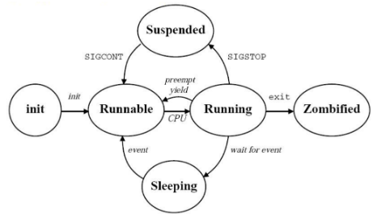

# Plánování a synchronizace procesů
- Otázky: transakce
- Předmět: IOS
- prezentace:
  - [správa procesů](https://wis.fit.vutbr.cz/FIT/st/cfs.php.cs?file%3D%2Fcourse%2FIOS-IT%2Flectures%2Fios-prednaska-05.pdf%26cid%3D13332)
  - [synchronizace procesů](https://wis.fit.vutbr.cz/FIT/st/cfs.php.cs?file%3D%2Fcourse%2FIOS-IT%2Flectures%2Fios-prednaska-06.pdf%26cid%3D13332)

## Plánovač 
- Přiděluje procesor procesům.
## Proces 
- Běžící program. 
- Definuje ho:
    - Identifikátor (PID)
    - Stav jeho plánování
    - Programem, kterým je řízen
    - Obsahem registrů
    - Data a zásobník
    - Využité zdroje OS (otevřené soubory, signály…)

### Stavy procesu 
- Vyjadřuje aktuální aktivitu procesu a je důležitý pro plánování
- Stavy v každém OS:
    - Nový (New) - Právě vytvořen.
    - Běžící (Running) - Právě se provádějí jeho instrukce.
    - Čekající (Waiting) - Čeká na výskyt nějaké události (IO např.)
    - Připravený (Ready) - Čeká na procesor.
    - Ukončený (Terminated) - Ukončil svůj běh.
- Další stavy na UNIXu
    - Zombie - Ukončený proces co čeká na “uklízení”.
    - Odložený (Suspended) - Zmrazený signálem (SIGSTOP).

### Process Control Block (PCB) 
- Struktura, kterou používá OS pro uložení dat o procesu. 
- Zahrnuje:
    - ID procesu
    - Stav plánování procesu
    - Obsahem registru
    - Plánovací informace (priorita)
    - Informace spojené se správou paměti (tabulky stránek…)
    - Informace o běhu (využití procesoru…)
    - Využití I/O zdrojů (otevřené soubory, používaná zařízení...)

### Uživatelský adresový prostor přístupný procesu (User address space)
- Kód
- Data
- Zásobník
- Soukromá data sdílených knihoven, sdílené knihovny, sdílená paměť

### Uživatelská oblast (User area) 
- Zvlášť pro každý proces spolu s daty, kódem a zásobníkem v user address space. 
- Není vždy použita. 
- Přístupná pouze jádru, obsahuje:
    - PID, PPID, UID, EID, GID, EGID
    - Obsah registrů
    - Deskriptory souboru
    - Obslužné funkce signálu
    - Účtování (Spotřeba CPU)
    - Pracovní a kořenový adresář

### Záznam v tabulce procesů (process table) 
- Uložen trvale v jádru. 
- Obsahuje informace o procesu (PID, PPID…, Stav plánování, událost na kterou se čeká, čekající signály, odkaz na tabulku paměťových regionů procesu...)

### Tabulka paměťových regionů procesu (pre-process region table) 
- Popis paměťových regionů procesu 
  - Spojitá oblast virtuální paměti použitá pro data, kód, zásobník, sdílenou paměť, tabulku stránek…

### Zásobník jádra 
- Využívan za běhu služeb jádra pro daný proces.

### Kontext procesu (v UNIXu)
- Uživatelský kontext - kód, data…
- Registrový kontext
- Systémový kontext - Uživatelská oblast, položka tabulky procesů…

### Systémová volání nad procesy - Pro využití funkcionalit jádra

### Hierarchie procesů 
- Předkem všech skoro procesu je proces init (PID=1).
- Pokud procesu skončí předek, jeho předkem se stane init.
### Přepnutí kontextu procesu 
- Dochází k němu, když OS sebere procesu procesor aby ho mohl využít jiný proces. 
- Je potřeba uložit stav starého procesu - registry, zásobník… a poté se musí načíst druhý proces. 
- Kontex je reprezentován jako PCB.

### Úloha 
- Skupina paralelně běžících procesů spuštěných jedním příkazem a propojených do pipeline.
### Skupina procesů 
- Množina, které je množné poslat signál jako jedné jednotce (může mít vedoucího).
### Sezení 
- Každá skupina procesů je v jednom sezení (může mít vedoucího).

### Plánování procesů 
- Vyžaduje se maximální využití procesoru a zároveň efektivní přepínání mezi procesy. 
- Plánování zajišťuje plánovač.
- Druhy plánování:
  - Preemptivní - Běžící proces neovlivní přepnutí kontextu, je uspán (např. časovačem).
  - Nepreemptivní - K přepnutí kontextu dojde, pouze pokud to běžící proces umožní předáním řízení jádru (systémové volání).

## Plánování procesů

### Dispečer (Dispatcher) 
- Řeší přepnutí procesů na základě plánovače (odebere procesor a přiřadí ho jinému procesu). 
- Trvá velmi dlouhou dobu (až tisíce instrukcí).
### Plánovací kritéria 
- Plánovače mají různé algoritmy, které mají různá kritéria a tak upřednostňují jiné třídy procesů.
    - Využití CPU
    - Propustnost
    - Doba běhu
    - Doba čekání
    - Doba odezvy

### Plánovací fronta 
- Po vstupu procesu do systému je vložen do fronty úloh, které obsahuje všechny procesy OS a jsou zde pouštěny k procesoru. 

### Plánovací algoritmy
- First Come First Served (FCFS) 
  - FIFO 
  - Jedná se o frontu. 
  - Je nepreemptivní a je zde poměrně dlouhá doba čekání.
- Round Robin 
  - Preemptivní podoba FCFS. 
  - Každý proces má časové kvantum a po jeho vypršení je procesor odebrán procesu a zařazen na konec fronty. 
  - Fronta je implementovaná jako kruhová fronta.
- Shortest Job First (SJF) 
  - Rozhoduje o přidělení procesoru doby obsazení procesoru - procesu s nejkratší dobou využití CPU a bez I/O je přidělen procesor. 
  - Nepreemptivní, minimalizuje průměrnou dobu čekání. 
  - Nutnost znát/odhadnout jak dlouho proces poběží. 
  - Hrozí zde hladovění procesů.
- Prioritní plánování 
  - Každému procesu je přiřazena priorita. 
  - Proces s největší prioritou dostane procesor. 
  - Ty které mají stejnou prioritu se rozhodnou podle FCFS. 
  - Hrozí vyhladovění.
    - Víceúrovňové 
      - Více úrovní/kategorií priorit.
    - Víceúrovňové se zpětnou vazbou 
      - Nově vznikající proces je zařazen do fronty s největší prioritou a postupně klesá do nižších prioritních front. 
      - Na nejnižší úrovni je round robin. 
      - Priorita se při čekání může zvyšovat.
    - Víceúrovňové se 100 prioritními úrovněmi 
      - Využívá se v Linuxu. 
      - Priorita se mění dle čekání nebo využívání CPU.
- O(1) plánovač 
  - Ve starší verzi jádra Linuxu. 
  - Víceúrovňové plánování se zpětnou vazbou s prioritami dle spotřeby a čekání. 
  - Dvě fronty - **aktivní** a **expirovaná**, kde procesy se z aktivní pomalu dostanou do expirované a jak tam jsou všechny jsou fronty přehozeny.
- Completely Fair Scheduler (CFS) 
  - Odstraňuje složitost O(1). 
  - U každého procesu si vede údaje o využitém procesorovém čase a minimálním stráveném procesorovém čase. 
  - Procesy má ve vyhledávací stromové struktuře a vybírá proces s nejmenším stráveným časem. 
  - Procesy nechává běžet po nějaké časové kvantum s rychlostí virtuálního času ovlivněnou prioritou(nižší prioritě běží virtuální čas rychleji) a pak je zařadí zpět do plánovacího stromu
- Plánování ve Windows NT a výše 
  -  Víceúrovňové plánování se zpětnou vazbou na základě interaktivity (32 úrovní). 
  -  Proces s oknem v popředí dostane větší prioritu a také okna s IO (vstup z klávesnice/myši).

### Problém vyhladovění 
- Proces příliš dlouho čeká na procesor a je neustále předbíhán jinými procesy (s větší prioritou). 
- Řešení - Explicitní kontrola nebo časová kvanta pro procesy.

### Problém inverze priorit 
- Nízko prioritní proces si naalokuje  nějaký zdroj a pak ho předbíhají více prioritní procesy a nemůže dokončit práci s tímto zdrojem. 
- Časem tento zdroj mohou potřebovat více prioritní procesy, ale jsou zablokovány a musí čekat na nízko prioritní proces, který má daný zdroj zabraný.
- Řešení - Procesy v kritické sekci získávají větší prioritu, proces blokující zdroj procesu s vyšší prioritou získá jeho prioritu (v kritické sekci), zákaz přerušení v kritické sekci.

## Vlákna
- Slouží pro tvorbu paralelních nebo souběžných programů. 
- Jedná se o takový odlehčený proces. 
- Výhodou je rychlejší spouštění a přepínání oproti procesům, zvyšuje rychlost odezvy aplikace, sdílený prostor dovoluje více aktivit na stejném adresovém prostoru. 
- Je identifikováno:
    - ID
    - Aktuální pozicí v programu
    - Vlastní množinou registrů a zásobníkem.

## Komunikace procesů
- Signály - kill, stop…
- Roury - |
- Zprávy - msgsnd, msgrecv
- Sdílená paměť - shmget, shmat
- Sockety
- Remote Procedure Call (RPC)

### Signály 
- Číslo zaslané procesu zvláště definovaného rozhraní. 
- Jsou generovány při chybách (sigsegv, aritmeticka chyba…), při externích událostech (dostupnost IO, vypršení časovače) a nebo na žádost procesu (kill). 
- Vznikají asynchronně k činnosti programu. 
- Implicitní reakce jsou ukončení, pozastavení a ignorování.
### Blokování signálu 
- Nastavením masky blokovaných signálů pomocí funkce sigprocmask. 
- Nelze blokovat SIGSTOP, SIGKILL a SIGCONT. 
- Nastavení se dědí na potomky.

## Synchronizace procesů 
- Musí k ní docházet při práci se zdroji, aby nedošlo k problémům (přečtení staré hodnoty…)

### Kritické sekce 
- Jejich provádění jedním procesem vylučuje současné provádění ostatními procesy (zápis do souboru).
- Problém vzájemného vyloučení 
  - Nanejvýš jeden proces je v daném okamžiku v kritické sekci.
- Uváznutí (Deadlock) 
  - Každý ze skupiny procesů je pozastaven a čeká na uvolnění zdroje který vlastní jeden z těchto (pozastavených) procesů.
- Blokování 
  - Proces čeká na uvolnění KS, ale ta není nikým využívaná. 
  - V případě že žádáme aby se procesy v KS střídaly ale jeden proces bude o sekci žádat s vyšší frekvencí a ten pak musí pravidelně čekat přestože druhý proces kritickou sekci nepotřebuje. 
  - Pokud pak proces, který je na řadě skončí, druhý se již nedostane.
- Vyhladovění (starvation) 
  - Proces čeká na podmínku, která může ale nemusí nastat (pokud by se vybíralo náhodně, je šance že proces nebude vybrán).
- Livelock 
  - Všechny procesy běží, ale vzájemně žádají o zdroj, který potřebují, ale neuvolní ten obsazený, dokud nezískají žádaný.
- Specializované algoritmy pro vstup do kritické sekce
    - Petersonův algoritmus 
        - Proces nastavením příznaku vyjádří svůj zájem o kritickou sekci, ale zároveň dá přednost jinému procesu. 
        - Následně čeká na uvolnění kritické sekce, nebo až mu druhý proces vrátí přednost.
    - Bakery algoritmus 
        - Před vstupem do KS získá proces “lístek” s jehož hodnota je větší než procesy, které již lístek mají. 
        - Pokud je hodnota stejná (kvůli tomu že se nekontrolují všechny lístky), rozhoduje se podle velikosti ID. 
        - Držitel nejmenšího čísla lístku může vstoupit do kritické sekce

### Semafory 
- Synchronizační prostředek nevyžadující aktivní čekání. 
- V principu je to sdílená hodnota se 2 atomickými operacemi - lock (wait) a unlock. 
- Atomicita je zaručena například zákazem přerušení. 
- Zámky jsou například read-write (čtení lez zamknout vícenásobně), reentrantní (více zamknutí) nebu mutexy (odemkne ho jen proces co ho zamknul). 
- Hodnota větší jak 0 znamená odemknuta, hodnota 0 a méně je zamknuto. 
- Procesy jsou pozastaveny a tak nečekají aktivně.

### Monitory 
- Vysokoúrovňové synchronizační mechanismy, často vystavěné nad semafory. 
- Jedná se o abstraktní datový typ, který zapouzdřuje sdílená data, nad kterými je možné implementovat operace. 
- Je však zaručeno, že v jeden okamžik bude rozpracována pouze jedna z těchto operací. 
- Řešení problému vzájemného vyloučení. 
- Často rozšířené o podmínky.

### Uváznutí (Deadlock) 
- Situace, kdy ve skupině procesů každý čeká na uvolnění prostředku s výlučným přístupem. 
- Podmínky uváznutí(Cofmanovi podmínky):
    1. Vzájemné vyloučení při použití prostředků (prostředek může v jeden okamžik používat jenom jeden proces).
    2. Vlastnictví alespoň jednoho zdroje, pozastavení a čekání na dalši (Proces může žádat o prostředky i když již má nějaké přiděleny).
    3. Prostředky vrací proces, který je vlastní až po dokončení jejich využití (jakmile proces zmíněný prostředek vlastní, nelze mu ho bezpečně odebrat, musí ho vrátit sám).
    4. Vzniká cyklická závislost na sebe čekajících procesů (proces 1 vlastní zdroje a čeká na zdroj používaný procesem 2, ten vlastní také zdroje a čeká na uvolnění zdrojů procesu 3 a tak dále až nakonec proces n čeká na uvolnění zdroje procesu 1).

**Řešení problému uváznutí**
- Prevence uváznutí - Principem je zrušení některé z nutných podmínek uváznutí.
    1. Nepoužívat sdílené prostředky nebo užívat sdílené prostředky umožňující sdílený přístup a u kterých není nutné vzájemné vyloučení.
    2. Proces může žádat o prostředky pouze tehdy, pokud žádné nevlastní.
    3. Pokud proces požádá o prostředky, které nemůže momentálně získat, je pozastaven a všechny jeho prostředky jsou mu odebrány a čeká se, až mu mohou být všechny potřebné prostředky přiděleny.
    4. Prostředky jsou očíslovány a je možné je získat pouze od nejnižších čísel k vyšším (nebo  v jiném pevně daném pořadí).
- Vyhýbání se uváznutí 
  - Princip je založen na tom, že každý proces před spuštěním deklaruje určité informace o způsobu, jakým bude využívat sdílené zdroje - v nejjednodušším případě se jedná o maximální počet současně požadovaných zdrojů jednotlivých typů. 
  - Toto se poté využívá k rozhodování o tom,které požadavky mohou být uspokojeny tak aby nevznikla cyklická závislost (využívá se bankéřův algoritmus).
- Detekce a zotavení se po uváznutí 
  - Periodicky se kontroluje jestli nedošlo k uváznutí (cyklem v grafu zdrojů). 
  - Zotavení se dělá ukončením některých nebo všech zablokovaných procesů a nebo odebráním zdrojů některým procesům a jejich pozastavení na určitou dobu.

    

**Fromální verifikace**
- V jednoduchých případech je možné provést formální verifikaci, že nemůže v systému dojít k nežádoucímu chování (toto je možné také provést inspekcí, simulací, testováním,dynamickou analýzou, formální verifikacea nebo kombinací přístupů). 
- Proces formální verifikace
    1. Vytvoření modelu
    2. Specifikace vlastnosti, kterou chceme ověřit (že nedojde k deadlocku např.)
    3. Kontrola jestli model splňuje specifikaci.
- Přístupy k formální verifikaci
    - Theorem proving 
    - Model checking - Generování a prohledávání stavového prostoru
    - Statickou analýzou - Ověření vlastností na základě popisu modelu aniž by se procházel stavový prostor.

## Transakce 
- Skupina operací, které jsou vykonávány jako celek. 
- Cílem je udržení modelu stavu skutečného světa během změn v konzistentním stavu. 
- Jejich zpracování se musí vypořádat s výskytem poruch a paralelismem. 
- Vlastnosti jsou ACID:
    - **A** - tomicity - Atomicita transakce - buď je provedena celá nebo vůbec.
    - **C** - onsistency - Konzistence datového modelu (zajišťování integritních omezení)
    - **I** - solation - Sekvenční zpracování transakcí - v jednom okamžiku je zpracována maximálně jedna transakce.
    - **D** - urability - Trvanlivost změn - Úspěšně dokončená transakce znamená trvanlivé změny v systému.

