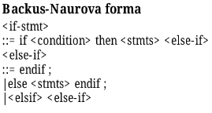

# Objektová orientace
- Otázky: základní koncepty, třídně a prototypově orientované jazyky, OO přístup k tvorbě SW
- Předmět: IPP
- prezentace:
  - [Principy objektově orientovaného programování](https://wis.fit.vutbr.cz/FIT/st/cfs.php.cs?file%3D%2Fcourse%2FIPP-IT%2Flectures%2F2020-21%2F02-04_IPP_OOJ-Krivka.pdf%26cid%3D14009)
  - [Návrhové vzory](https://wis.fit.vutbr.cz/FIT/st/cfs.php.cs?file%3D%2Fcourse%2FIPP-IT%2Flectures%2F2020-21%2F11-IPP_Navrhove_vzory-Krivka.pdf%26cid%3D14009)
## Objektově orientované programování 
- Speciální programovací paradigma, kde je kód přidružen k datům. 
- Snaží se o napodobování objektů reálného světa. 
- Mezi výhody patří analogie reálného a softwarového modelu, flexibilita, znovupoužitelnost a vlastnosti těchto jazyků jako je dědičnost nebo např. zapouzdřenost. 
- Nevýhodou může být často složitější sémantika či režie spojená s prací s objekty.

## Koncepty OOP
- **Objekty** 
    - Jednotlivé prvky modelované reality. 
    - Pamatují si svůj stav a navenek poskytují operace.
- **Abstrakce** 
    - Některé detaily mohou být abstrahovány. 
    - Funkce černé skříňky, pro okolí definovaná pouze svým rozhraním, přes které komunikuje s okolím a nikoli vnitřními detaily implementace, které může být zjednodušením reálného světa.
- **Zapouzdření** 
    - Skutečná implementace je skrytá. 
    - Nelze měnit interní stav objektu libovolným způsobem (je potřeba použít rozhraní daným protokolem).
- **Kompozice** 
    - Objekt může obsahovat jiné objekty.
- **Delegování** 
    - Objekt může využívat služeb jiných objektů použitím rozhraní.
- **Dědičnost** 
    - Objekty jsou organizovány stromovým způsobem, kdy objekty jednoho druhu mohou dědit schopnosti z tříd jiného druhu a rozšířit je o své schopnosti. 
    - Důležité pro udržovatelnost a rozšířitelnost systémů. Dědičnost může být buď jednoduchá (jeden rodič) nebo vícenásobná (více rodičů).
- **Polymorfismus** 
    - Odkazovaný objekt se chová podle toho jaké je třídy instancí. 
    - Několik objektů tedy poskytuje stejné rozhraní a pracuje se s nimi navenek stejně, konkrétní chování se liší podle implementace. 
    - V případě polymorfismu podmíněného dědičností to může být například rozdílné chování třídy, která dědí na stejně volanou metodu.

## Další pojmy

- **Přetěžování metod** 
  - Dovoluje definovat více metod se stejným názvem, ale rozdílným počtem argumentů a tělem metody.
- **Přetěžování operátorů** 
  - Dovoluje změnu funkce operátoru nebo definice operátorů pro vlastní typy.
- **Časná/Statická vazba** 
  - Při překladu nemusí být známé (kvůli polymorfismu) s jakým typem objektu (potomkem) se bude pracovat a tak se použije otcovská třída. 
  - Řeší se za překladu.
- **Pozdní/Dynamická vazba** 
  - Volání metody se řeší až za běhu programu a tak je volaná synovská implementace metody - tzv. virtuální metody.
- **Tabulka virtuálních metod (Virtual Method Table - VMT)** 
  - Implementace nutná pro polymorfismus a metody s pozdní vazbou. 
  - Tabulka se naplní metodami a podle typu za běhu je volaná ta správná definice.
- **Rozhraní (Interface)** 
  - Schéma, které deklaruje množinu metod, které musí třída, která toto rozhraní implementuje implementovat.

## Třídně orientované jazyky 
- Zavádí pojem třídy, která je takovou šablonou pro vytvářený objekt. 
- Stará se o správu protokolu objektu, směrování zpráv a může obsahovat implementace některých metod. 
- Po vytvoření objektu je volaný konstruktor. 
- Existují zde statické metody a proměnné (jsou stejné pro všechny objekty). (Java, C++, C#...).

## Prototypově orientované jazyky 
- Většinou ve skriptovacích dynamicky typovaných jazycích. 
- Nemají třídy a objekty se vytváří buď přímou definicí nebo klonováním objektů. 
- Klonovaný objekt je přesnou kopií a má v sobě často ukazatel na originální objekt (prototyp). 
- Pokud objekt nemá implementaci nějaké metody použije se delegace a metoda se hledá v prototypu. 
- Třídy zde lze nahradit **rysy**
  -  objekty, které obsahují pouze metody a jejich klony při delegování používají tyto metody. 
- Provázáním rysů je možné řešit dědičnost. (Self, JavaScript...)

> **Prototyp** = Rys doplněný o objekt, který obsahuje sloty instančních proměnných s výchozími hodnotami a ve svém rodičovském slotu odkazuje na rys.

## Vlastnosti OOJ
### Syntaxe 
- Popisováno pomocí kombinace BNF (Backus-Naur form), EBNF, bezkontextových gramatik a slovního popisu s příklady.

### Sémantika 
- Velmi složitá na formální popis a používá se tak převážně slovní popis a příklady.
### Překlad 
- Popis každé třídy je uložen. 
- Náročná práce se jmenným prostorem a modifikátory viditelnosti. 
- Sémantická analýza je obtížnější kvůli polymorfismu, pozdní vazby a modifikátorů viditelnosti.

## Typy OOJ
- Čistý = vše je objekt (Smalltalk, SELF) 
- Hybridní = odvození od strukturovaných/modulárních jazyků 
    - Základní/primitivní datové typy (čísla, znaky) 
    - Datové struktury 
    - Třída je speciální případ datové struktury 
    - Často jiná syntaxe a sémantika oproti základním 
    - Riadenie toku: Procedurální - příkazy volání funkce, větvení, iterace_OO: instanciace, přiřazení, (polymorfní) invokace metody

