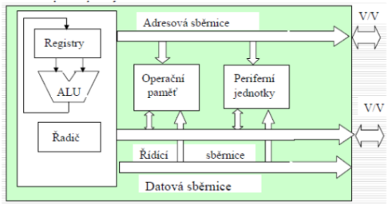

# Programování v jazyku symbolických instrukcí
- Otázky: činnost počítače, strojový jazyk, symbolický jazyk, assembler
- Předmět: ISU
- zdoje:
  - https://docs.google.com/document/d/1WR3wW3GcCOX9s6LquO9XYOiVyecESQTzWOPF95uKnA0/edit#

## Jazyk symbolických instrukcí/adres 
- Nestrukturovaný imperativní nízkoúrovňový programovací jazyk (třída jazyků - NASM, MASM, GAS…). 
- Obsahuje symbolické reprezentace strojových instrukcí procesoru (proto takové české jméno).

## Strojový kód/jazyk 
- Posloupnost strojových instrukcí prováděných procesorem.

## Strojová instrukce 
- Kódovaný příkaz pro provedení elementární operace procesoru, kterou je schopen procesor přímo vykonat. 
- Procesory se liší v nabízené sadě strojových instrukcí. 
- Instrukce jsou reprezentovány mnemonikou, tedy jménem instrukce (SUB, ADD, IMUL, MOVAPS…) ta může ale nemusí být následována operandem nebo operandy. 
- Mnemonika je poté převedena na číselnou reprezentaci instrukcí. 
- Každá instrukce se skládá z:
  - **Operačního kódu**
    - Říká co se bude provádět. 
    - Určuje typ instrukce a jejích operandů. 
    - V případě CISC procesorů se někdy tento operační kód (a tedy i instrukce) skládá z posloupnosti mikooperací (microops), jelikož některé instrukce jsou velmi složité a je potřeba je poskládat ze základních operací (sčítání, posun…). 
    - Například POPF má 9 microops, FPATAN až 102 na Ivy Bridge procesorech.
  - **Operandů** 
    - Definuje s čím se bude instrukce provádět. 
    - Operandy mohou někdy být implicitní (FADDP - st1 = st0+st2; pop) a může jich být rozdílné množství (IMUL má jak jednooperandovou, tak dvoj, tak i tří operandovou verzi - IMUL r/m64, IMUL r64, r/m64, IMUL r64, r/m64, imm32
    - Operandy mohou být:
      - Konstanta
      - Registr
      - Adresa určená konstantou
      - Adresa určená hodnotou v registru
      - Adresa určená kombinací registru a konstant (ofsety)

## Asembler 
- Program, který převede jazyk symbolických adres na strojový kód. 
- Asembler podporuje určitý syntax jazyka symbolických adres (NASM, TASM, GAS, INTEL ASM…), který udává pořadí operandů (MOV RAX, 42 nebo MOV #42, %RAX), zápis registrů a konstant (ECX, %ECX, 42, #42). 
- Často podporují konstrukty jakou jsou makra či speciální funkce (__float32__(3.1415)). 
- Stejně tak doplňuje jazyk o pseudoinstrukce, které jsou direktivou pro překladač (například align pro zarovnání dat…).
- Překlad ve většině překladačů probíhá dvěma a více průchody, existují však speciální jednoprůchodové assemblery.

### Makro (Macro) 
- Slouží k definování symbolů, které může být podmíněné při překladu. 
- V podstatě se jedná o to, že preprocesor při překladu po nalezení volání makra toto “volání” nahradí jeho definicí. 
- Makra mohou být jak hodnotové (%define foo 42) tak funkční (%macro bar 4 …).

## Procesor (CPU) 
- Základní výpočetní jednotka v počítači, která vykonává strojové instrukce počítačového programu a obsluhuje jeho vstupy a výstupy. 
- Komunikace probíhá pomocí sběrnice.
- Obsahuje registry pro rychlou práci s hodnotami, jejich počet a velikosti se liší dle instrukční sady. 
- Existují také zásobníkové procesory, které místo s registry provádí operace nad zásobníkem (podobně jako to má FPU).
- Části:
    - **Řadič** - Zajišťuje součinnost jednotlivých částí procesoru.
    - **Registry** - Kromě registrů, které může využívat programátor (RAX, RCX, RBX…) obsahuje CPU také registry sloužící pro uchovávání mezivýsledků a informací pro procesor a programátora (EFLAGS, IP…)
    - **ALU** - Aritmeticko-logická jednotka - Provádí nad daty aritmetické a logické operace.
    - **FPU** - Viz. dole, některé procesory jí však mít nemusí.
    - **Vektorová jednotka (SIMD)** - Pro vektorové zpracování a operace nad daty (SSE, AVX, Neon…)

        

### Matematický koprocesor (FPU) 
- Vykonává operace s čísly v pohyblivé řádové čárce. 
- x86 koprocesory obsahují 80bitové registry a umí pracovat s 32b, 64b a 80b hodnotami. 
- Registry jsou pojmenovaný STx (x je číslo registru) a pracuje se s nimi jako se **zásobníkovými registry** - st0 je vrchol tohoto zasobníku. 
- Všechny instrukce pro koprocesor obsahují prefix *F* a mnoho instrukcí obsahuje variantu se sufixem *P*, který automaticky výjme (POP) hodnotu z vrcholu FPU. 
- Koprocesor FPU je také na Intel procesorech využívaný technologií MMX, která pracuje s celými čísly, ale využívá registry FPU.

### Činnost procesoru při vykonávání instrukcí 
- Zjednodušené vykonávání instrukce má následující podkroky:
  1. **Fetch** 
       - Do instrukčního registru je načtena instrukce, která se má vykonat. 
       - Je na ni ukozováno Instruction Pointer registrem (IPR) a tento registr je inkrementován aby ukazoval na následující instrukci..
  2. **Decode**
       - Obsah instrukčního registru je dekódován. 
       - Zjištění o jakou instrukci se jedná a dekódování operandů.
  4. **Execute** 
       - Provedení dekódované instrukce například v ALU, v FPU nebo v této části samotné (skok, nop…).

### Registry procesorů x86 
- Bez prefix je to varianta pro 16bitový mód, prefix *E* je pro 32bitový mód, *R* jsou pro 64bitový.
- **(E/R)FLAGS** 
  - Registr příznaků (přetečení, podtečení, znaménka, směru řetězových instrukcí, nulovosti…)
- **(E/R)IP** - Instruction pointer 
  - Ukazuje na následující instrukci, která se má vykonat.
- **(E/R)SP** - Stack pointer 
  - Ukazatel na vrchol zásobníku.
- **(E/R)AX** - Akumulátor 
  - Implicitní registr pro některé instrukce.
- **(E/R)AX/BX/CX/DX/SI/DI/BP, R8-R15 - All purpose registers** 
  - Registry, které může programátor normálně využívat na co chce, některým jsou však specifikovány účely na které by měli/mohli být využity (BP jako ukazatel na zásobník dat procedury...) a některé implicitně drží výsledky instrukcí (CX zbytek po dělení a counter pro LOOP).

odkazy z google docs:
 - cyklus vykonávání instrukcí: https://www.youtube.com/watch?v=Z5JC9Ve1sfI
 - jak funguje CPU: https://www.youtube.com/watch?v=NKYgZH7SBjk

### Přenosové instrukce:
```
MOV dst, src
```


### Aritmetika

**Inkrement, Dekrement**

```
INC dst
DEC dst
```

**Sčítání a Odčítání**

```
ADD dst, src
SUB dst, src
```

**Bitová negace**
```
NEG dst
```

**Násobení**
```
mul src
imul src - se znaménkem
```
Pro různé velikosti operandu src se tedy provede:
- Pro 8 bitový operand: AX = AL * src
- Pro 16 bitový operand: AX:DX = AX * src
- Pro 32 bitový operand: EAX:EDX = EAX * src 

Později rozšířeno:
```
imul dst, src       ; dst = dst * src
imul dst, imm       ; dst = dst * imm
imul dst, src, imm  ; dst = src * imm 
```

**Dělení**

```
div src
idiv src - se znaménkem 
```

Pro různé velikosti operandu src se tedy provede:
- Pro 8 bitový operand: AH = AX / src AL = AX % src
- Pro 16 bitový operand: AX = AX:DX / src DX = AX:DX % src
- Pro 32 bitový operand: EAX = EAX:EDX / src EDX = EAX:EDX % src

### Posuvy a rotace

instrukce:
- SHL, SHR, SAR, RCL, RCR, ROL, ROR

syntaxe:

```
SHL reg, count  ; Přímo zadaná hodnota count
SHL reg         ; Hodnota count v registru CL
SHR reg, count
SHL reg 
```


### Skoky

**Nepodníněné skoky**

```
JMP dst
```
Operandem instrukce dst může být návěští, šestnáctibitový registr nebo
šestnáctibitové místo v paměti. 

**Podmíněné skoky**

```
JXX dst
```

- Operandem instrukce dst může být pouze návěští.
- Podmíněné skoky testují příznaky sign (S), zero (Z), carry (C), parity (P), a
overflow (O). 
- Je však také možno provádět podmíněné skoky na základě předchozího porovnání dvou čísel instrukcí CMP. 
- Je však třeba rozlišovat, zda jde o čísla se znaménkem (používáme termíny Greater/Less/Equal) nebo bez znaménka (termíny Above/Below/Equal)


**Porovnání**

```
CMP dst, src
```


### Cyklus

**LOOP**

Instrukce LOOP je kombinací instrukcí DEC a JNZ. Instrukce dekrementuje
registr CX a pokud CX není 0, skočí na návěští, které je operandem instrukce.
Pokud je CX nula, je provedena instrukce následující za LOOP. 

```
LOOP label
```


**Varianty LOOP**

```
LOOPE label
LOOPZ label
```
Význam:
```
(E)CX = (E)CX – 1
if (E)CX > 0 and ZF=1, jump to label
```
^^^Vhodná pro hledání prvního prvku v poli, který se nerovná dané hodnotě.^^^

```
LOOPNE label
LOOPNZ label
```
Význam:
```
(E)CX = (E)CX – 1
if (E)CX > 0 and ZF=0, jump to label
```
^^^Vhodná pro hledání prvního prvku v poli, který se rovná dané hodnotě.^^^

