# Služby aplikační vrstvy
- Otázky: web, e-mail, DNS, IP telefonie, správa SNMP, Netflow
- Předmět: ISA
  - https://docs.google.com/document/d/1WR3wW3GcCOX9s6LquO9XYOiVyecESQTzWOPF95uKnA0/edit#heading=h.fwrc9warf824

## Aplikační vrstva
- Nejvyšší (nejvíce abstraktní) vrstva IP a OSI modelu. 
- Specifikuje komunikační protokol mezi sítí a aplikací (uživatelem). Např. SNMP, POP, CoaP, Whois, SSH…

# E-mail 
- Systém pro zasílání a příjem elektronické pošty (zpráv).

### Současné požadavky na e-mailový systém
- Doručení zpráv přímo cílovému uživateli.
- Interní struktura (přeposílání, odpovídání…).
- Bezpečné doručení zpráv.
- Možnost vytvářet zprávy s různým typem obsahu (MIME types).

## Architektura
**Mail User Agent (MUA - Klient)** 
- Zpracování zpráv. 
- Program pro vytváření a čtení zpráv a manipulaci se schránkou. 
- Jedná se o rozhraní pro uživatele. 
- Protokoly POP3, IMAP...

**Mail Transfer Agent (MTA - Server)** 
- Přenos zpráv od zdrojového PC na cílový (server/PC). 
- Přepravu realizuje SMTP protokol. 
- Např. Sendmail, Microsoft Exchange Server, qmail...

**Mail Delivery Agent** 
- Občas je brán jako samostatná část architektury. 
- Program pro lokální doručování. 
- Např. procmail nebo maildrop.

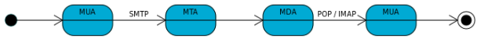

## Protokoly

### SMTP - Simple Mail Transfer Protocol 
- Internetový protokol pro přenos zpráv elektronické pošty. 
- Pracuje nad protokolem TCP na portu 25 pro komunikaci mezi servery (MTA) a na portu 587 pro komunikaci s klienty (MUA). 
- V případě detekce trvalé chyby (server neexistuje nebo uživatel neexistuje) se zasílá odesílateli informace o selhání. 
- V případě dočasné chyby (server je momentálně nedostupný nebo zaneprázdněn) by měl server uložit dopis do fronty na určitou dobu a opakovat pokusy o odeslání. 
- Pokud ani po určené době se nepovede je dopis zahozen a informace odeslána odesílateli.

**Komunikace:**
1. Navázání spojení
2. Identifikace klienta (zpráva HELO pro SMTP nebo EHLO pro ESMTP)
3. Vyplnění údajů (MAIL FROM, RCPT TO)
4. Napsání zprávy (DATA)
5. Ukončení (QUIT)

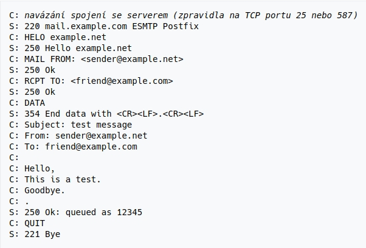

### POP3 (Post Office Protocol v3) 
- TCP spojení. Stáhne všechny emaily a zobrazuje je lokálně (může trvat dlouho). 
- Velmi jednoduchý protokol
- Autorizace - USER, PASS
- Transakce - LIST, RETR, DELE, STAT
- Aktualizace a skončení - QUIT

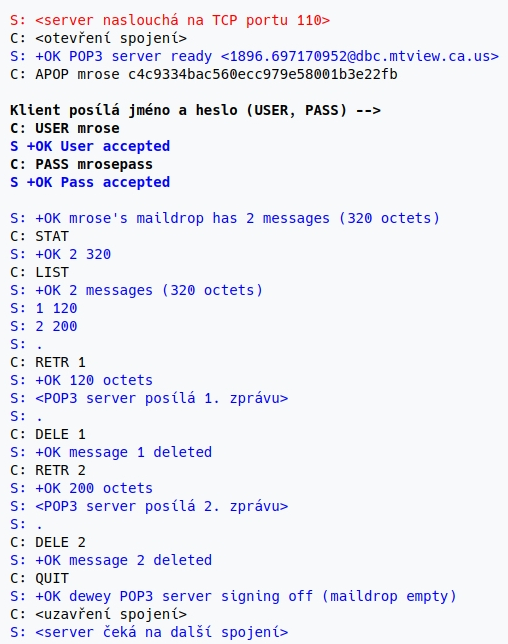

### IMAP (Internet Message Access Protocol) 
- Pracuje nad TCP. 
- Obsahuje pokročilejší správu emailu - složky, práce v online i offline režimu. 
- Do PC stahuje jen nezbytné info (hlavičky zpráv) a zbytek stáhne až na požádání. 
- Podporuje i čtení jen částí zpráv. 
- Zprávy mají své tagy (přečtené, nepřečtené, důležité…).

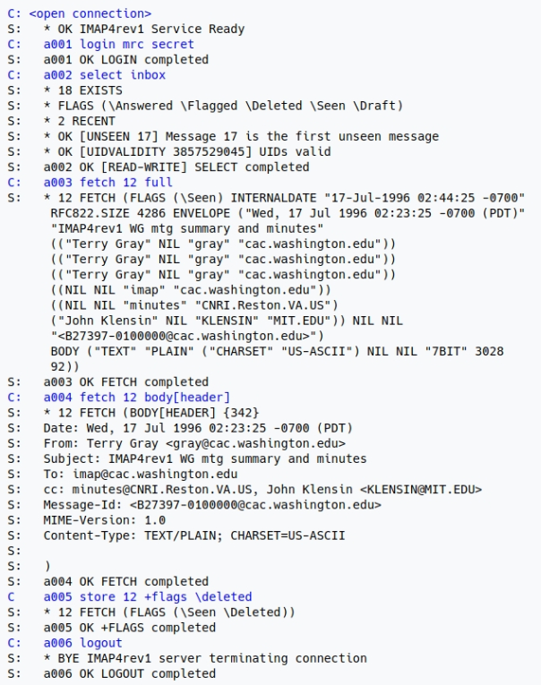

## Struktura zpravy 
- Obálka
  - Adresa odesílatele
  - Adresa příjemce
  - Priorita
- Zpráva
  - Hlavička
  - Tělo zprávy

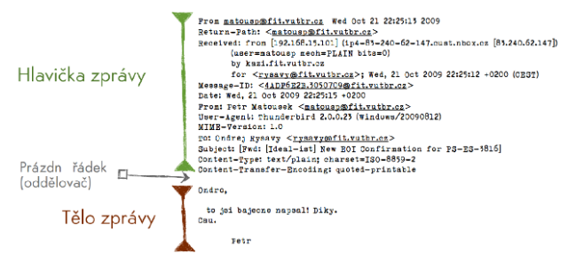

## Přenos zpráv
1. Klient odesílá zprávu pomocí SMTP na server určený doménou (kterou si získá pomocí DNS - MX záznam).
2. Server odesílatele pak tuto zprávu pošle pomocí SMTP na server příjemce (opět pomocí DNS zjistí adresu).
3. Server příjemce pak email doručí do schránky příjemce, který si ji vyzvedne pomocí IMAP nebo POP3.

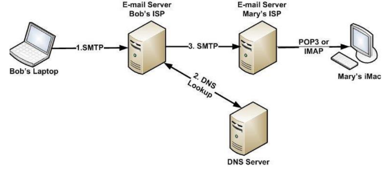

# DNS

## DNS (Domain Name System)
- Hierarchický decentralizovaný systém doménových jmen, který realizují DNS servery DNS protokolem. 
- Hlavním úkolem je převod doménových jmen a IP adres uzlů sítě - Distribuovaná databáze síťových informací. 
- Protokol pracuje na TCP i UDP (port 53). 
- Registraci a správu domén provádí organizace ICANN, která na top level správu pověřuje další organizace. 
- Top level domény jsou rozděleny na generické (.com, .org…) a nárovní (.cz, .us, .fr…).

## Prostor doménových adres 
- Tvoří hierarchicky uspořádaný strom. 
- Kořen je speciální root záznam. 
- Doména je reprezentována podstromem, kde doménové jméno je reprezentované cestou mezi vrcholem domény a kořenem stromu. 
- Konkrétní zařízení jsou reprezentovány jako listy stromu. 
- Strom lze rozdělit do zón, kde každou spravuje jiná organizace nebo osoba.

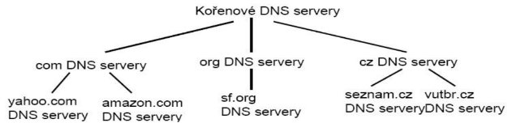

## Reverzní DNS mapování 
- Jedná se o získání doménového jména dle IP adresy. 
- Jednotlivé byty adresy je potřeba přeskládat naopak a nakonec připojit .in-addr.arpa (147.229.8.12 -> 12.8.229.147.in-addr.arpa)

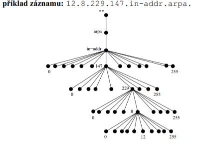

## Typy DNS serverů
### Primární 
- Úplné (autoritativní) záznamy o doménách, které spravuje. 
- Pro každou doménu je pouze jeden primární nameserver.
### Sekundární 
- Autoritativní kopie dat od primárních serverů (zone transfer).
### Záložní 
- Pouze přijímá dotazy a předává je dalším DNS serverům. 
- Odpovědi ukládá do vyrovnávací paměti (na určitou dobu do času expirace nebo explicitni notifikace). 
- Poskytuje neautoritativní odpovědi (nemusí být již aktuální).

## Resolver 
- Klientský program, který získává informace od DNS serveru a vyřizuje požadavky klienta. 
- Je součástí OS.

## Rezoluce 
- Proces vyhledávání odpovědi v DNS systému. 
- Pokud dotazovaný DNS server nezná odpověď může dělat

### Rekurzivní dotazy 
- Server se ptá dalších serverů. 
- Odpoví poté odpovědí nebo chybou.

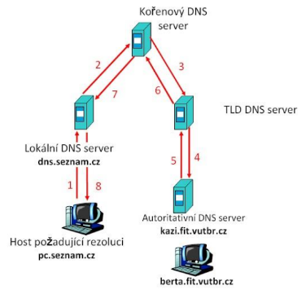

### Iterativní dotazy 
- Server odpoví, kde se má resolver zeptat. 
- Posílá tedy nejlepší možnou odpověď.

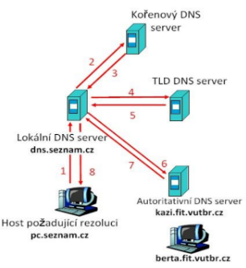

## Formát DNS záznamu
- Jméno (www.fit.vutbr.cz)
- Typ záznamu 
  - SOA (Start Of Authority) - Obsahuje název primárního serveru a emailovou adresu správce, sériové číslo, refresh, retry, expire,
  - NS (Name Server) - Určuje autoritativní server pro danou zónu.
  - A (Address) - Přímé mapování doménových adres na IP adresy.
  - MX (Mail Exchanger) - Poštovní server (lze jich mít i více). 
  - CNAME (Canonical Name) - Mapování aliasu na kanonické jméno počítače.
  - PTR (Domain Name Pointer) - Mapuje IP adresu na doménovou adresu (reverzní mapování).
  - NAPTR (Naming Authority Pointer) - Mapování retezce pro data. Použití regulárních výrazů pro dynamické záznamy v DNS.
  - TXT (Text) - Obsahuje textová data (info o doméně, serveru, správci…).
  - SRV (Server Selection) - Lokalizace služeb a serveru, distribuce zátěže či zálohování služeb.
  - AAAA, ip.arpa - A záznam pro IPv6.
- Class
- TTL (Time To Live)
- RDLENGTH
- RDATA

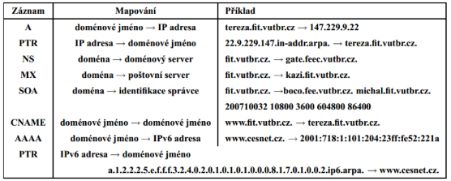
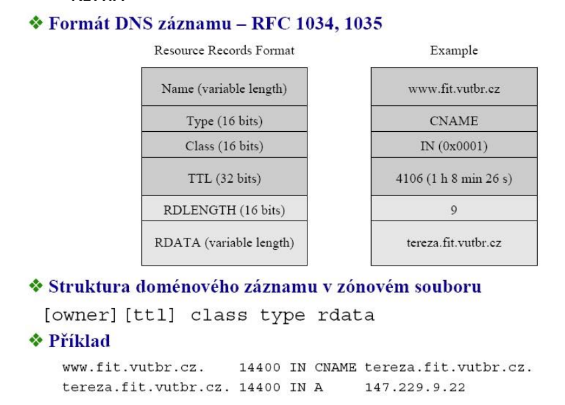

## Zabezpečení DNS 
- jedná se o veřejnou službu, která je nezbytná pro komunikaci na internetu. 
- V případě porušení integrity dat nebo autentizace zdroje by mohlo docházet k problému a to i nebezpečným (internetové bankovnictví by někdo přesměroval na svůj falešný server…).
- 
### DNSSEC 
- Zabezpečení DNS pomocí asymetrické kryptografie. 
- Využívá řetězu důvěryhodnosti, zvětšuje velikost packetu a náročnost zpracování).
### DoH (DNS over HTTPS) 
- K zabezpečení využívá HTTPS.
### DoT (DNS over TLS) 
- K zabezpečení využívá TLS.

### Bezpečnostní rizika DNS
- Podvržení odpovědi - Hádá se ID a vrací neutorizované odpovědi na dotaz klienta.
- Podvržení do cache (cache poisoning, DNS spoofing) - Podvržení špatné IP adresy do cache resolveru.
- Odepření služby (denial of service - DoS/DDoS) - Přetížení služby, které blokuje legitimní požadavky.

# IP telefonie

## IP telefonie (Voice over IP - VoIP) 
- Poskytování telefonních služeb přes internet v reálném čase. 
- Výhodami je cena, centrální správa, rozšíření vlastností telefonů, lepší kvalita hlasu… 
- Oproti klasické telefonii ale nenabízí garantovanou šířku pásma, lepší spolehlivost a zabezpečení, napájení zařízení z ústředny, zavedené standardy či lokalizaci volajícího (pro 112). 
- IP telefonie musí zaručit integraci s veřejnou telefonní sítí, spolehlivost, kvalitu a přenosové pásmo.

## Nutné funkce které musí IP telefonie zajistit
Převod hlasu na IP datagramy
Řízení komunikace - adresování, směrování a registrace účastníka.
Připojení do klasického telefonního systému JTS (PSTN) - Pomocí bran.

## Protokoly IP telefonie

### Signalizační 
- Spojení jde nejdříve do ústředny a poté do cílového místa. 
- Musí se domluvit na protokolu. 
- Musí autentizovat a autorizovat uživatele, řídit hovor, navázat a ukončit spojení.

- #### SIP 
  - Textový protokol nad UDP.
  1. Uživatel se zaregistruje (REGISTER) - Odpoví OK
  2. Ustanovení spojení (INVITE) - Pošle INVITE na nejbližší server a ten pomocí SRV záznamu v DNS pokusí zařízení vyhledat - Odpoví OK, klient ACK pro potvrzení. 
  3. Zvolí se vhodný kodek (podle toho jaký volající mají).
  4. Po dokončení volání se pošle příkaz pro ukončení (BYE)

- #### H.323 
  - Zahrnuje více protokolů a je jak signalizační tak pro přenos dat (zahrnuje RTP). 
  - Binární nad TCP. 
  - Spojení oproti SIP je po celou dobu hovoru a vyměňují se stavové informace.

- #### RAS (Registration, Admission, Status) 
  - Pro přihlášení, správu a registraci uživatele.
- #### H.225 
  - Signalizace volání během hovoru a jeho započatí a ukončení.
- #### H.245 
  - Pro vyjednání parametrů mezi volajícímu. Spojení existuje celou dobu.
- #### RTP

### Pro přenos dat 
- Nejde již přes ústřednu. 
- Přenáší hlas po částech (20-30ms).

- #### RTP (Real Time Transport Protocol) 
  - Pracuje nad UDP. A přenáší data.
- #### RTCP (RTP Control Protocol) 
  - Monitoruje a kontroluje informací pro RTP - sám o sobě nepřenáší data (to dělá RTP a tomu pomáhá). 
  - Sleduje počet přenesených a ztracených packetů, zpoždění, kolísání rychlostí...

### ENUM 
- Mapuje čísla na IP. 
- Využívá speciální DNS záznamy pro překlad telefonního čísla na IP.

## Základní komponenty pro IP telefonii
- **IP telefon** - Koncové zařízení. SW nebo HW.
- **Ústředna** - Síťové zařízení nebo program. Zajišťuje přístup a registraci pro uživatele. Výhledává volané, směruje hovory a překládá adresy.
- **Brána** - Slouží k propojení IP telefonie s veřejnou sítí (PSTN nebo GSM). Popř. se sítí co používá jinou signalizaci.
- **MCU (Multipoint Control Unit)** - Řídící jednotka pro komunikaci více koncových zařízení a bran. Obsahuje prostředky pro vytvoření vícebodové konference.
- **Aplikační server** - Poskytuje další služby - Správa identit, hlasová pošta, přidělování adres (DHCP) a překlad ENUM (DNS).

## Zpracování hlasu 
- pro lidský hlas stačí 4kHz, pokud chceme rekonstruovat signál je potřeba ho ovzorkovat s dvojnásobnou frekvencí než byl vytvořen.

## Hodnocení kvality přenosu
### ACR (Absolute category rating) 
- Metoda absolutního hodnocení - Výstupem je MOS (Mean Opinion Score), pokud je < 3 pak je přenos nedostatečně kvalitní (50 v R faktoru). >=4 je kvalitní.
### Subjektivní 
- Hodnotí lidé - Posluchač hodnotí záznamy známkami 1-5.
### Objektivní 
- Hodnotí program - Porovnává původní a přenesený vzorek.
### E-model 
- Výsledkem je R-faktor (0-100). 
- Kvalitní R-Faktor je >=70. 
- Vstupem je šum, hlasitost, kvantizační zkreslení, způsob kódování, ozvěny, zpoždění, ztráty a očekávání. 
- Výhodou oproti ACR je že výstupní R-faktor se dá zjišťovat na straně příjemce.

## Bezpečnostní rizika VoIP 
- Odposlech, viry, spam, phishing, DoS, DDoS, Neautorizované použití služby.

## Zabezpečení VoIP
- Řízení přístupu k síťovému médiu - 802.1x
- Oddělení hlasového provozu pomocí VLAN
- Zabezpečení spojení - IPSec, Secure RTP.

# Prostředky pro správu sítí

## SNMP
### SNMP (Simple Network Management Protocol) 
- Protokol pro správu sítí. Umožňuje průběžný sběr dat o síti.

### Pasivní monitorování sítě 
- Poslouchá a nezasahuje do provozu.
- Sledování logovacích souboru 
  - syslog - logování příchozích a odchozí požadavků a odpovědí.
- Čekání na událost 
  - Asynchronní zprávy/upozornění/výstrahy - SNMP traps, upozornění od aplikací, Data NetFlow

### Aktivní monitorování sítě 
- Aktivně posílá dotazy a testuje zařízení. 
- Pravidelně testuje přístupnost (ICMP, SNMP, telnet...). 
- Zatěžuje síť oproti pasivnímu.

### Analýza provozu
- Sledování v reálném čase - Sleduje se konkrétní síťové rozhraní (wireshark, tcpdump...).
- Dlouhodobé statistiky - Netflow, SNMP…

### Model pro správu sítě 
- Umožňuje průběžný sběr dat pro správu a vyhodnocení sítě

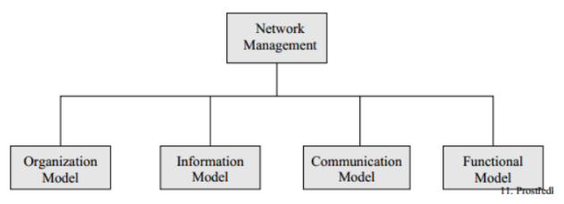

**Organizační model **
- Manager (NMS - Network Management System) 
  - Aplikace, která běží na centrálním serveru sítě. 
  - Sbírá data od agentů pomocí SNMP(aktivně). 
  - Provádí analýzu a prezentaci dat.
- Agent 
  - Běží na PC nebo na prvcích sítě. 
  - Sleduje co se děje na síťovém rozhraní (kolik packetu/bytů/ICMP…) a data ukládá do databáze (MIB). 
  - Odpovídá na dotazy Managera a asynchronně odesílá zprávy SNMPTrap (reakce na nějakou událost).

**Informační model** 
  - Popisuje strukturu a uložení dat pro správu sítě. 
  - Data ukládá do MIB - viz dole.

**Komunikační model** - Využívá SNMP. 
Definuje přenos mezi agenty a manažery - formát komunikace (GetRequest, SetRequest, Trap…).

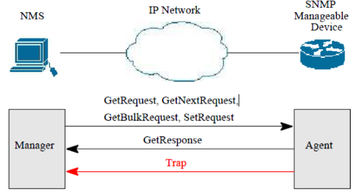

### MIB (Management Information Base) 
- Hierarchická stromová struktura, kde každý objekt má svůj ID. 
- Ukládá informace například o počtu multicast packetu, počtu přenesených bytů… 
- Pro popis datových typů využívá jazyk SMI (podmnožina ASN.1). 
- Příklad umístění 1.3.6.1.2.1.1.1 = iso.org.dod.internet.mgmgt.mib-2.system.sysDescr

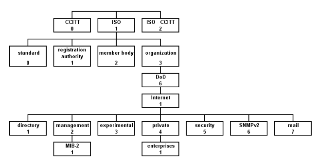

### RMON (Remote Network Monitoring) 
- Pracuje nad SNMP. 
- Využívá tzv sond a agentů pro monitorování.

## NetFlow
### NetFlow 
- Monitorování sítě na základě IP toků (sekvence packetů se stejnými údaji - IPčka, porty, protokol...). 
- Pro každý tok zaznamenává dobu vzniku a trvání, počet přenesených packetů a bytů atd…
### Architektura NetFlow
- Exportér (sonda) 
  - Síťové zařízení (HW/SW) monitorující procházející provoz. 
  - Data ukládá a po určité době odesílá kolektoru (sám ne na požádání). Záznamy se posílají vždy po dokončení toku - Detekce konce, neaktivita, příliš dlouhý tok, zaplnění paměti. 
  - Nesbírají se data od všech packetu, ale vzorkují se (deterministický po určité době nebo nedeterministicky náhodně).
- Kolektor 
  - Přijímá data z exportéru ta zpracovává a ukládá. 
  - Podporuje dotazování a grafické zobrazení dat.
- Protokol NetFlow - Komunikace.
- Nástroje na zobrazení dat - Grafy, statistiky…
### Použití netflow 
- Monitorování, plánování (stačí-li linka)
- bezpečnostní analýza v reálném čase (DoS, DDoS analýza)
- sledování aplikací uživatelů (torrent, nevhodný obsah…)
- účtování (měření IP provozu pro účtování)
- dlouhodobé ukládání informací o přenesených datech (provider musí uschovat 6 měsíců)
- vyvažování směrování mezi ISP (optimalizace směrování).