# TCP/IP komunikace
- Otázky: model klient-server, protokoly TCP, UDP a IP, řízení a správa toku TCP
- Předmět: IPK
- zdroje:
  - https://docs.google.com/document/d/1WR3wW3GcCOX9s6LquO9XYOiVyecESQTzWOPF95uKnA0/edit#heading=h.fwrc9warf824
- prezentace:
  - [IPv4](https://wis.fit.vutbr.cz/FIT/st/cfs.php.cs?file=%2Fcourse%2FIPK-IT%2Flectures%2FIPK2021-04-IPv4.pdf&cid=14005)
  - [IPv6](https://wis.fit.vutbr.cz/FIT/st/cfs.php.cs?file=%2Fcourse%2FIPK-IT%2Flectures%2FIPK2021-06-IPv6.pdf&cid=14005)
  - [Transportni vrstva](https://wis.fit.vutbr.cz/FIT/st/cfs.php.cs?file=%2Fcourse%2FIPK-IT%2Flectures%2FIPK2021-03-TRANSPORT.pdf&cid=14005)

## TCP/IP model
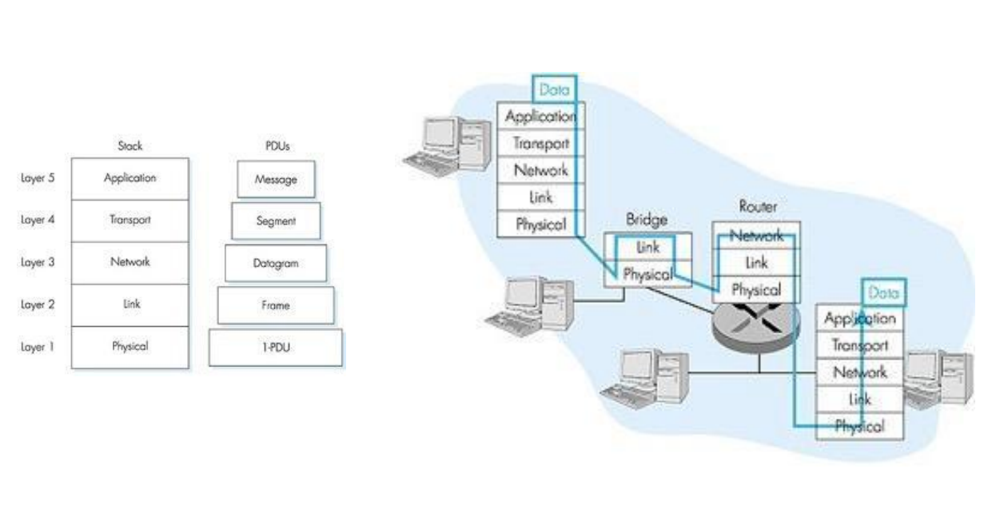
## OSI/ISO model
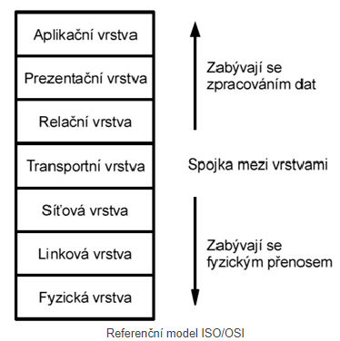

## Přehled protokolů TCP a UDP
- Protokoly transportní vrstvy

| TCP | UDP |
| - | - |
| Garantuje spolehlivé doručení | Nezajištujě doručení |
| Navázání spojení | Pouze zasílání zprávy a možné získání odpovědi (podle portu) |
| Podporuje fragmentaci dat | Data zaslána vcelku, pokud se nevlezou, využije se TCP |
| Zabezpečuje doručení | Nezaručuje doručení |
| Lze vyžádat část dat, která se ztratila | Data nelze fragmentovat |
| Kontrola celistvosti dat, checksum a acknowledgment | Pouze checksum |
| Pomalejší - režije | rychlejší |
| HTTP, HTTPS, SMTP, POP, FTP, atd. | Video konference, DNS, VoIP, atd.|

## TCP
- Jedná se o obousměrné propojení na internetu.
- Garantuje spolehlivé doručení dat ve správném pořadí.
- Navržený pro WAN sítě. Vytváří point-to-point spojení (1 na 1). 
- Je to stavový protokol (musí se navázat spojení a provést handshake).

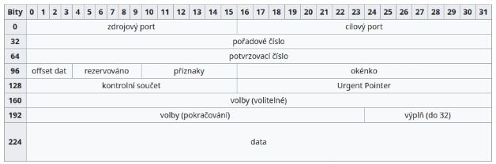

- **Okenko** - Počet packetů, které je ochoten přijmout bez potvrzení.
- **Urgent pointer** - Ofset od sekvenčního čísla indikující poslední urgentní byte.
- **Příznaky**:
  - URG - Urgentní data.
  - PSH - Co nejrychlejší doručení aplikační vrstvě.
  - RST - Požadavek na reset virtuálního spojení.
  - ACK - Potvrzení.
  - SYN - Požadavek na spojení.
  - FIN - Požadavek na ukončení spojení.

### Navázání spojení
- Obě strany si musí pamatovat své pořadové číslo a číslo protistrany.
- 3 way handshake

1. Klient odešle na server packet s nastaveným SYN flagem a náhodně vygenerovaným pořadovým číslem x.
2. Server odešle klientovi datagram s nastaveným příznakem SYN a ACK a potvrzovacím číslem x+1 a náhodným pořadovým číslem y.
3. Klient odešle datagram s nastaveným příznakem ACK, pořadovým číslem x+1 a číslem odpovědi y+1

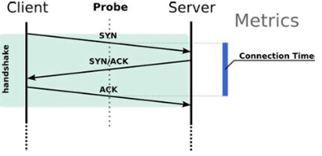

### Ukončení spojení

1. Ukončující strana pošle datagram s příznakem FIN.
2. Protistrana odpoví datagramem s nastaveným ACK (opět správným pořadovým číslem).
3. Protistrana odešle datagram s FIN.
4. Ukončující strana pošle datagram s ACK.

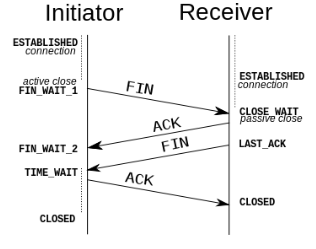

### Řízení spojení 
- Problémem je zajištění spolehlivého spojení nad nespolehlivým spojením IP.
- Musí tak docházet k potvrzování packetů - tedy příjemce po obdržení packetu (se správným checksumem a sekvenčním číslem) pošel nazpět ACK packet, který opět musí obsahovat součet sekvenčního čísla a velikosti packetu a vlastní sekvenční číslo. 
- Pokud nepřijde po určité době ACK je datagram poslán znova. 
- Aby se vyvarovalo čekání po každém packetu u velkého množství dat je možné využít zřetězení segmentů, kde se poté potvrdí více packetů najednou.

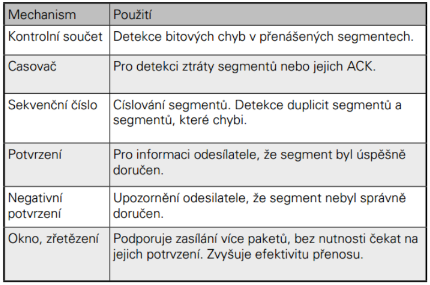

**Checksum** - CRC (cyclic redundancy check) součet. Je vypočítaný z hlavičky a po přijetí packetu si příjemce hlavičku přepočítá a porovná checksumy.

**Sekvenční číslo** - Slouží pro kontrolu správného pořadí packetu a že nedošlo ke ztrátě packetu. Sekvenční číslo celého packetu ukazuje pozici prvního bytu v celém proudu dat.

**Řízení toku** - Tok je potřeba nastavit tak aby příjemce stíhal packety zpracovávat a nedocházelo k jejich zahazování a tak zbytečnému vytěžování sítě. TCP tedy na jakoukoliv ztrátu packetu nahlíží jako na zahlcení sítě. Jestliže se packety neztrácejí odesílatel zvyšuje rychlost přenosu, v opačném případě snižuje rychlost přenosu.

- Sliding window (Klouzající okno) 
  - Velikost okna říká odesílateli kolik packetů může poslat najednou bez toho aby čekal na potvrzení. 
  - Toto okno upravuje v závislosti na potvrzeních (zvětšuje ho pokud přichází jinak nezvětšuje nebo zmenšuje). 
  - Pokud dojde ke ztrátě packetu (nepřijde ACK) použije Go Back N nebo Selective repeat algoritmus. 
  - Cílem je maximální využití přenosové linky a minimalizace zpoždění, které způsobuje potvrzování. 
  - Nulová velikost okna značí zahlcení bufferu.

    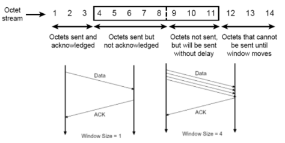

- Slow-Start 
  - Po vytvoření spojení se okno nastaví na 1 a pokud nedochází ke ztrátě packetů je exponenciálně zvětšováno, v případě že dojde, je okno zmenšeno opět na 1. 
  - Po překročení ssthresh (nastavené hranice) roste velikost lineárně.
- TCP TAHOE - Pokud dojde ke ztrátě packetů data jsou přeposlána a ssthresh je nastaveno na polovinu a window size opět na 1.
- TCP RENO - Pokud dojde ke ztrátě přepošle data a nastaví ssthresh na polovinu a od této hodnoty začíná.

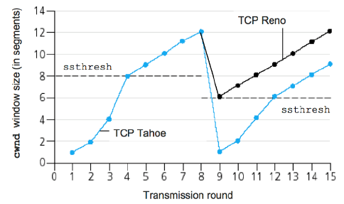

- RED (Random Early Detection) - Náhodně zahazuje packety před naplněním fronty. Pak se zahazuje vše.
- WRED (Weighted Random Early Detection) - Rozdílná náhodnost pro rozdílné priority (více queues s rozdílnými thresholdy).

- Go Back N (Opakování s návratem) 
  - Příjemce packety mimo pořadí zahazuje a posílá ACK posledního správně přijatého (ne pro všechny ale pro skupinu se správnými čísly).
  - Algoritmus obsahuje okno o velikosti N, které určuje maximální počet nepotvrzených packetů.
  - Při detekci ztráty packetu se znovu zašlou všechny packety v okně. 
  - Nevýhodou je, že se zbytečně zatěžuje síť packety, které již předtím dorazily v pořádku.
- Selective Repeat (Selektivní opakování) 
  - Chytřejší než Go Back N. 
  - Příjemce informuje odesílatele o tom, které rámce mu chybí a odesílatel může tak poslat jenom ty, které nepřišly správně. 
  - Při tomto algoritmu příjemce ukládá i rámce, které jsou mimo pořadí. 

## UDP (User Datagram Protocol)
- Jednoduchý protokol transportní vrstvy. 
- Je bez záruky doručení a pořadí packetů. 
- Narozdíl od TCP je nespojovaný a bez řízení toku. 
- Používá se pro VoIP, DNS, streaming…

### UDP datagram 
- Menší než u TCP. 
- Obsahuje:
  - Port odesílatele
  - Port příjemce
  - Délku - Hlavičky + dat
  - Checksum - viz nahoře. Akorát je počítaná pomocí pseudo-hlavičky.

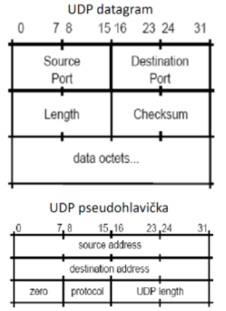

## IP (Internet protocol)
- Protokol síťové vrstvy. 
- Je nespojovaný (nevytváří se spojení) a je nespolehlivý. 
- Je to protokol pro komunikaci zařízení nikoliv aplikací. 
- Data rozděluje do jednotlivých datagramů (packetů) a definuje pro ně adresovací metody - zdrojové a koncové adresy.

### IPv4
- Používá 32bitové adresy, ale velká část možných kombinací je rezervována.

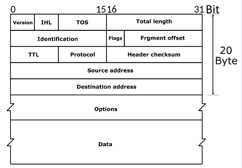
- Version (Verze) - 4 pro IPv4, 6 pro IPv6.
- IHL (Délka hlavičky) - V počtu 32bitových slov.
- ToS/DSCP (Typ služby) - Definice požadavku kvality služby/O jakou aplikaci je jedná - VoIP např.
- Total Length (Celková délka)
- Identification (Identifikace datagramu) - Unikátní číslo pro identifikaci.
- Flags (Příznaky) - Například zapnutí nebo vypnutí fragmentace.
- Fragment offset (Ofset fragmentace) - Ofset počítáno po 8bytových blocích.
- TTL (Životnost) - Počet skoků dokud nebude zahozen.
- Protocol - Protocol vyšší vrstvy (ICMP, IGMP, RIP, TCP, UDP…).
- Header checksum - Checksum hlavičky. Nutný přepočítat na každém směrovači.

#### Adresování
- Adresy pevné délky 32b, které se skládají z identifikace sítě a hosta.
- Na veřejné síti adresy přiděluje organizace ICANN

**Unicast** - Komunikace s jedním zařízením - 1-to-1.

**Loopback** - Adresa na lokální rozhraní (sam sebe).

**Broadcast** - Všechny počítači na dané síti (host má bitvou hodnotu samých 1). 1-to-All

**Multicast** - Určeno pro skupinu počítačů, které si o spojení požádaly. 1-to-Many. Adresy třídy D ve třídním adresování.

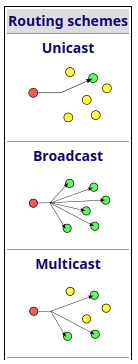

- Třídní adresování - Původní koncept. Adresy jsou rozděleny do tříd.

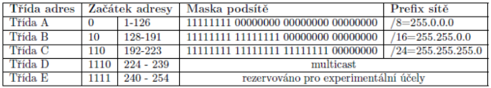

- Beztřídní adresování 
  - **Adresa** je tvořena **adresou sítě**, **podsítě** a **hosta** a hranici mezi podsítí určuje **maska**.
  - **Subnetting** - Vytváření více podsítí pomocí masky sítě. 
  - **Supernetting** - Opak k subnettingu.

### IPv6
 - Používá 128bitové adresy (zapisují se hexadecimálně a oddělují dvojtečkami a umožňuje zkracování v tomto zápisu). 
 - Důvodem pro vznik bylo aby byl dostatek adres, hierarchické směrování a adresace, podpora služeb kvalit, zvýšení bezpečnosti, snížení zátěže směrovačů a možnost automatické konfigurace adresy. 
 - Zpracování hlavičky nevyžaduje přepočet checksum. 
 - Pevná velikost hlavičky (40B). 
 - Nepodporuje broadcast. (Nahradil multicast)

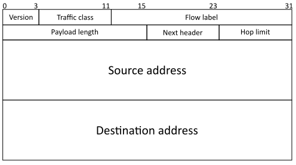

- Traffic class (Třída provozu) - Pro potřeby služeb se zajištěnou kvalitou.
- Flow Label (Značka toku) - Identifikace toku (souvisejících datagramů).
- Next Header (Další hlavička) - Určuje typ případné další hlavičky nebo identifikuje protokol vyšší vrstvy.
- Hop limit (Limit skoků) - Jako TTL u IPv4.

**Rozšiřující hlavičky** 
- Připojují se za základní hlavičku. 
- Důležité je i jejich pořadí. 
- Každá musí obsahovat položku další hlavička, typ dat, délku dat, data. 
- Pokud jí směrovač nerozumí, zahodí ji, upozorní odesílatele a přejde na další.

**Fragmentace** 
- Fyzická linka má omezení na velikost přenášených dat a tak je potřeba datagram rozložit (fragmentovat) na menší packety. 
- Sestavení provádí až koncový host.

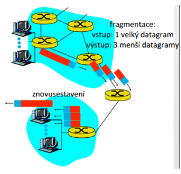

## Model klient-server
- Schéma komunikace mezi 2 procesy (samotnou komunikaci popisuje protokol). Klient i server jsou aplikační procesy.
- **Server** - Čeká na příchod požadavku, ten zpracuje a odpoví na něj. 
- **Klient** - Posílá požadavky na zpracování serveru. Většinou iniciuje komunikaci. Zpracování zde neprobíhá - to provádí server.

**Spojově orientovaná komunikace** - Například přes TCP.

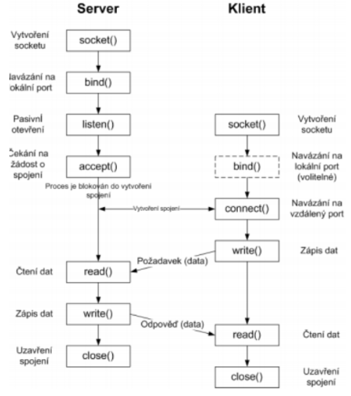

**Nespojovitě orientovaná komunikace** - Například UDP.

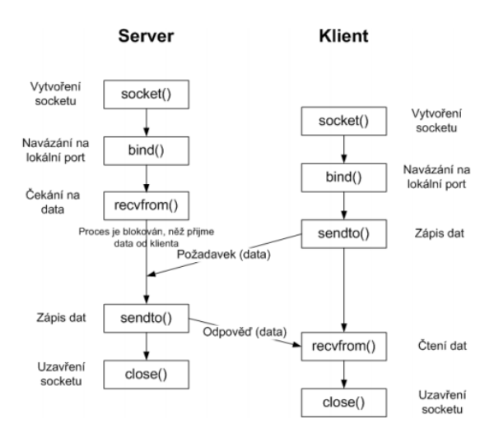

**Konkurentní server** 
- Současné zpracování více požadavků od více klientů. Paralelní (souběžná/konkurentní) implementace - fork() nebo threads.
 
**Iterativní server**
- Komunikuje s klienty v pořadí podle příchodu požadavků na spojení.

**Protokol** 
- Soubor syntaktických a sémantických pravidel určujících výměnu informace mezi nejméně 2 entitami. 
- Nejčastěji popisován pomocí stavových automatů, gramatik, grafů, algebraicky nebo neformálně slovním popisem. 
- Protokol zahrnuje procedury navázání spojení, adresování, prenosu dat, zpracování chyb, řízení toku, přidělování prostředků...

