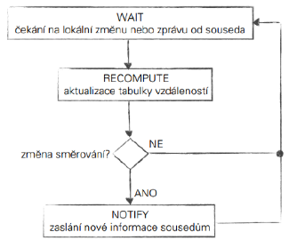
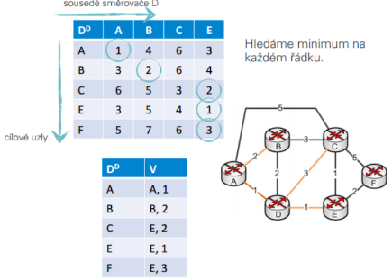
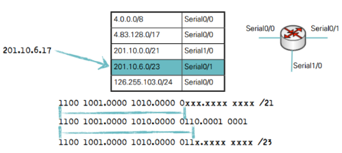
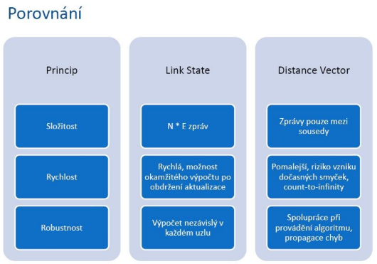
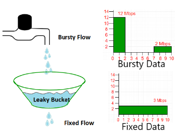
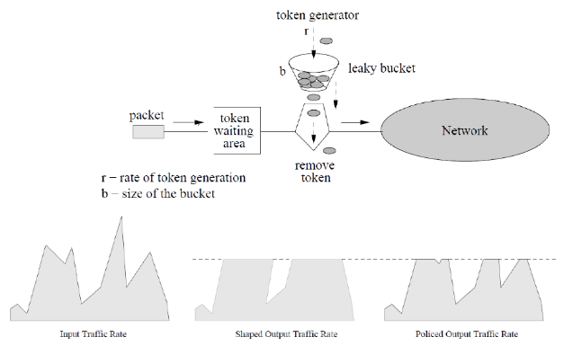
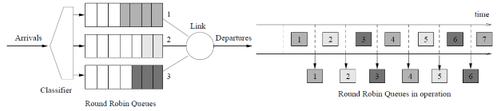
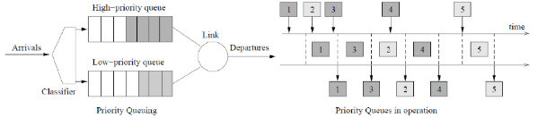
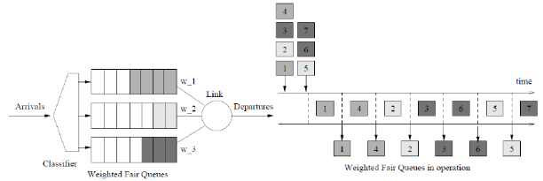
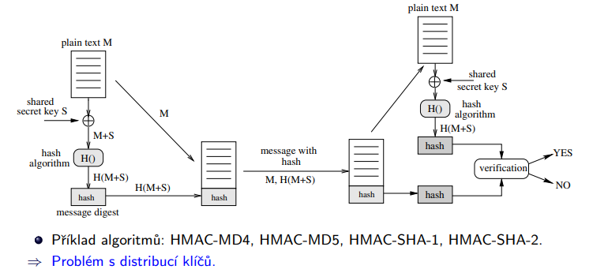

# Směrování a zabezpečení přenosů v počítačových sítích
- Otázky: algority Link-State, Distance-Vector, šifrování, autentizace a integrita dat
- Předmět: IPK, ISA
- zdroje:
  - https://docs.google.com/document/d/1WR3wW3GcCOX9s6LquO9XYOiVyecESQTzWOPF95uKnA0/edit#heading=h.fwrc9warf824
- prezentace:
  - [Smerovani - IPK](https://wis.fit.vutbr.cz/FIT/st/cfs.php.cs?file=%2Fcourse%2FIPK-IT%2Flectures%2FIPK2021-07-SMEROVANI.pptx.pdf&cid=14005)
  - [Zabezpeceni - ISA](https://wis.fit.vutbr.cz/FIT/st/cfs.php.cs?file=%2Fcourse%2FISA-IT%2Flectures%2Fisa-zabezpeceni.pdf&cid=14699)

## Směrování

Probíhá na vrstvě L3 - síťové vrstvě

> **Směrování** = Určení vhodné cesty v síti od zdroje k cíli.

> **Přepínání** = Přesun packetu ze vstupu na výstup, výstup určí směrování.

Při směrování se síť často abstrahuje jako ohodnocený graf, kde uzly jsou směrovače, hrany jsou linky a atribut hrany je cena linky.

### Funkce směrovače (routeru)
- **Zpracování směrovacích informací** - Výpočet nejkratší cesty, správa směrovací tabulky, běh směrovacích protokolů...
- **Přepínání paketů** - Validace paketů, zjištění cílové adresy packetu, nalezení výstupního portu, kontrola TTL, výpočet checksum...
- **Speciální funkce** - Transformace paketů, klasifikace, prioritizace, filtrování paketů...

## Související pojmy
- **Doba konvergence** - Doba potřebná k rozšíření informace o změně do všech směrovačů a jejich reakce na tuto změnu.
- **Směrovací tabulka** - Lokální tabulka směrovače obsahující informace pro každý známý cíl v síti.
- **Brána (gateway)** - Směrovač mezi vnitřní a vnější sítí.
- **Směrovací protokol** - Komunikační protokol mezi směrovači. Např. RIP, OSPF, IGRP…
- **Statické směrování** - Záznamy ve směrovací tabulce se musí ručně měnit (například pro LAN).
- **Dynamické směrování** - Záznamy se dynamicky mění dle sítě.

## Link-state algoritmus
- Globální algoritmus.
- Každý směrovač má k dispozici kompletní informace o topologii sítě. Vyžaduje šíření informací o sítí celou oblastí. 
- Výpočet nejkratší cesty se provádí na základě informací o kompletní topologii a hodnocení hran grafu. 
- Po *k* iteracích je známá cesta ke k uzlům. 
- Dojde-li ke změně v sítí, routery posílají pouze tuto změnu a ne celou tabulku. 
- Největší zátěž je na síť na začátku, kde router posílá prvotní informace všem ostatním. 
- Stavy linek se testují "Hello" pakety
### Výhody:
- rychlost, robustnost a menší zátěž linky

## Link-state protokoly

### Is-Is (Intermediate System to Intermediate System)
- Využívá **Dijkstrův algoritmus**. 
- Informace šíří záplavově.
- Podporuje Multicast.
- Od OSPF se liší kategorizací oblastí a také metodou spolehlivého šíření informací o topologii a jejich změnách. 

### OSPF (Open Shortest Path First)
- Využívá **Dijkstrův algoritmus**.
- Dělí síť na oblasti aby nemusel provádět přepočet celé sítě - které se musí provádět po každé změně.
- Šíří informaci o změně v celé oblasti záplavově (LSA Flooding).
- Nesen IP protokolem
- Podporuje Multicast. 
- **Load balancing** - více cest se stejnou cenou může být současně vybráno. 
- Obsahuje Area 0 (backbone), která je propojovací oblastí.

## Dijkstrův algoritmus
- Předpokládá že topologie sítě včetně cen linek je předem známá každému uzlu a tento graf je všude stejný -> proto se využívá u link-state
- Provádí se iterativní výpočet, kde každý směrovač vypočítá cestu s nejnižší cenou pro každou cílovou síť.
- Začátkem cesty je vždy aktuální směrovač.

viz https://www.youtube.com/watch?v=pVfj6mxhdMw

## Distance-vector
- Směrovací protokol
- Směrovače znají pouze sousedy a cenu linek k nim. 
- Informace se vyměňují mezi sousedy - nepotřebuje kompletní graf sítě.
- Informace o síti získávají routery od sousedů pomocí směrovacích updatů.
- U RIP a IGRIP se vyměňují celé tabulky a to zatěžuje síť a snižuje rychlost konvergence, také se může stát, že má router špatná data a směruje špatně.

### RIP (Routing Information Protocol)
- Nenáročný a jednoduchý protokol.
- Využívá Bellman-Fordův algoritmus.
- Metrikou je počet skoků 
  - jako ochrana proti smyčkám je implementováno omezení pro počet skoků (15 - nekonečno) - toto však ale také omezuje možnou velikost sítě.
- Periodické aktualizace každých 30s
- RIP zprávy jsou neseny v UDP datagramu a posílány broadcastem na port 520
- Časy potřebné ke konvergenci a rozšířitelnosti zaostávají za jinými protokoly.

### EIGRP (Enhanced Interior Gateway Routing Protocol)
- Moderní náhrada za IGRP (kvůli přechodu na beztřídní adresování).
- Využívá tabulky navíc pro další informace (tabulku sousedu a tabulku topologie). 
- Vysílá pouze změny v topologii nikoli celou tabulku a ty neposílá pravidelně, ale pouze dojde-li ke změně - kvůli těmto vlastnostem je někdy považován za hybridní protokol.

### Poison Reverse
- Snaha zabránit smyčkám a “počítání do nekonečna”.
- Jakmile směrovač zjistí špatnou cestu, všem ostatním routerům oznámí, že je cesta s metrikou nekonečno (16 např.) a tak do ní další routery neposílají packety.

## Bellman-Fordův algoritmus
- Iterativní algoritmus.
- Běží pokud jsou informace vyměňovány mezi sousedy
  - WAIT - Změna lokální ceny linky (zpráva pro souseda).
  - RECOMPUTE - Nová data, aktualizuj distance table.
  - NOTIFY - Pokud cena nejlepší cesty byla změněna.

viz https://www.youtube.com/watch?v=obWXjtg0L64

## Směrovací tabulka
- Datová struktura v routeru. 
- Obsahuje informace nutné ke směrování. 
- Záznamy obsahují: 
  - Cílovou IP
  - masku cílové podsítě
  - bránu
  - výstupní síťové rozhraní a metriku. 
- Řádky jsou cíle, sloupce jsou sousedé, v buňkách jsou vedeny ceny do cíle přes daného souseda.

### Princip směrování podle tabulky 
- Tabulka je setříděná podle masky od nejdelší (nejvíc specifické - PC) po nejkratší (nejméně specifické - podsítě).
- Hledá se záznam s nejdelší shodou prefixu.
- Pokud se nenajde shoda, pošle se na defaultní rozhraní (nejméně specifické).

## Service Level Agreement (SLA)
- Specifikuje nároky na přenos zákaznických dat (Nároky na fyzické připojené, dostupnost sítě, propustnost sítě…). 
- K tomuto se využívá:
  - Rozložení provozu (traffic shaping) 
  - Omezení provozu (traffic policing)

### Leaky bucket 
- traffic shaping
- Využívá bufferu ze kterého data konstantě vychází ven.
- Maximální rychlost průchodu je tedy omezená

### Token bucket 
- traffic policing
- Využívá opět bufferu. Packety se mohou ztrácet při přeplnění bufferu.

## Fronty
- FIFO fronty - Řadí podle toho jak přicházejí a neřeší priority.
- Round robin fronty - Každý tok má jednu frontu a na výstup se cyklický vybírá ze všech front packet.

    

- Prioritní fronta - Packety jsou klasifikovány do prioritních tříd a každá třída je výstupní frontou, kde fronty s vyšší prioritou mají přednost. Je zde riziko vyhladovění.

    

- Váhová fronta - Každý tok má frontu s váhou, která určuje počet packetů, které se odeberou a pošlou.

    

## Šifrování:

- Cíle: Důvěrnost, Autentizace, Integrita dat, Neodmítnutelnost, Dostupnost, kontrola přístupu

### Symetrické šifrování:
- Používá jeden klíč K pro šiforvání i dešifrování zprávy, využit pro zajištění důvěrnosti
- Je nutné zajistit výměnu klíčů
- Rychlejší jak asymetrické šifrování
- Algoritmy: DES, 3DES, AES, … jsou relativně rychlé, využito v SSL, IPsec,...

### Asymtetrické šifrování:
- Využívá dvojci klíčů - privátní a veřejný klíč
- Veřejný klíč lze odvodit z privátního, nikoliv naopak
- Využití:
  - Příjemce vytvoří veřejný a privátní párový klíč, vystaví veřejný klíč KB_pub.
  - Odesílatel si stáhne KB_pub a pomocí něj podepíše zprávu a odešle.
  - Příjemce pomocí privátního klíče KB_sec rozšifruje zprávu.
- Využit pro zajištění důvěrnosti + autentizace.

## Integrita dat

- Integrita (autentizace) zprávy pomocí tajného klíče (symetrická kryptografie).
  -  Využívá kryptografickou hešovací funkci H(text M), např. MD 4/5/6, SHA 1/2/3.
- Kryptografický heš HMAC (Hash-Based Message Authentication Code).
  - Mechanismus HMAC přidává do výpočtu tajný klíč S: H(M+S).

### Využití
- Použití algoritmu MD5 pro autentizaci zpráv OSPFv2, EIGRP, RIPv2 či BGP.
- Algoritmus SHA-1 použit v TLS, PGP, SSH, S/MIME, IPSec.
- SHA-1 a MD4 použity pro autentizaci zpráv SNMPv3.

> Autentizace je proces oveření identity, za kterou se subjekt vydává
